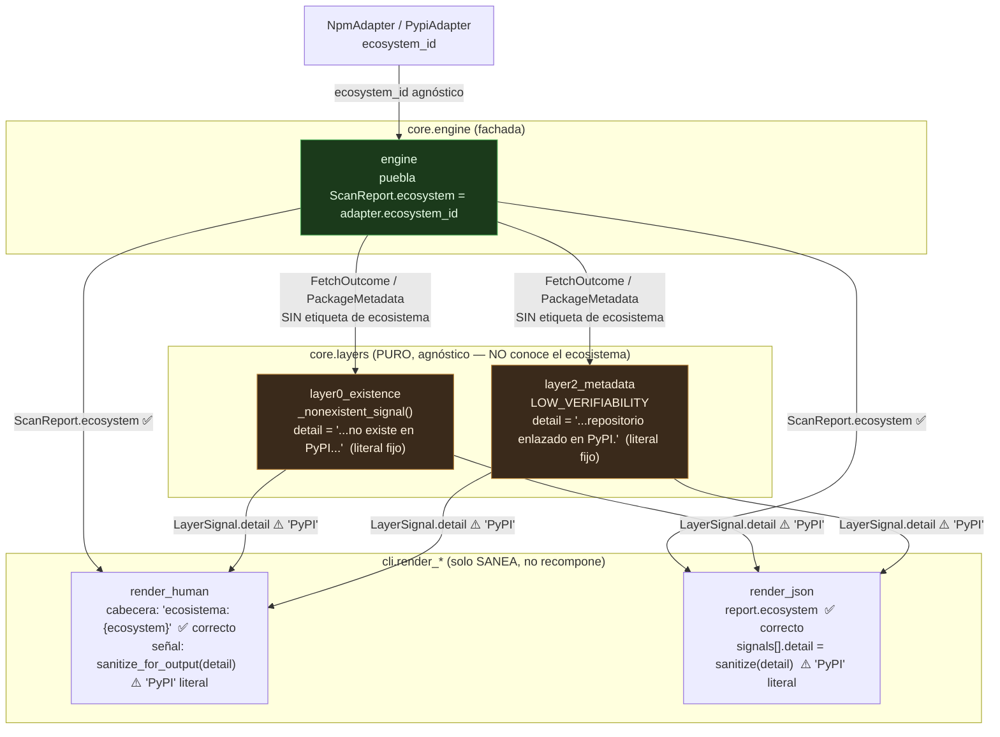

# Flujo del ecosistema hacia la salida (H4-T46)

Diagrama de apoyo al [ADR-0001](../adr/0001-texto-ecosistema-en-detail-capas-0-2.md). Muestra por
qué el campo **estructural** `ecosystem` llega correcto a la salida mientras el texto libre
`signals[].detail` de las Capas 0/2 mantiene el literal "PyPI" (deuda documentada, vía (a)).

`adapter.ecosystem_id` viaja a `ScanReport.ecosystem` (cabecera humana + JSON correctos). El
`detail` de las señales L0/L2 se **construye dentro de la capa pura** con el literal fijo "PyPI";
los renders solo lo **sanean**, no lo recomponen, así que ese texto no se reescribe por ecosistema.

## Lectura

- **✅ Correcto (R10.1 en el campo estructural):** `ScanReport.ecosystem` se puebla con
  `adapter.ecosystem_id` en el engine y llega íntegro y saneado a la cabecera humana y al JSON.
- **⚠️ Deuda documentada (vía (a) del ADR-0001):** el `detail` de `NONEXISTENT` (L0) y
  `LOW_VERIFIABILITY` (L2) contiene "PyPI" como literal construido en la capa pura. Para una dep
  npm ese texto narrativo está desalineado, pero el dato estructural es correcto.

## Punto de pago futuro (fuera de H4-T46)

La forma correcta de saldar la deuda —si se prioriza— es la **vía (b1)**: que el nombre del
ecosistema viaje como **dato agnóstico** estructurado por la flecha
`ENG -->|FetchOutcome ...| L0/L2` (un atributo de `FetchOutcome`/contexto que la capa interpola),
**nunca** como `if ecosystem == "npm"` en la capa ni como reemplazo de substring en el render.
Requiere cambio de modelo + firmas de `evaluate` + repoblado de los tests de Capas 0/2, y por eso
es una tarea aparte, no parte de H4-T46.
