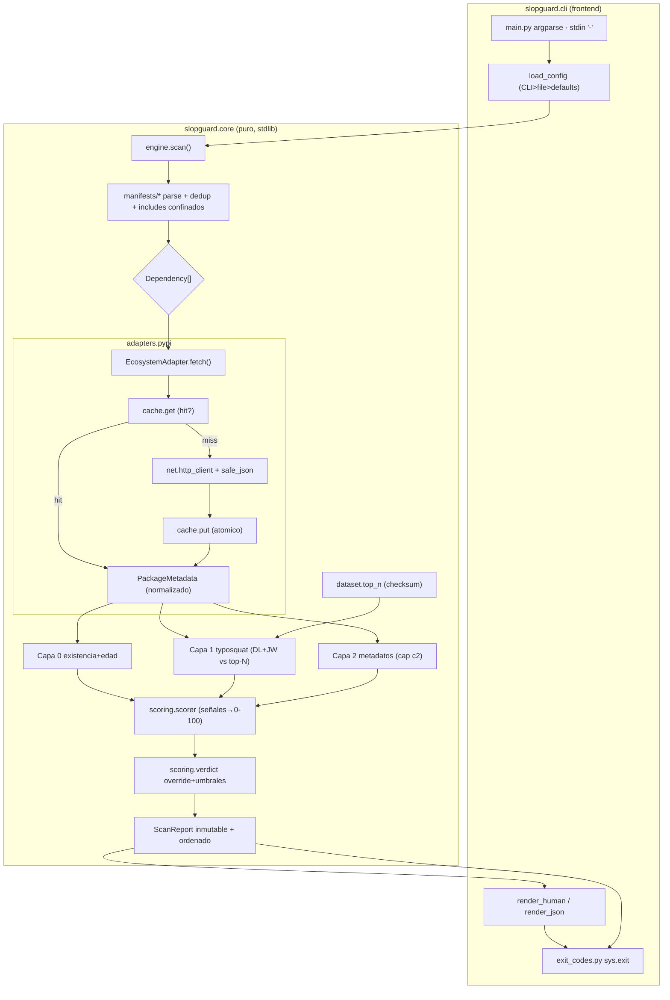
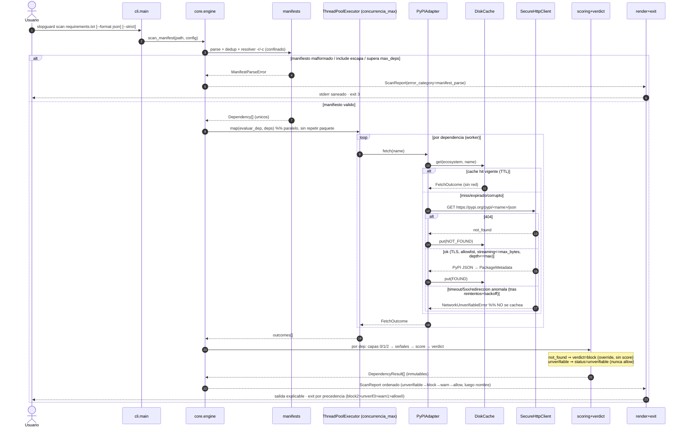

# Diseño SlopGuard (Hito 1) — Parte 2: Contratos y Diagramas

> Continuación de `design.md`. Secciones §3 (Contratos de API) y §4 (Diagramas Mermaid).

---

## 3. Contratos de API

### 3.1 API pública del core (lo que consume la CLI — congelada)

Fachada en `slopguard.core.__init__`. La CLI **solo** importa de aquí.

```python
def scan_manifest(path: str | Path, config: Config, *,
                  use_cache: bool = True, ecosystem_id: str = "pypi") -> ScanReport:
    """Escanea un manifiesto en disco. Detecta tipo, parsea, deduplica, evalua capas y
    produce un ScanReport inmutable y ordenado. Lanza solo errores del core (§3.6);
    nunca propaga stacktraces de red/parsing crudos."""

def scan_stdin(text: str, config: Config, *,
               use_cache: bool = True, ecosystem_id: str = "pypi") -> ScanReport:
    """Igual que scan_manifest pero con entrada en formato pip-freeze (stdin '-')."""

def scan_dependencies(deps: Sequence[Dependency], config: Config, *,
                      use_cache: bool = True, ecosystem_id: str = "pypi") -> ScanReport:
    """Punto de entrada de bajo nivel: evalua un lote ya parseado. Determinista respecto
    al orden de entrada (R5.7)."""

def load_config(explicit_path: str | Path | None,
                cli_overrides: Mapping[str, object]) -> Config:
    """Resuelve config con precedencia CLI > archivo > defaults. Valida rangos;
    lanza InvalidConfigError si algo esta fuera de dominio (R8.2/R8.3)."""

def aggregate_exit_code(report: ScanReport, *, strict: bool) -> int:
    """Calcula el exit code agregado con la precedencia R7.5. Funcion pura."""
```

Errores → `error_category`/exit code: ver §3.6. Salida: `ScanReport` inmutable (§2.3).

### 3.2 Interfaz `EcosystemAdapter` (extensibilidad — R10)

```python
class EcosystemAdapter(Protocol):
    """Abstrae existencia, metadatos y fuente del top-N. El motor de capas/scoring
    depende SOLO de esta interfaz, nunca de PyPI directamente (R10.1)."""
    ecosystem_id: str

    def normalize_name(self, raw: str) -> str:
        """Normaliza el nombre segun las reglas del ecosistema (PyPI = PEP 503)."""

    def fetch(self, name: str) -> FetchOutcome:
        """Una consulta (red o cache): existencia + metadatos normalizados en un viaje.
        Mapea 404→NOT_FOUND; error transitorio agotado→UNVERIFIABLE; ok→FOUND(meta).
        Aplica TLS+allowlist+streaming+limites internamente. No lanza por 404."""

    def load_top_n(self) -> "TopNDataset":
        """Carga el dataset embebido verificando su checksum; aborta (DatasetIntegrityError)
        si falta o esta corrupto (R3.9)."""

    def get_downloads(self, name: str) -> None:
        """HOOK RESERVADO. En Hito 1 retorna None SIEMPRE; la ausencia de descargas NO es
        senal de riesgo (R4.4). Reservado para integraciones futuras."""
```

`get_age` no es método del adapter: la Capa 0 deriva la edad de `metadata.first_release_epoch`
y de un `now_epoch` **inyectado una vez por corrida** (determinismo y testabilidad). El
override de inexistencia y el scoring viven en el core, agnósticos del ecosistema.

`TopNDataset`: estructura inmutable con índices precomputados para acotar el coste de Capa 1
(ver ADR-02): `by_length: Mapping[int, tuple[str, ...]]`, `by_first_char: Mapping[str,
tuple[str, ...]]`, `members: frozenset[str]`, `version: str`, `generated_at: str`.

### 3.3 Contrato del cliente HTTP seguro (`core/net`)

```python
class SecureHttpClient:
    """Cliente HTTPS endurecido sobre urllib. allowlist de hosts, TLS verificado,
    sin redirecciones cross-scheme/cross-host, lectura streaming acotada."""
    def get_json(self, url: str, *, connect_timeout_s: float, read_timeout_s: float,
                 max_response_bytes: int, max_json_depth: int) -> dict[str, object]:
        """GET HTTPS. Verifica host∈allowlist y scheme=https. Rechaza Content-Length
        excesivo; lee en chunks abortando si supera max_response_bytes; descomprime de
        forma incremental con cota; parsea con safe_json_loads(max_json_depth).
        Lanza NetworkUnverifiableError ante cualquier anomalia (incl. redireccion rara)."""
```
`safe_json_loads(data: bytes, max_depth: int) -> object`: rechaza anidamiento > `max_depth`
antes/durante el parseo (anti JSON bomb).

### 3.4 Contrato de la caché (`core/cache`)

```python
class DiskCache:
    def __init__(self, root: Path, ttl_horas: int, *, enabled: bool) -> None: ...
    def get(self, ecosystem: str, name: str) -> FetchOutcome | None:
        """None = miss (ausente/expirado/corrupto/esquema invalido). Nunca lanza por
        entrada corrupta: la trata como miss (R9.5)."""
    def put(self, ecosystem: str, name: str, outcome: FetchOutcome) -> None:
        """Escribe FOUND/NOT_FOUND con escritura atomica (temp+os.replace), perms 0600,
        dir 0700. NO persiste UNVERIFIABLE. No-op si enabled=False (--no-cache)."""
```

### 3.5 Contrato de la CLI

- **Comando:** `slopguard scan <ruta|-> [flags]`. Subcomando auxiliar: `slopguard version`.
- **stdin:** ruta `-` ⇒ lee formato `pip freeze` de stdin (`scan_stdin`).
- **Detección de manifiesto:** por nombre/extensión (`requirements*.txt`, `pyproject.toml`);
  `-` ⇒ freeze. Flag opcional `--manifest-type {requirements,pyproject,freeze}` para forzar.
- **Flags principales:**
  `--format {human,json}` (default human) · `--no-cache` · `--strict` ·
  `--config <ruta>` · `--ecosystem pypi` (default).
  Overrides de umbrales/red: `--umbral-block` `--umbral-warn` `--edad-minima-dias`
  `--concurrencia` `--connect-timeout` `--read-timeout` `--reintentos`
  `--timeout-total` `--jw-min` `--dl-max`.
- **Precedencia:** CLI > archivo de config > defaults (R8.2).
- **Salida:** humano a stdout; errores operacionales a stderr (saneados, **sin** rutas
  absolutas ni contenido del manifiesto — R6.5). JSON siempre a stdout.
- **Exit codes (R7, precedencia R7.5):**

| Código | Significado | Condición |
|---|---|---|
| 0 | allow | todo allow, sin warn/block/unverifiable |
| 1 | warn | ≥1 warn, sin block ni unverifiable (sin `--strict`) |
| 2 | block | ≥1 block (señal dominante); o cualquier warn con `--strict` |
| 3 | operacional/unverifiable | error total (manifiesto/config/dataset) **o** ≥1 unverifiable sin block |

Algoritmo de agregación (puro, en `core/scoring/verdict.py`):
```
if error_operacional_total:        return 3   # manifest_parse/invalid_config/dataset_integrity
if any verdict==block:             return 2   # block domina (R7.5)
if any status==unverifiable:       return 3
if any verdict==warn:              return 2 if strict else 1
return 0
```

### 3.6 Errores del core → `error_category`

| Excepción del core | error_category | exit |
|---|---|---|
| `ManifestParseError` (malformado, vacío-no, tamaño, include escapado/ciclo/inexistente) | `manifest_parse` | 3 |
| `InvalidConfigError` | `invalid_config` | 3 |
| `DatasetIntegrityError` (checksum/ausente/no cargable) | `dataset_integrity` | 3 |
| `NetworkUnverifiableError` (por-dependencia; no aborta el lote) | `network_unverifiable` | 3 (si sin block) |

Las tres primeras son **operacionales totales** (abortan el escaneo). `NetworkUnverifiableError`
es por-dependencia: marca esa dep `unverifiable` y el lote continúa (degradación segura).

---

## 4. Diagramas Mermaid

### 4.1 Componentes y flujo de datos



El motor (`L0/L1/L2/SC/V`) depende solo de `adapters.base`/`PackageMetadata`; la línea hacia
`adapters.pypi`/`net` queda confinada dentro del adapter (frontera de extensibilidad R10).

### 4.2 Secuencia de `slopguard scan requirements.txt` (caché, ThreadPool, degradación)



---

*(Continúa en `design-parte3.md`: §5 ADRs y §6 Trazabilidad.)*
