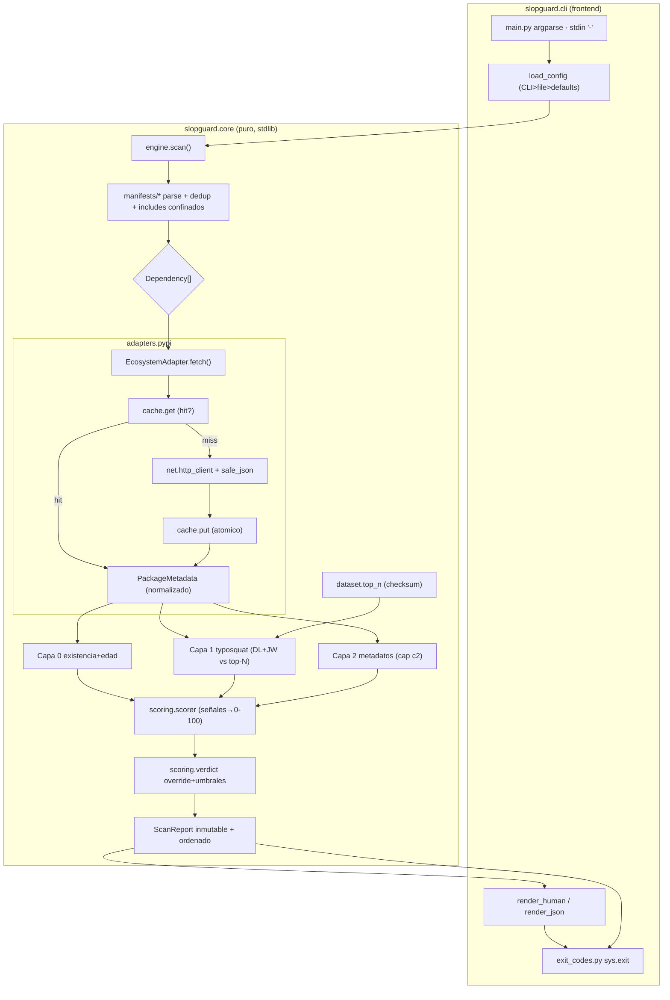
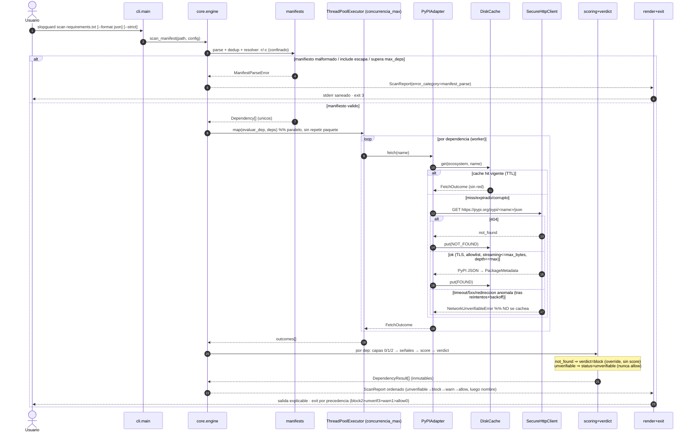

# Documento de Diseño: SlopGuard (Hito 1)

> Fase 2 del flujo Spec-Driven. Fuente de verdad: `specs/slopguard-hito1/requirements.md`.
> No contiene código de implementación: define arquitectura, modelos, contratos, diagramas,
> ADRs y trazabilidad. Implementable por tareas pequeñas en Fase 3.

**Convenciones (memoria del equipo):** Python 3.11+, mypy strict, funciones ≤50 líneas,
docstrings en español, identificadores en inglés. Core sin dependencias de la CLI; la CLI
consume solo la API pública del core. Resultados **inmutables de verdad**:
`@dataclass(frozen=True, slots=True)` + `tuple[...]` (nunca `list`) — lección del
`password-validator` (frozen no impide mutar listas internas).

---

## 1. Arquitectura

### 1.1 Principios
Dos mitades con un contrato único (patrón validado en `password-validator`):
- **Core (`slopguard.core`)**: lógica pura, determinista, cero deps de runtime (solo stdlib),
  cero imports de CLI/`argparse`/`print`. Expone una API pública congelada.
- **Frontend (`slopguard.cli`)**: argparse, render humano/JSON, mapeo a exit code del proceso,
  saneo de salida. No reimplementa reglas de dominio.

El motor de capas/scoring nunca habla con PyPI: depende de `EcosystemAdapter` y del modelo
**normalizado** `PackageMetadata`. Añadir npm = nuevo adapter, sin tocar capas ni scoring (R10).

### 1.2 Componentes

| Componente | Módulo | Responsabilidad | Capa |
|---|---|---|---|
| Normalización | `core/normalize.py` | PEP 503, saneo, acotado de longitud | core |
| Parsers manifiesto | `core/manifests/*` | requirements/pyproject/freeze; dedup; includes | core |
| Includes | `core/manifests/includes.py` | `-r`/`-c` confinados, ciclos, profundidad | core |
| Adapter (interfaz) | `core/adapters/base.py` | `EcosystemAdapter`, `PackageMetadata`, `FetchOutcome` | core |
| Adapter PyPI | `core/adapters/pypi.py` | `fetch()` vía HTTP seguro; mapea PyPI JSON→normalizado | core |
| Registro | `core/adapters/registry.py` | Factory por `ecosystem_id` (default `pypi`) | core |
| HTTP seguro | `core/net/http_client.py` | urllib+TLS+allowlist+redirect+streaming+límites | core |
| JSON seguro | `core/net/safe_json.py` | `safe_json_loads(max_depth)` | core |
| Caché disco | `core/cache/disk_cache.py` | JSON-only, atómico, perms, TTL, validación | core |
| Capa 0 | `core/layers/layer0_existence.py` | Existencia + edad | core |
| Capa 1 | `core/layers/layer1_similarity.py` | Typosquatting DL+JW contra top-N | core |
| Capa 2 | `core/layers/layer2_metadata.py` | Metadatos (cap `c2_max_contrib`) | core |
| Similaridad | `core/layers/similarity/{damerau,jaro_winkler}.py` | DL banda+cutoff; Jaro-Winkler | core |
| Dataset | `core/dataset/top_n.py` + `pypi_top_10k.json/.sha256` | Carga + checksum | core |
| Scoring | `core/scoring/scorer.py` | Combina señales → score 0-100 | core |
| Veredicto/exit | `core/scoring/verdict.py` | score→verdict, override, agregación exit | core |
| Config | `core/config.py` | TOML + precedencia + validación rangos | core |
| Orquestador | `core/engine.py` | manifiesto→…→`ScanReport` | core |
| API pública | `core/__init__.py` | Fachada congelada | core |
| CLI | `cli/main.py` | argparse, subcomandos, stdin `-`, precedencia | frontend |
| Render humano | `cli/render_human.py` | TTY explicable; saneo ANSI/C0-C1/CRLF | frontend |
| Render JSON | `cli/render_json.py` | JSON versionado | frontend |
| Mapeo exit | `cli/exit_codes.py` | `sys.exit` con el código del core | frontend |

### 1.3 Layout `src/`

```
src/slopguard/
  __init__.py            # __version__; re-exporta API pública
  py.typed
  core/
    __init__.py          # FACHADA: scan_manifest(), scan_dependencies(), modelos, errores
    models.py  config.py  normalize.py  errors.py  engine.py
    manifests/  base.py requirements_txt.py pyproject_toml.py pip_freeze.py includes.py detect.py
    adapters/   base.py pypi.py registry.py
    net/        http_client.py safe_json.py
    cache/      disk_cache.py
    layers/     layer0_existence.py layer1_similarity.py layer2_metadata.py
                similarity/  damerau.py jaro_winkler.py
    scoring/    scorer.py verdict.py
    dataset/    top_n.py pypi_top_10k.json pypi_top_10k.sha256
  cli/
    __init__.py  main.py render_human.py render_json.py exit_codes.py
```

**Contratos de import (import-linter — R10.1/R10.3):**
- `core.*` ✗→ `cli.*`.
- `core.layers.*`, `core.scoring.*` ✗→ `core.adapters.pypi`, ✗→ `core.net.*`
  (las capas dependen solo de `adapters.base`).
- Regla AST/lint global: prohibido `eval`/`exec`/`pickle`/`marshal` sobre datos externos
  (NFR-Seguridad.1-2).

---

## 2. Modelos de datos

Todo modelo de dominio es `@dataclass(frozen=True, slots=True)`; colecciones del resultado =
`tuple[...]`. Enums `StrEnum`/`IntEnum` para estabilidad del JSON.

### 2.1 Entrada
```python
@dataclass(frozen=True, slots=True)
class Dependency:
    name: str            # normalizado PEP 503
    version_pin: str | None
    raw: str             # original SANEADO (para mostrar)
    origin: str          # ruta RELATIVA y saneada del manifiesto
```

### 2.2 Frontera del adapter
```python
@dataclass(frozen=True, slots=True)
class PackageMetadata:   # NORMALIZADO, agnóstico de ecosistema; nunca payload crudo
    name: str
    first_release_epoch: float | None
    releases_count: int
    has_repo_url: bool
    has_description: bool
    has_author: bool
    has_license: bool
    has_classifiers: bool
    in_top_n: bool

class FetchState(StrEnum): FOUND="found"; NOT_FOUND="not_found"; UNVERIFIABLE="unverifiable"

@dataclass(frozen=True, slots=True)
class FetchOutcome:
    state: FetchState
    metadata: PackageMetadata | None        # solo si FOUND
    error_category: "ErrorCategory | None"  # network_unverifiable si UNVERIFIABLE
```

### 2.3 Señales, veredicto, resultado
```python
class Layer(IntEnum): L0=0; L1=1; L2=2

class SignalCode(StrEnum):
    NONEXISTENT="nonexistent"          # L0 override
    NEW_PACKAGE="new_package"          # L0 blanda
    TYPOSQUAT="typosquat"              # L1 dura
    NAME_UNTRUSTED="name_untrusted"    # L1 dura (nombre > nombre_max_chars)
    WEAK_METADATA="weak_metadata"      # L2 blanda
    LOW_VERIFIABILITY="low_verifiability"  # L2 blanda (sin repo)

@dataclass(frozen=True, slots=True)
class LayerSignal:
    layer: Layer
    code: SignalCode
    weight: int                  # puntos de riesgo (0 si informativa/override)
    is_soft: bool                # True=corroborante acotada; False=dura/override
    detail: str                  # explicación en español, SANEADA
    suspected_target: str | None = None

class Verdict(StrEnum): ALLOW="allow"; WARN="warn"; BLOCK="block"
class Status(StrEnum): OK="ok"; UNVERIFIABLE="unverifiable"
class ErrorCategory(StrEnum):
    MANIFEST_PARSE="manifest_parse"; INVALID_CONFIG="invalid_config"
    NETWORK_UNVERIFIABLE="network_unverifiable"; DATASET_INTEGRITY="dataset_integrity"

@dataclass(frozen=True, slots=True)
class DependencyResult:
    name: str
    version_pin: str | None
    status: Status
    verdict: Verdict | None      # None si unverifiable
    score: int | None            # 0-100; None si unverifiable o block-override
    signals: tuple[LayerSignal, ...]
    suspected_target: str | None
    error_category: ErrorCategory | None

@dataclass(frozen=True, slots=True)
class ScanSummary:
    total: int; allow: int; warn: int; block: int; unverifiable: int; exit_code: int

@dataclass(frozen=True, slots=True)
class ScanReport:
    schema_version: str          # "1.0"
    tool_version: str
    ecosystem: str               # "pypi"
    summary: ScanSummary
    results: tuple[DependencyResult, ...]   # ya ordenado (R6.4)
    error_category: ErrorCategory | None    # error operacional total
```

**Estado vs override:**
- Inexistencia (404): `status=ok` (la verificación SÍ se completó), `verdict=block`,
  `score=None`. Override, no score.
- No verificable (red agotada/redirección anómala/bomba): `status=unverifiable`,
  `verdict=None`, `score=None`, `error_category=network_unverifiable`. Nunca `allow`.

### 2.4 Config
```python
@dataclass(frozen=True, slots=True)
class Config:   # defaults = tabla §R8 (única fuente de verdad)
    umbral_block:int=80; umbral_warn:int=50; edad_minima_dias:int=90; ttl_cache_horas:int=24
    concurrencia_max:int=8; connect_timeout_s:float=5.0; read_timeout_s:float=10.0
    reintentos_red:int=2; timeout_total_por_dep_s:float=30.0
    jw_min:float=0.92; dl_max:int=2; nombre_max_chars:int=100
    releases_min:int=1; metadata_faltantes_min:int=2; releases_populares:int=10; c2_max_contrib:int=10
    max_manifest_bytes:int=5_000_000; max_deps:int=5000
    max_response_bytes:int=10_000_000; max_json_depth:int=50; max_include_depth:int=10
```
Validación (R8.3): `0 ≤ umbral_warn < umbral_block ≤ 100`; timeouts/reintentos/límites `>0`;
`0 ≤ jw_min ≤ 1`; `dl_max ≥ 1`; `nombre_max_chars ≥ 4`. Violación → `INVALID_CONFIG` (exit 3),
sin aplicar valores a medias.

### 2.5 JSON de salida (`schema_version="1.0"`)
```json
{
  "schema_version": "1.0", "tool_version": "0.1.0", "ecosystem": "pypi",
  "summary": {"total":3,"allow":1,"warn":1,"block":1,"unverifiable":0,"exit_code":2},
  "error_category": null,
  "results": [
    {"name":"reqursts","version_pin":null,"status":"ok","verdict":"block","score":82,
     "suspected_target":"requests","error_category":null,
     "signals":[
       {"layer":1,"code":"typosquat","weight":60,"is_soft":false,
        "detail":"El nombre se parece a 'requests' (distancia 1).","suspected_target":"requests"},
       {"layer":0,"code":"new_package","weight":15,"is_soft":true,
        "detail":"Publicado hace 4 dias (umbral 90).","suspected_target":null},
       {"layer":2,"code":"weak_metadata","weight":7,"is_soft":true,
        "detail":"1 release y faltan descripcion y repositorio.","suspected_target":null}]}
  ]
}
```
Reglas: **sin timestamps de reloj** (determinismo); claves fijas; orden determinista (R6.4);
strings externos **saneados** (R6.5). `score`/`verdict`=`null` si `unverifiable`; inexistencia
→ `score=null`, `verdict="block"`.

### 2.6 Entrada de caché (JSON only)
```json
{"cache_schema_version":"1","ecosystem":"pypi","name":"requests","fetched_at":1718500000.0,
 "state":"found","metadata":{"name":"requests","first_release_epoch":1297500000.0,
 "releases_count":148,"has_repo_url":true,"has_description":true,"has_author":true,
 "has_license":true,"has_classifiers":true,"in_top_n":true}}
```
- Se cachea el modelo **normalizado**, no el PyPI JSON crudo. `not_found` → `metadata=null`.
- `unverifiable` **NO se cachea** (no persistir fallos transitorios).
- Filename = `sha256(f"{ecosystem}:{name}").hexdigest()+".json"` (anti path traversal por
  construcción). Al leer: validar `cache_schema_version`, tipos/rangos, TTL; cualquier fallo →
  miss (refetch, no crashear). Dir `0700`, archivos `0600`.

---

## 3. Contratos de API

### 3.1 API pública del core (lo que consume la CLI — congelada)

Fachada en `slopguard.core.__init__`. La CLI **solo** importa de aquí.

```python
def scan_manifest(path: str | Path, config: Config, *,
                  use_cache: bool = True, ecosystem_id: str = "pypi") -> ScanReport:
    """Escanea un manifiesto en disco. Detecta tipo, parsea, deduplica, evalua capas y
    produce un ScanReport inmutable y ordenado. Lanza solo errores del core (§3.6);
    nunca propaga stacktraces de red/parsing crudos."""

def scan_stdin(text: str, config: Config, *,
               use_cache: bool = True, ecosystem_id: str = "pypi") -> ScanReport:
    """Igual que scan_manifest pero con entrada en formato pip-freeze (stdin '-')."""

def scan_dependencies(deps: Sequence[Dependency], config: Config, *,
                      use_cache: bool = True, ecosystem_id: str = "pypi") -> ScanReport:
    """Punto de entrada de bajo nivel: evalua un lote ya parseado. Determinista respecto
    al orden de entrada (R5.7)."""

def load_config(explicit_path: str | Path | None,
                cli_overrides: Mapping[str, object]) -> Config:
    """Resuelve config con precedencia CLI > archivo > defaults. Valida rangos;
    lanza InvalidConfigError si algo esta fuera de dominio (R8.2/R8.3)."""

def aggregate_exit_code(report: ScanReport, *, strict: bool) -> int:
    """Calcula el exit code agregado con la precedencia R7.5. Funcion pura."""
```

Errores → `error_category`/exit code: ver §3.6. Salida: `ScanReport` inmutable (§2.3).

### 3.2 Interfaz `EcosystemAdapter` (extensibilidad — R10)

```python
class EcosystemAdapter(Protocol):
    """Abstrae existencia, metadatos y fuente del top-N. El motor de capas/scoring
    depende SOLO de esta interfaz, nunca de PyPI directamente (R10.1)."""
    ecosystem_id: str

    def normalize_name(self, raw: str) -> str:
        """Normaliza el nombre segun las reglas del ecosistema (PyPI = PEP 503)."""

    def fetch(self, name: str) -> FetchOutcome:
        """Una consulta (red o cache): existencia + metadatos normalizados en un viaje.
        Mapea 404→NOT_FOUND; error transitorio agotado→UNVERIFIABLE; ok→FOUND(meta).
        Aplica TLS+allowlist+streaming+limites internamente. No lanza por 404."""

    def load_top_n(self) -> "TopNDataset":
        """Carga el dataset embebido verificando su checksum; aborta (DatasetIntegrityError)
        si falta o esta corrupto (R3.9)."""

    def get_downloads(self, name: str) -> None:
        """HOOK RESERVADO. En Hito 1 retorna None SIEMPRE; la ausencia de descargas NO es
        senal de riesgo (R4.4). Reservado para integraciones futuras."""
```

`get_age` no es método del adapter: la Capa 0 deriva la edad de `metadata.first_release_epoch`
y de un `now_epoch` **inyectado una vez por corrida** (determinismo y testabilidad). El
override de inexistencia y el scoring viven en el core, agnósticos del ecosistema.

`TopNDataset`: estructura inmutable con índices precomputados para acotar el coste de Capa 1
(ver ADR-02): `by_length: Mapping[int, tuple[str, ...]]`, `by_first_char: Mapping[str,
tuple[str, ...]]`, `members: frozenset[str]`, `version: str`, `generated_at: str`.

### 3.3 Contrato del cliente HTTP seguro (`core/net`)

```python
class SecureHttpClient:
    """Cliente HTTPS endurecido sobre urllib. allowlist de hosts, TLS verificado,
    sin redirecciones cross-scheme/cross-host, lectura streaming acotada."""
    def get_json(self, url: str, *, connect_timeout_s: float, read_timeout_s: float,
                 max_response_bytes: int, max_json_depth: int) -> dict[str, object]:
        """GET HTTPS. Verifica host∈allowlist y scheme=https. Rechaza Content-Length
        excesivo; lee en chunks abortando si supera max_response_bytes; descomprime de
        forma incremental con cota; parsea con safe_json_loads(max_json_depth).
        Lanza NetworkUnverifiableError ante cualquier anomalia (incl. redireccion rara)."""
```
`safe_json_loads(data: bytes, max_depth: int) -> object`: rechaza anidamiento > `max_depth`
antes/durante el parseo (anti JSON bomb).

### 3.4 Contrato de la caché (`core/cache`)

```python
class DiskCache:
    def __init__(self, root: Path, ttl_horas: int, *, enabled: bool) -> None: ...
    def get(self, ecosystem: str, name: str) -> FetchOutcome | None:
        """None = miss (ausente/expirado/corrupto/esquema invalido). Nunca lanza por
        entrada corrupta: la trata como miss (R9.5)."""
    def put(self, ecosystem: str, name: str, outcome: FetchOutcome) -> None:
        """Escribe FOUND/NOT_FOUND con escritura atomica (temp+os.replace), perms 0600,
        dir 0700. NO persiste UNVERIFIABLE. No-op si enabled=False (--no-cache)."""
```

### 3.5 Contrato de la CLI

- **Comando:** `slopguard scan <ruta|-> [flags]`. Subcomando auxiliar: `slopguard version`.
- **stdin:** ruta `-` ⇒ lee formato `pip freeze` de stdin (`scan_stdin`).
- **Detección de manifiesto:** por nombre/extensión (`requirements*.txt`, `pyproject.toml`);
  `-` ⇒ freeze. Flag opcional `--manifest-type {requirements,pyproject,freeze}` para forzar.
- **Flags principales:**
  `--format {human,json}` (default human) · `--no-cache` · `--strict` ·
  `--config <ruta>` · `--ecosystem pypi` (default).
  Overrides de umbrales/red: `--umbral-block` `--umbral-warn` `--edad-minima-dias`
  `--concurrencia` `--connect-timeout` `--read-timeout` `--reintentos`
  `--timeout-total` `--jw-min` `--dl-max`.
- **Precedencia:** CLI > archivo de config > defaults (R8.2).
- **Salida:** humano a stdout; errores operacionales a stderr (saneados, **sin** rutas
  absolutas ni contenido del manifiesto — R6.5). JSON siempre a stdout.
- **Exit codes (R7, precedencia R7.5):**

| Código | Significado | Condición |
|---|---|---|
| 0 | allow | todo allow, sin warn/block/unverifiable |
| 1 | warn | ≥1 warn, sin block ni unverifiable (sin `--strict`) |
| 2 | block | ≥1 block (señal dominante); o cualquier warn con `--strict` |
| 3 | operacional/unverifiable | error total (manifiesto/config/dataset) **o** ≥1 unverifiable sin block |

Algoritmo de agregación (puro, en `core/scoring/verdict.py`):
```
if error_operacional_total:        return 3   # manifest_parse/invalid_config/dataset_integrity
if any verdict==block:             return 2   # block domina (R7.5)
if any status==unverifiable:       return 3
if any verdict==warn:              return 2 if strict else 1
return 0
```

### 3.6 Errores del core → `error_category`

| Excepción del core | error_category | exit |
|---|---|---|
| `ManifestParseError` (malformado, vacío-no, tamaño, include escapado/ciclo/inexistente) | `manifest_parse` | 3 |
| `InvalidConfigError` | `invalid_config` | 3 |
| `DatasetIntegrityError` (checksum/ausente/no cargable) | `dataset_integrity` | 3 |
| `NetworkUnverifiableError` (por-dependencia; no aborta el lote) | `network_unverifiable` | 3 (si sin block) |

Las tres primeras son **operacionales totales** (abortan el escaneo). `NetworkUnverifiableError`
es por-dependencia: marca esa dep `unverifiable` y el lote continúa (degradación segura).

---

## 4. Diagramas Mermaid

### 4.1 Componentes y flujo de datos



El motor (`L0/L1/L2/SC/V`) depende solo de `adapters.base`/`PackageMetadata`; la línea hacia
`adapters.pypi`/`net` queda confinada dentro del adapter (frontera de extensibilidad R10).

### 4.2 Secuencia de `slopguard scan requirements.txt` (caché, ThreadPool, degradación)



---

## 5. ADRs

### ADR-01 — Función de scoring determinista (señales de capas 0/1/2 → 0-100)

**Contexto.** Hay que combinar señales heterogéneas en un score entero 0-100 determinista,
con override de inexistencia fuera del scoring (R5.2), regla de no-factor-único para señales
blandas (R5.6) y el objetivo dominante de **minimizar falsos positivos** ("el ruido es el
enemigo"). Defaults: `umbral_block=80`, `umbral_warn=50`, `c2_max_contrib=10`.

**Decisión.** Modelo **aditivo con saturación** y separación en dos clases de señal:

- **Señales DURAS** (basadas en el nombre; cruzan a warn/block). Mutuamente excluyentes
  TYPOSQUAT ⊕ NAME_UNTRUSTED (si el nombre supera `nombre_max_chars` no se corren distancias):

  | Señal | Condición (mejor candidato top-N) | Peso |
  |---|---|---|
  | TYPOSQUAT (dl=1) | mejor Damerau-Levenshtein `== 1` | 60 |
  | TYPOSQUAT (dl=2) | mejor DL `== 2` | 40 |
  | TYPOSQUAT (jw fuerte) | DL>dl_max y Jaro-Winkler `≥ 0.95` | 30 |
  | TYPOSQUAT (jw débil) | DL>dl_max y `0.92 ≤ JW < 0.95` | 25 |
  | NAME_UNTRUSTED | `len(nombre) > nombre_max_chars` | 30 |

- **Señales BLANDAS** (corroborantes, acotadas): NEW_PACKAGE `+15`; Capa 2 =
  `min(WEAK_METADATA(7) + LOW_VERIFIABILITY(5), c2_max_contrib=10)` ⇒ aporte L2 ∈ {0,5,7,10}.

  `score = min(100, dura + min(blandas, 25))`.

**Invariante anti-FP (núcleo del diseño).** Suma máxima de señales blandas = `15 + 10 = 25`,
estrictamente **< `umbral_warn` (50)**. Por tanto **ninguna combinación de señales blandas por
sí sola** puede producir warn ni block: un paquete que **existe** y **no** dispara typosquat
nunca supera 25 → siempre `allow`. Solo el typosquatting (señal dura) o la inexistencia
(override) elevan a warn/block. Esto satisface R5.6 *por construcción* y minimiza FP.

**Condición efectiva de `block` (≥80).** Como blandas ≤25, se requiere dura ≥55 ⇒ **solo
`dl=1`** califica, y aún necesita ≥20 de blandas (NEW_PACKAGE 15 + L2 ≥5). En palabras:
*bloqueo automático ⟺ nombre a 1 edición de un paquete popular **Y** recién publicado **Y**
con metadatos débiles/sin repo*. Esa conjunción es la firma de un typosquat real; un paquete
establecido (p. ej. `attr` vs `attrs`, dl=1) **no** es nuevo ni débil ⇒ score 60 ⇒ `warn`
(humano confirma), nunca block. `dl=2` satura en 65 ⇒ `warn` (mayor riesgo de FP con 10k
nombres; `--strict` lo eleva a fallo en CI).

**Override e independencia.** Inexistencia (404) ⇒ `verdict=block`, `score=None`, **fuera** de
esta función (R5.2), independiente de `umbral_block`. `unverifiable` ⇒ sin score (R5.8).
Pertenencia exacta al top-N ⇒ sin señal L1 (R3.2); no se usan pesos negativos (modelo de
riesgo no-negativo, evita underflow y mantiene 0-100).

**Alternativas.** (a) *Media ponderada normalizada*: difícil de razonar, los umbrales pierden
significado absoluto, riesgo de FP por inflado. (b) *Reglas if/else jerárquicas puras*: menos
explicable como score continuo y frágil ante nuevas señales. (c) *Pesos negativos
("bonus" por popularidad)*: introduce underflow y comportamiento no monótono.

**Trade-offs.** ➕ Determinista, explicable señal-a-señal, FP minimizados por invariante
estructural, extensible (añadir señales blandas no rompe el techo si se respeta el cap). ➖
`dl=2` nunca auto-bloquea (mitigado con `--strict`); los pesos son heurísticos iniciales a
calibrar con `depscope` en Hito 3.

**Consecuencias.** Pesos viven en una tabla/constantes versionadas; cambiarlos es una decisión
trazable. Tests de propiedad: (i) sin typosquat ni inexistencia ⇒ nunca > `umbral_warn`-1;
(ii) determinismo bajo permutación del lote (R5.7). **Riesgo (delegar a `developer-complex`):**
ninguno especial aquí, es aritmética pura; sí cubrir con tests de tabla exhaustivos.

---

### ADR-02 — Similaridad: Damerau-Levenshtein + Jaro-Winkler, combinación y cota de coste

**Contexto.** R3 exige DL + JW contra ~10k nombres, determinista, sin red, acotando el coste
cuadrático (R3.6, NFR-Seg.5) y con `nombre_max_chars=100`.

**Decisión.**
- **Combinación:** una entrada *dispara* señal si `1 ≤ DL ≤ dl_max` **o** `JW ≥ jw_min` (R3.3);
  `DL=0` (idéntico) ⇒ sin señal (R3.2). El **candidato primario** (objetivo sospechado, R3.4) se
  elige por: menor DL → mayor JW → nombre ascendente (desempate determinista). El **peso** se
  gradúa según (DL, JW) según la tabla de ADR-01.
- **Cota de coste (prefiltros sobre índices precomputados del dataset):**
  1. **DL acotada con banda + cutoff** (`damerau_levenshtein_bounded(a,b,max_distance)`):
     como `DL ≥ |len(a)−len(b)|`, solo se comparan candidatos con longitud en
     `[L−dl_max, L+dl_max]` (índice `by_length`); el algoritmo aborta la fila si el mínimo
     supera `dl_max` ⇒ O(`|a|·dl_max`) por candidato, no O(`|a|·|b|`).
  2. **JW solo sobre `by_first_char`**: Jaro-Winkler con boost de prefijo da `≥0.92`
     esencialmente cuando se comparte el primer carácter; los near-miss con primer carácter
     distinto los cubre DL (misma longitud ⇒ ya en `by_length`). Cobertura conjunta sólida sin
     escanear los 10k para JW.
  3. **Acotado previo de longitud** (R3.6): si `len > nombre_max_chars` ⇒ **no** se corre
     distancia; se emite NAME_UNTRUSTED. Nombres `≤3` ⇒ sin señal (R3.5).

**Alternativas.** (a) *Solo Damerau-Levenshtein*: pierde transposiciones/prefijos que JW
captura mejor (más FN). (b) *Comparar contra los 10k sin prefiltro*: O(N·|a|²) ≈ 10⁸/dep,
inaceptable y vector de DoS. (c) *BK-tree/trie*: menor coste asintótico pero más complejidad y
estado mutable; innecesario para N=10k con banda+buckets.

**Trade-offs.** ➕ Coste acotado y determinista, cero deps, prefiltros exactos para DL (sin FN)
y sólidos para JW. ➖ El prefiltro JW por primer carácter es heurístico (riesgo teórico de FN
si JW≥0.92 con primer char distinto y longitud fuera de banda; en la práctica improbable y
cubierto por DL). Documentar el supuesto y cubrir con tests.

**Consecuencias.** El dataset se carga como `TopNDataset` con `by_length`/`by_first_char`/
`members` precomputados una sola vez. **Riesgo (delegar a `developer-complex`):** la DL con
banda + cutoff es correctness-critical (off-by-one en transposiciones); aislar con tests
vectoriales (incl. casos `attrs/attr`, `requests/reqursts`, transposiciones `ab↔ba`).

---

### ADR-03 — Transporte HTTP: urllib (stdlib) + ThreadPool + endurecimiento

**Contexto.** Cero deps de runtime (solo stdlib), paralelismo I/O-bound, y NFR-Seguridad.3-4
(HTTPS estricto, allowlist, sin redirecciones cross-scheme/host, límites de respuesta,
anti-bomba). Objetivo R9.8: 30 deps caché fría ≤ `T_ref` (10s).

**Decisión.**
- **HTTP:** `urllib.request` con un `OpenerDirector` construido a medida que **omite el
  redirect handler por defecto** y usa uno propio que **rechaza** cualquier `Location` con
  scheme≠https o host∉allowlist (`{"pypi.org"}`) ⇒ `NetworkUnverifiableError`. `ssl` vía
  `ssl.create_default_context()` (verificación de certificado y hostname **activas**, sin
  opción de desactivar TLS).
- **Lectura segura:** rechazar `Content-Length` > `max_response_bytes`; leer en *chunks*
  acumulando y abortando si excede; **no** anunciar `Accept-Encoding: gzip` (evita bombas de
  descompresión); si llega `Content-Encoding`, descomprimir incrementalmente con cota de salida.
  Parseo con `safe_json_loads(max_json_depth=50)`.
- **Concurrencia:** `ThreadPoolExecutor(max_workers=concurrencia_max)`; **dedup** de nombres
  antes de despachar (no consultar el mismo paquete dos veces — NFR-Rend.2); `socket` con
  `connect_timeout_s`/`read_timeout_s`; reintentos `reintentos_red` con backoff exponencial
  base 0.5s acotado por `timeout_total_por_dep_s`; al agotar ⇒ `unverifiable` (R2.5), nunca
  `allow`. La caché se consulta **antes** de la red por dependencia.

**Alternativas.** (a) `requests`/`httpx`: ergonómicos pero violan "cero deps de runtime" y
amplían la superficie supply-chain de una herramienta de seguridad. (b) `asyncio`/`aiohttp`:
aiohttp es dep externa; asyncio puro con urllib no es natural. ThreadPool I/O-bound es simple
y suficiente para N≈30. (c) Procesos: overhead innecesario.

**Trade-offs.** ➕ Cero deps, control total del endurecimiento, suficiente rendimiento. ➖ Más
código de bajo nivel (redirect handler, streaming, descompresión); el GIL no estorba por ser
I/O-bound.

**Consecuencias.** Todo el acoplamiento a red vive en `core/net` + `adapters/pypi`; las capas
no lo importan (import-linter). **Riesgo alto (delegar a `developer-complex`):** concurrencia +
presupuesto de timeout por dependencia + transporte seguro (redirect handler, streaming caps,
descompresión incremental, `safe_json` de profundidad). Requiere tests con servidor local
malicioso (redirección cross-host, respuesta gigante, JSON profundo, gzip bomb).

---

### ADR-04 — Diseño del adapter para extensibilidad a npm

**Contexto.** R10: añadir npm sin tocar el motor de capas/scoring; core sin deps de CLI;
verificable por análisis estático.

**Decisión.** `EcosystemAdapter` (Protocol) con un primitivo de red único `fetch(name) →
FetchOutcome` que devuelve un **`PackageMetadata` normalizado** (agnóstico de ecosistema), más
`normalize_name`, `load_top_n` y el hook reservado `get_downloads` (None en Hito 1). El motor
de capas consume solo metadatos normalizados; el mapeo de la forma cruda (PyPI JSON, y mañana
el registry de npm) vive dentro de cada adapter. `registry.get_adapter(ecosystem_id)` como
factory (default `"pypi"`). Edad/override/scoring permanecen en el core, no en el adapter.

**Alternativas.** (a) Capas hablando con PyPI directamente: rápido pero rompe R10 y mezcla
responsabilidades. (b) Herencia de clase base abstracta (ABC) en vez de Protocol: válido, pero
Protocol da tipado estructural y evita acoplar por herencia. (c) Plugins por entry-points:
sobre-ingeniería para Hito 1 (un solo ecosistema real).

**Trade-offs.** ➕ Frontera limpia verificable con import-linter; npm = un módulo nuevo. ➖
El modelo normalizado debe ser superset razonable de varios ecosistemas; algún campo podría
no aplicar a npm (se mapea como ausente/booleano).

**Consecuencias.** `PackageMetadata` y `FetchOutcome` son el contrato estable entre adapters y
capas. Contratos import-linter (§1.3) hacen fallar el build si una capa importa `adapters.pypi`.

---

### ADR-05 — Caché en disco segura (JSON-only, atómica, validada)

**Contexto.** R9.1-9.7 + NFR-Seg.6: caché en `~/.cache/slopguard/`, TTL 24h, `--no-cache`,
JSON only (nunca pickle), escritura atómica, claves saneadas (anti path traversal), perms
0700/0600, validación al leer como entrada **no confiable**.

**Decisión.** Una entrada por paquete (§2.6). **Filename = `sha256(f"{ecosystem}:{name}")`**
⇒ elimina path traversal por construcción y normaliza longitud/caso. Serialización **JSON**
exclusivamente. **Escritura atómica:** archivo temporal en el mismo dir + `os.replace`
(rename atómico) tras `flush`; `os.makedirs(mode=0o700)`, `os.chmod(0o600)` en el archivo.
**TTL** por `fetched_at` vs `now`. **Lectura defensiva:** validar `cache_schema_version`,
tipos y rangos de cada campo; **cualquier** fallo (corrupto, esquema viejo, expirado) ⇒ tratar
como miss, refetch, **no** crashear (R9.5). `unverifiable` **no** se cachea (no persistir
fallos transitorios). `--no-cache` ⇒ ni lee ni escribe.

**Alternativas.** (a) `pickle`/`shelve`: prohibido (deserialización insegura, NFR-Seg.2). (b)
SQLite: robusto pero añade complejidad/locks; innecesario para una caché clave-valor pequeña.
(c) Nombre = nombre normalizado del paquete: legible pero arriesga colisiones/caso/traversal;
el hash es más seguro.

**Trade-offs.** ➕ Seguro por construcción, atómico bajo concurrencia, degradación a miss
nunca rompe. ➖ Filenames no legibles (se mitiga guardando `name` dentro); sin invalidación
selectiva más allá del TTL (aceptable en Hito 1).

**Consecuencias.** `DiskCache` encapsula perms, atomicidad y validación. **Riesgo (delegar a
`developer-complex`):** atomicidad/perms bajo concurrencia del ThreadPool y parsing defensivo
de entradas no confiables; tests de corrupción, TTL al límite, y carrera de escritura.

---

## 6. Trazabilidad (requisito → diseño)

| Req | Componente / Decisión |
|---|---|
| R1.1 | `manifests/requirements_txt.py` + `normalize.py` (PEP 503) |
| R1.2 | `manifests/pyproject_toml.py` (`[project].dependencies` + optional) vía `tomllib` |
| R1.3 | `manifests/pip_freeze.py`; `scan_stdin` para `-` |
| R1.4 | `requirements_txt.py`: ignora comentarios/blancos/`-e`/`--hash`/URL/VCS |
| R1.5 | `manifests/includes.py`: resuelve `-r`/`-c` confinado, ciclos, `max_include_depth` |
| R1.6 | `includes.py` → `ManifestParseError` (escape/inexistente) → exit 3 (§3.6) |
| R1.7 | `engine.scan`: manifiesto vacío ⇒ 0 deps, exit 0 |
| R1.8 | `ManifestParseError` con ruta+línea, sin stacktrace (§3.6, R6.5) |
| R1.9 | `Config.max_manifest_bytes`/`max_deps`; chequeo antes de cargar todo |
| R1.10 | `engine`/`base.py`: dedup por nombre normalizado |
| R1.11 | `Dependency.version_pin`; evaluación a nivel paquete (Capa 0) |
| R2.1 | `adapters/pypi.fetch` (PyPI JSON, nombre normalizado) |
| R2.2 | `layer0` + `scoring/verdict`: 404 ⇒ override `block` (ADR-01) |
| R2.3 | `layer0`: edad desde `first_release_epoch` |
| R2.4 | `layer0` NEW_PACKAGE (blanda +15, nunca bloquea sola — ADR-01) |
| R2.5 | `net/http_client` + adapter: reintentos+backoff, `unverifiable` (ADR-03) |
| R3.1 | `layer1` + `similarity/*` (DL+JW), rango 4..`nombre_max_chars` |
| R3.2 | `layer1`: match exacto ⇒ sin señal |
| R3.3 | `layer1`: `DL ≤ dl_max` o `JW ≥ jw_min` ⇒ señal + objetivo (ADR-02) |
| R3.4 | `layer1`: candidato primario por menor DL→mayor JW→nombre (ADR-02) |
| R3.5 | `layer1`: `len ≤ 3` ⇒ sin señal |
| R3.6 | `normalize.bound_name` + NAME_UNTRUSTED; no corre distancia (ADR-02) |
| R3.7 | `layer1` sin red, determinista (dataset local) |
| R3.8 | `engine`/`verdict`: Capa 0 (404) prevalece + nota de dataset desactualizado |
| R3.9 | `dataset/top_n` checksum ⇒ `DatasetIntegrityError` exit 3 (ADR-... NFR-Seg.7) |
| R4.1 | `adapters/pypi`: metadatos solo de PyPI JSON |
| R4.2 | `layer2` WEAK_METADATA (`releases_min`, `metadata_faltantes_min`) |
| R4.3 | `layer2` LOW_VERIFIABILITY (sin repo) |
| R4.4 | `PackageMetadata.in_top_n` (proxy); `get_downloads` hook=None; ausencia no es riesgo |
| R4.5 | `layer2`: aporte ≤ `c2_max_contrib` (cap, ADR-01) |
| R5.1 | `scoring/scorer` (función determinista documentada, ADR-01) |
| R5.2 | `scoring/verdict`: override inexistencia independiente de `umbral_block` |
| R5.3-5.5 | `scoring/verdict`: umbrales block/warn/allow |
| R5.6 | Invariante anti-FP: blandas ≤25 < `umbral_warn` (ADR-01) |
| R5.7 | `engine`/`scorer` deterministas bajo permutación del lote |
| R5.8 | `DependencyResult`: `unverifiable` sin score, nunca `allow` |
| R6.1-6.2 | `render_human` (nombre/score/verdict/explicación/objetivo/acción) |
| R6.3 | `render_json` + `schema_version` (§2.5) |
| R6.4 | `engine`: orden unverifiable→block→warn→allow, luego nombre |
| R6.5 | `normalize.sanitize_for_output` (ANSI/C0-C1/CRLF) en TTY/log/JSON; sin rutas abs |
| R7.1-7.5 | `scoring/verdict.aggregate_exit_code` (precedencia, §3.5) |
| R7.6 | `--strict`: warn→exit 2, etiqueta `warn` se mantiene |
| R8.1 | `config.load_config` (`[tool.slopguard]` / `.slopguard.toml`) |
| R8.2 | precedencia CLI > archivo > defaults |
| R8.3 | validación de rangos ⇒ `InvalidConfigError` exit 3 |
| R8.4 | `Config` defaults = tabla §R8 |
| R9.1-9.2 | `cache/disk_cache` TTL, hit sin red (ADR-05) |
| R9.3 | `--no-cache` ⇒ ni lee ni escribe |
| R9.4 | `ThreadPoolExecutor` + timeouts (ADR-03) |
| R9.5 | `DiskCache.get` ⇒ miss ante corrupto/expirado, no crashea |
| R9.6 | escritura atómica temp+`os.replace`, claves saneadas (hash) |
| R9.7 | JSON only, validación al leer, perms 0700/0600 (ADR-05) |
| R9.8 | ThreadPool + caché ⇒ objetivo `T_ref` (ADR-03) |
| R10.1 | `EcosystemAdapter` desacopla core de PyPI (import-linter) |
| R10.2 | nuevo adapter sin tocar capas/scoring (ADR-04) |
| R10.3 | core sin deps de CLI (import-linter) |
| NFR-Rend.1-2 | ADR-03 (paralelismo, dedup) |
| NFR-Seg.1-2 | regla AST/lint: sin `eval`/`exec`/`pickle`/`marshal`; nunca importa paquetes |
| NFR-Seg.3 | `http_client`: HTTPS+cert+allowlist, sin redirección cross-scheme/host (ADR-03) |
| NFR-Seg.4 | `http_client`+`safe_json`: `max_response_bytes`, streaming, `max_json_depth`, anti-bomba |
| NFR-Seg.5 | `normalize.bound_name` antes de distancia; manejo sin crashear (ADR-02) |
| NFR-Seg.6 | `disk_cache`: claves saneadas + validación al leer (ADR-05) |
| NFR-Seg.7 | `dataset/top_n`: versión+procedencia+checksum (R3.9) |
| NFR-Priv.1-2 | solo PyPI por nombre; sin LLM/terceros; no se envía el manifiesto |
| NFR-Degr.1 | `unverifiable`/exit 3; nunca falso "todo bien" (ADR-03) |
| NFR-Costo.1 | solo PyPI JSON + dataset embebido |
| NFR-Det.1 | `now_epoch` inyectado; resultados inmutables; orden de capas fijo; sin timestamps en JSON |
| NFR-Mant.1 | mypy strict, funciones ≤50 líneas, docstrings español (lint/mypy) |
| NFR-Mant.2 | core capas 0-2 solo stdlib (ADR-03, import-linter) |

**Sin requisitos huérfanos:** R1.1–R10.3 y todos los NFR están mapeados.

---

## 7. Non-goals (lo que este diseño NO hace)
- No ejecuta/importa/`eval` código de paquetes; solo inspecciona metadatos.
- No usa LLM, embeddings ni ML (Hito 1); no consulta descargas reales (hook reservado).
- No implementa Capa 3 (threat-intel) ni Capa 4 (LLM); ni frontends pre-commit/Action.
- No soporta multi-ecosistema simultáneo; npm es post-MVP vía adapter.
- No persiste fallos transitorios en caché; no invalida caché salvo por TTL.
- No incluye timestamps de reloj en la salida JSON (rompería el determinismo).

## 8. Tareas marcadas para `developer-complex` (alto riesgo)
1. **Concurrencia + presupuesto de timeout por dependencia** (ThreadPool, backoff, dedup).
2. **Transporte HTTP endurecido** (redirect handler, streaming caps, descompresión incremental,
   `safe_json` con `max_json_depth`).
3. **Damerau-Levenshtein con banda + cutoff** (correctness-critical: transposiciones, off-by-one).
4. **Caché atómica y validación defensiva** bajo concurrencia (perms, `os.replace`, parsing no
   confiable).
Criptografía: solo `hashlib.sha256` (checksum dataset + claves de caché), sin esquemas
custom. Migraciones: ninguna en Hito 1.
