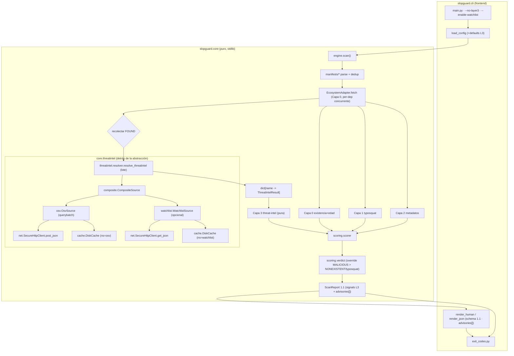

# Documento de Diseño: SlopGuard (Hito 2 — Capa 3 Threat-Intel)

> Fase 2 del flujo Spec-Driven. Fuente de verdad: `specs/slopguard-hito2/requirements.md`
> (R1-R8 + NFR en EARS; tabla de 14 defaults). **Integra** —no reinventa— la arquitectura del
> Hito 1 (`specs/slopguard-hito1/design.md` + `design-parte2/3.md`): reutiliza `SecureHttpClient`,
> `DiskCache`, `safe_json`, la concurrencia y el modelo de señales/veredicto. Cambios **aditivos**
> (`schema_version` 1.0 → 1.1). Los ADRs, la trazabilidad y las áreas de alto riesgo viven en
> `design-parte2.md`.

**Convenciones (heredadas, sin cambios):** Python 3.11+, mypy strict, funciones ≤50 líneas,
docstrings en español, identificadores en inglés. **Cero dependencias de runtime (solo stdlib).**
Core sin imports de CLI; la CLI consume solo `slopguard.core`. Resultados inmutables de verdad:
`@dataclass(frozen=True, slots=True)` + `tuple[...]`. Enums `StrEnum`/`IntEnum`. TLS no
desactivable; allowlist de hosts; anti-bomba; degradación segura; invariante anti-FP intacta.

---

## 1. Arquitectura

### 1.1 Dónde encaja la Capa 3

Capa 3 es una **cuarta capa de detección** que corre **después** de Capa 0 (existencia), sobre
las dependencias **existentes** (`FOUND`). A diferencia de las capas 0/1/2 —que son **por-dep** y
puramente locales sobre un `FetchOutcome`/dataset—, la Capa 3 necesita un **viaje de red en lote**
(OSV `querybatch`) y, opcionalmente, otro (watchlist). Por eso el diseño introduce dos piezas:

1. Una **fuente de threat-intel** detrás de una abstracción (`ThreatIntelSource`, Protocol),
   análoga a `EcosystemAdapter`: encapsula red+caché+parseo y devuelve un **modelo normalizado**
   (`ThreatIntelResult` por nombre). El motor de capas/scoring **nunca** habla con OSV/depscope
   directamente, igual que nunca habla con PyPI (frontera R8 ≡ R10 del Hito 1).
2. Una **capa 3 pura** (`core/layers/layer3_threatintel.py`) que consume el `ThreatIntelResult`
   ya resuelto (como L0 consume `FetchOutcome`) y emite señales `MALICIOUS`/`KNOWN_HALLUCINATION`/
   `THREATINTEL_UNVERIFIABLE`. **No importa red ni fuente concreta.**

El **engine** orquesta el nuevo intercalado: tras el fetch concurrente de Capa 0 recolecta los
nombres `FOUND`, los resuelve en **lote** contra la fuente de threat-intel (chunked, cacheado,
dedup) y luego evalúa las capas 0→1→2→3 por-dep con el resultado de threat-intel ya disponible.

### 1.2 Componentes nuevos

| Componente | Módulo | Responsabilidad | Capa |
|---|---|---|---|
| Fuente threat-intel (interfaz) | `core/threatintel/source.py` | `ThreatIntelSource` Protocol + modelos de transporte (`ThreatIntelResult`, `MaliceState`). **`Advisory` NO vive aquí: es modelo hoja en `core/models.py`** (§2.2, finding R-Advisory) | core |
| Fuente OSV | `core/threatintel/osv.py` | `POST /v1/querybatch` vía `SecureHttpClient`; parsea `results[].vulns[].id`, filtra prefijo `MAL-`; caché por-nombre | core |
| Fuente watchlist | `core/threatintel/watchlist.py` | `GET` corpus depscope; parseo + match exacto del nombre normalizado; caché del corpus | core |
| Composición | `core/threatintel/composite.py` | Combina OSV (siempre) + watchlist (si `enable_watchlist`) en un único `ThreatIntelResult` por nombre | core |
| Resolución en lote | `core/threatintel/resolver.py` | Chunking ≤ `osv_batch_max`, dedup, presupuesto de timeout por lote, degradación segura → `dict[str, ThreatIntelResult]` | core |
| **Capa 3** | `core/layers/layer3_threatintel.py` | `ThreatIntelResult` → señales L3 (pura, sin red) | core |
| Registro de fuentes | `core/threatintel/registry.py` | Factory `get_threatintel_source(config, use_cache)`; None si `enable_layer3=false` | core |

Módulos **extendidos** (cambios aditivos, sin romper el Hito 1):
- `core/models.py`: 3 nuevos `SignalCode`, nuevo `Layer.L3`, **`Advisory` (modelo hoja, decisión
  firme — ver §2.2 y el contrato de import abajo)**, campo `advisories` en `DependencyResult`.
- `core/config.py`: 14 defaults nuevos (tabla R5), validación de rangos, validación de host https.
- `core/net/http_client.py`: `post_json` + allowlist **dinámica por instancia** (ver §3.3 y ADR-09).
- `core/scoring/verdict.py`: override `MALICIOUS` (precede a typosquat; coexiste con `NONEXISTENT`).
- `core/engine.py`: intercalado del `querybatch` entre Capa 0 y las capas por-dep (§4).
- `core/__init__.py`: re-exporta `Advisory` y los nuevos `SignalCode` para el render.

### 1.3 Layout `src/` (añadidos en **negrita**)

```
src/slopguard/core/
  models.py            # + Layer.L3, SignalCode MALICIOUS/KNOWN_HALLUCINATION/THREATINTEL_UNVERIFIABLE, Advisory, DependencyResult.advisories
  config.py            # + 14 defaults de Capa 3 + validación host https
  engine.py            # + intercalado querybatch (0 → [resolve L3 batch] → 0/1/2/3 por-dep)
  net/http_client.py   # + post_json; allowlist por-instancia (extra_allowed_hosts)
  scoring/verdict.py   # + override MALICIOUS
  threatintel/                       # **NUEVO paquete**
    __init__.py        # **vacío de lógica: NO re-exporta osv/watchlist/composite/resolver (mantiene la frontera verificable)**
    source.py          # **ThreatIntelSource (Protocol) + ThreatIntelResult/MaliceState** (importa Advisory de core.models — §2.2)
    osv.py             # **OsvSource: querybatch + parseo MAL- + caché**
    watchlist.py       # **WatchlistSource: corpus depscope + match exacto + caché**
    composite.py       # **CompositeSource: OSV (+watchlist) → ThreatIntelResult**
    resolver.py        # **resolve_threatintel: chunk + dedup + presupuesto + degradación**
    registry.py        # **get_threatintel_source(config, use_cache)**
  layers/
    layer3_threatintel.py            # **Capa 3 pura: ThreatIntelResult → señales L3**
```

**Contratos de import (import-linter — extiende los del Hito 1).**

> **Resolución del conflicto frontera ↔ `Advisory` (finding R-arquitectura/rojo).** El finding
> detecta que `build_dependency_result` (en `core.scoring.verdict`) debe poblar `advisories[]` y
> por tanto necesita el tipo `Advisory`; si `Advisory` viviera en `core.threatintel.source`, el
> contrato `core.scoring ✗→ core.threatintel.*` rompería el build. **Decisión firme (opción a):**
> `Advisory` es un **modelo puro hoja en `core/models.py`** (donde §1.2 ya lo coloca; se corrige la
> contradicción de §2.2). Así `verdict.py` importa `Advisory` desde `core.models` —módulo hoja ya
> permitido— y la frontera queda **sin excepciones**: `core.layers`/`core.scoring` ✗→ TODO
> `core.threatintel` (incluido `source`). Las capas/scoring **no necesitan** importar nada de
> `core.threatintel`: la Capa 3 recibe `ThreatIntelResult` ya construido como entrada pura, y las
> señales L3 portan el subconjunto de datos que `verdict.py` necesita (los `Advisory` ya viven en
> la señal/resultado como objetos `core.models.Advisory`). Ver §3.5 para el mecanismo exacto.

Bloques `[[tool.importlinter.contracts]]` concretos a añadir a `pyproject.toml` (materializados —
no solo prosa— para que las propiedades estáticas 1/2 sean verificables mecánicamente; el contrato
actual `forbidden core.net` se mantiene y se complementa, no se reemplaza):

```toml
# (1) Capas y scoring NO importan las impls de red de threat-intel (R8.1/R8.3).
#     NOTA: se prohíbe TODO core.threatintel para capas/scoring, sin excepción —
#     posible porque Advisory vive en core.models (hoja), no en core.threatintel.
[[tool.importlinter.contracts]]
name = "Capas y scoring no dependen de la red de threat-intel (R8.1/R8.3)"
type = "forbidden"
source_modules = ["slopguard.core.layers", "slopguard.core.scoring"]
forbidden_modules = ["slopguard.core.threatintel", "slopguard.core.net"]

# (2) La interfaz/transporte-modelo de fuente NO conoce el transporte concreto;
#     las IMPLS (osv/watchlist/composite/resolver) sí pueden usar net/cache.
[[tool.importlinter.contracts]]
name = "La interfaz de fuente threat-intel no conoce la red (R8.1)"
type = "forbidden"
source_modules = ["slopguard.core.threatintel.source"]
forbidden_modules = ["slopguard.core.net"]

# (3) Layer 3 (capa pura) depende SOLO de la abstracción + modelos, nunca de
#     impls concretas — refuerzo a nivel de submódulo (cubierto por (1), explícito).
[[tool.importlinter.contracts]]
name = "Capa 3 pura solo usa la abstracción de fuente (R8.3)"
type = "forbidden"
source_modules = ["slopguard.core.layers.layer3_threatintel"]
forbidden_modules = [
  "slopguard.core.threatintel.osv",
  "slopguard.core.threatintel.watchlist",
  "slopguard.core.threatintel.composite",
  "slopguard.core.threatintel.resolver",
]
```

- `core.*` ✗→ `cli.*` (contrato del Hito 1 sin cambios).
- Regla AST/lint (ruff S): prohibido `eval`/`exec`/`pickle`/`marshal` sobre respuestas de
  OSV/depscope (NFR-Seg.2; ya cubierto por el select `S` del Hito 1, sin contrato nuevo).
- Guardia estático de allowlist generalizado (ADR-09): test (no import-linter) que verifica
  `ALLOWED_HOSTS == {pypi.org}` (base) y que el conjunto efectivo por-instancia ⊆
  `{pypi.org, api.osv.dev, depscope.dev}`, con `depscope.dev` solo si `enable_watchlist`.

**Verificación de no-colisión (finding amarillo/arquitectura).** El contrato (1) prohíbe
`core.scoring → core.threatintel`, y `verdict.py` (en `core.scoring`) importa `Advisory` de
`core.models` (NO de `core.threatintel`): no hay colisión. Un test de import-linter en CI confirma
que los tres contratos pasan con el árbol de imports real antes de cerrar la Fase 3.

### 1.4 Diagrama de componentes y frontera de import



**Frontera (R8.1/R8.3):** `L0/L1/L2/SC/V` dependen solo de `core.models`, `core.config` y
`core.adapters.base`. `L3` (`layer3_threatintel`) depende de `core.models` (consume
`ThreatIntelResult`/`Advisory` como datos puros, ambos en `core.models`); **no importa
`core.threatintel.*`** —ni siquiera `source`— porque el `ThreatIntelResult` ya viene construido e
inyectado por el engine (la Capa 3 nunca instancia ni llama a una fuente). El **engine** (en
`core`, fuera de capas/scoring) es quien importa `core.threatintel.resolver`/`registry`, igual que
importa `adapters.concurrent` en el Hito 1. Las líneas hacia `osv/watchlist/composite/resolver/
net/cache` quedan confinadas dentro del paquete `core.threatintel`. Añadir una nueva fuente
(p.ej. GitHub Advisory) = un módulo nuevo que implemente `ThreatIntelSource`, sin tocar capas ni
scoring (R8.2).

> **Nota de modelado (resuelve el conflicto `Advisory` ↔ frontera).** `Advisory`, `ThreatIntelResult`
> y `MaliceState` son **modelos de dominio puros**. `Advisory` y el campo `DependencyResult.advisories`
> viven en `core.models` (hoja); `ThreatIntelResult`/`MaliceState` viven en `core.threatintel.source`
> SOLO porque son el contrato de transporte de la fuente y la Capa 3 los recibe ya construidos. Como
> la Capa 3 los recibe inyectados (no los importa para instanciarlos), no cruza la frontera. Si en la
> implementación resultara más limpio, `ThreatIntelResult`/`MaliceState` pueden moverse también a
> `core.models` sin cambiar ninguna decisión (son hojas); `Advisory` SÍ debe estar en `core.models`
> obligatoriamente porque `core.scoring.verdict` lo necesita (ver §3.5 y contratos §1.3).

---

## 2. Modelos de datos

Todo modelo nuevo es `@dataclass(frozen=True, slots=True)`; colecciones = `tuple[...]`. Enums
`StrEnum`. Los cambios al modelo del Hito 1 son **aditivos con default**, para no romper a los
constructores existentes ni los tests (619 verdes).

### 2.1 Nuevos `SignalCode` y `Layer.L3` (en `core/models.py`)

```python
class Layer(IntEnum):
    L0 = 0; L1 = 1; L2 = 2
    L3 = 3                                   # NUEVO: threat-intel

class SignalCode(StrEnum):
    # ... (Hito 1 sin cambios) ...
    MALICIOUS = "malicious"                         # L3, DURA, override de block (ADR-06)
    KNOWN_HALLUCINATION = "known_hallucination"     # L3, DURA, peso ≥ umbral_block (ADR-07)
    THREATINTEL_UNVERIFIABLE = "threatintel_unverifiable"  # L3, BLANDA informativa (peso 0)
```

- `MALICIOUS`: `is_soft=False`, `weight=0` (como `NONEXISTENT`: el veredicto lo fija el override,
  no el scoring). Porta `advisories` vía el resultado, no vía el peso.
  - **Tratamiento en `_max_hard_weight` (finding amarillo/simetría):** con `weight=0`, `MALICIOUS`
    es inocuo si **atravesara** el scorer (no altera el máximo de duras). Pero el escenario donde
    `MALICIOUS` llega al scorer **no existe**: `build_dependency_result` lo intercepta en la rama de
    override **antes** de llamar a `compute_score` (§3.5, ADR-06), igual que `NONEXISTENT`. Por
    **simetría y defensa en profundidad** se **excluye explícitamente `MALICIOUS` por code en
    `_max_hard_weight`** junto a `NONEXISTENT` (ambos son overrides `weight=0` que no deben
    contribuir al score numérico). El filtro pasa de `if signal.code is SignalCode.NONEXISTENT`
    a `if signal.code in {SignalCode.NONEXISTENT, SignalCode.MALICIOUS}`. Cambio quirúrgico, sin
    efecto numérico (weight 0), que blinda contra que un futuro cambio de peso lo deje colarse.
- `KNOWN_HALLUCINATION`: `is_soft=False`, `weight=85` (≥ `umbral_block`=80; ADR-07). Bloquea por
  score, **no** por override → coexiste con la invariante anti-FP sin tocar el scorer.
  - **En `_max_hard_weight`:** sí participa con su peso 85 (es una dura legítima que SÍ contribuye
    al score); NO se filtra por code. Es el único de los tres `SignalCode` L3 que entra al scorer.
- `THREATINTEL_UNVERIFIABLE`: `is_soft=True`, `weight=0`. **Nunca** eleva a warn/block por sí
  sola (R3.3): solo marca el `status` de la dep a `unverifiable` cuando no hay block dominante.

### 2.1-bis `Advisory` (modelo hoja en `core/models.py`)

**Decisión firme (resuelve la contradicción §1.2-vs-§2.2):** `Advisory` vive en `core/models.py`,
NO en `core/threatintel/source.py`. Razón: `DependencyResult.advisories: tuple[Advisory, ...]`
(§2.3) y `build_dependency_result` (en `core.scoring.verdict`) lo necesitan, y la frontera
import-linter prohíbe que `core.scoring` importe `core.threatintel`. Al ser `core.models` un módulo
**hoja** (no importa nada del paquete), tanto `verdict.py` como `source.py` pueden importarlo sin
cruzar fronteras.

```python
# en core/models.py (junto a DependencyResult)
@dataclass(frozen=True, slots=True)
class Advisory:
    """Advisory de malicia normalizado y SANEADO (nunca payload crudo de OSV)."""
    id: str                  # p.ej. "MAL-2025-47868" (validado: prefijo MAL-, charset acotado)
    kind: str                # "malicious" (única clase relevante en Hito 2)
    url: str                 # "https://osv.dev/vulnerability/<id>" (construido, no reflejado)
    source: str              # "osv"
```

### 2.2 Modelos de transporte de threat-intel (en `core/threatintel/source.py`)

`source.py` importa `Advisory` de `core.models` (no lo redefine). Define solo el contrato de
transporte de la fuente (`MaliceState`, `ThreatIntelResult`) y el `Protocol`:

```python
from slopguard.core.models import Advisory   # modelo hoja; NO se redefine aquí

class MaliceState(StrEnum):
    """Resultado de consultar malicia/alucinación para UN nombre."""
    CLEAN = "clean"                  # consultado y limpio (sin MAL-, sin match watchlist)
    MALICIOUS = "malicious"          # ≥1 advisory MAL-* (OSV)
    KNOWN_HALLUCINATION = "known_hallucination"  # match exacto en watchlist
    UNVERIFIABLE = "unverifiable"    # la(s) fuente(s) no se pudieron consultar

@dataclass(frozen=True, slots=True)
class ThreatIntelResult:
    """Resultado normalizado de threat-intel para UN nombre (lo que ve la Capa 3)."""
    name: str                                    # nombre normalizado
    state: MaliceState
    advisories: tuple[Advisory, ...]             # vacío salvo state==MALICIOUS
    watchlist_source: str | None                 # procedencia+atribución si KNOWN_HALLUCINATION
    watchlist_date: str | None                   # fecha del corpus (atribución, R2.3/R7.2)
    unverifiable_reason: str | None              # qué fuente falló (saneado), si UNVERIFIABLE
```

`MALICIOUS` **precede** a `KNOWN_HALLUCINATION` dentro de un mismo nombre (ambos refuerzan block;
si OSV ya dice malicioso, ese es el motivo primario). `CLEAN` solo si **todas** las fuentes
activas respondieron limpio. Si OSV falla pero watchlist matchea (o viceversa), el match positivo
domina y la porción no verificable se anota; si **ninguna** señal positiva y **alguna** fuente
falló → `UNVERIFIABLE` (degradación segura, nunca `CLEAN`).

### 2.3 Extensión de `DependencyResult` (aditiva)

```python
@dataclass(frozen=True, slots=True)
class DependencyResult:
    name: str
    version_pin: str | None
    status: Status
    verdict: Verdict | None
    score: int | None
    signals: tuple[LayerSignal, ...]
    suspected_target: str | None
    error_category: ErrorCategory | None
    advisories: tuple[Advisory, ...] = ()   # NUEVO, default () ⇒ retro-compatible
```

El default `()` mantiene compatibles todos los call-sites del Hito 1 (`build_dependency_result`
se extiende para poblarlo desde las señales L3; ver §3.5). Las `signals` de L3 viven en la misma
tupla `signals` que las demás capas (orden de capas 0→1→2→3).

### 2.4 JSON de salida `schema_version="1.1"` (aditivo)

```json
{
  "schema_version": "1.1", "tool_version": "0.2.0", "ecosystem": "pypi",
  "summary": {"total":2,"allow":0,"warn":0,"block":2,"unverifiable":0,"exit_code":2},
  "error_category": null,
  "results": [
    {"name":"bioql","version_pin":null,"status":"ok","verdict":"block","score":null,
     "suspected_target":null,"error_category":null,
     "advisories":[
       {"id":"MAL-2025-47868","kind":"malicious",
        "url":"https://osv.dev/vulnerability/MAL-2025-47868","source":"osv"}],
     "signals":[
       {"layer":3,"code":"malicious","weight":0,"is_soft":false,
        "detail":"Reportado como malicioso por OSV (MAL-2025-47868). No instalar.",
        "suspected_target":null}]},
    {"name":"reqe","version_pin":null,"status":"ok","verdict":"block","score":85,
     "suspected_target":null,"error_category":null,
     "advisories":[],
     "signals":[
       {"layer":3,"code":"known_hallucination","weight":85,"is_soft":false,
        "detail":"Nombre alucinado conocido (corpus depscope-hallucinations, 2026-06-20).",
        "suspected_target":null}]}
  ]
}
```

Reglas (heredadas + nuevas): **sin timestamps de reloj** (determinismo); claves fijas; orden
determinista (`unverifiable→block→warn→allow`, luego nombre); strings externos de OSV/depscope
**saneados** ANSI/C0-C1/CRLF (R7.4). `advisories` se omite-como-`[]` cuando no hay malicia (clave
**siempre presente** para estabilidad del schema 1.1). `score=null` para `MALICIOUS` (override) y
para `unverifiable`; `score` numérico (≥80) para `KNOWN_HALLUCINATION`.

**Compatibilidad hacia atrás (NFR-Compat.1).** El cambio es **estrictamente aditivo**: el engine
sube su constante `_SCHEMA_VERSION` de `"1.0"` a `"1.1"`; el campo `advisories` se **añade** (nunca
se quita ni renombra ninguna clave 1.0). Un consumidor de schema 1.0 ignora `advisories` y las
`signals` de `layer:3` sin romperse (claves nuevas, no modificadas). `DependencyResult.advisories`
tiene default `()` ⇒ todos los call-sites y los 619 tests del Hito 1 siguen construyendo
`DependencyResult` sin pasar `advisories`. Con `enable_layer3=false` el JSON es idéntico al del Hito
1 salvo `schema_version="1.1"` y `advisories:[]` (clave presente pero vacía).

### 2.5 Entradas de caché de threat-intel (JSON-only, namespaced)

Se reutiliza `DiskCache` con **namespace por fuente** en la clave (anti colisión con la caché de
metadatos del Hito 1, que usa `sha256("{ecosystem}:{name}")`). Dos formas:

**OSV (por nombre):** clave `sha256("osv:pypi:{name}")`; TTL `osv_ttl_cache_horas` (6h).
```json
{"cache_schema_version":"ti-1","source":"osv","ecosystem":"pypi","name":"bioql",
 "fetched_at":1718500000.0,"state":"malicious",
 "advisories":[{"id":"MAL-2025-47868","kind":"malicious",
   "url":"https://osv.dev/vulnerability/MAL-2025-47868","source":"osv"}]}
```

**Watchlist (corpus completo, una entrada):** clave `sha256("watchlist:{host}{path}")`; TTL
`watchlist_ttl_cache_horas` (24h). El corpus se cachea como **conjunto de nombres normalizados**
(no se redistribuye embebido en el paquete: solo caché local del usuario, respeta CC-BY-NC-SA).
```json
{"cache_schema_version":"ti-1","source":"watchlist","host":"depscope.dev",
 "fetched_at":1718500000.0,"corpus_date":"2026-06-20","license":"CC-BY-NC-SA-4.0",
 "names":["reqe","djangoo","..."]}
```

Igual que el Hito 1: `state=UNVERIFIABLE` **no** se cachea; lectura defensiva (cualquier
desviación de esquema/tipos/TTL ⇒ miss, no crashea); `--no-cache` ⇒ ni lee ni escribe; dir 0700,
archivo 0600.

**Contrato cerrado de caché threat-intel (decisión firme — resuelve el finding amarillo "caché
sin contrato cerrado" y el de "corpus watchlist sin validación/cap").** Se descarta la subclase;
se añade a `DiskCache` un **par de métodos genéricos JSON-only** que reúsan la maquinaria atómica
y de permisos del Hito 1 (`_atomic_write`, `tempfile.mkstemp` + `os.replace`, `_DIR_MODE=0o700`,
`_FILE_MODE=0o600`), sin duplicarla y sin tocar el camino tipado `get/put` de `FetchOutcome`:

```python
def get_blob(
    self, namespace: str, key: str, validator: Callable[[dict[str, Any]], T | None],
    *, ttl_segundos: int, now: float | None = None,
) -> T | None:
    """Lee un blob JSON validado, namespaced. Miss = deshabilitada/ausente/corrupta/
    expirada/fallo de validación. Clave en disco = sha256(f"{namespace}:{key}").
    Reusa _read_json (json.loads, nunca pickle/eval) y la verificación de TTL."""

def put_blob(
    self, namespace: str, key: str, payload: dict[str, Any],
    *, now: float | None = None,
) -> None:
    """Escribe un blob JSON atómico (0700/0600) bajo sha256(f"{namespace}:{key}").
    No-op si --no-cache. El caller NO debe llamar a put_blob para UNVERIFIABLE."""
```

- **Namespacing de clave:** `sha256(f"{namespace}:{key}")` ⇒ separado por construcción de la caché
  de metadatos del Hito 1 (`sha256(f"{ecosystem}:{name}")`), sin colisión posible (prefijos
  distintos). `namespace ∈ {"osv","watchlist"}`; `key = f"pypi:{name}"` (OSV) o `f"{host}{path}"`
  (watchlist).
- **`cache_schema_version="ti-1"`** obligatorio en el payload; valor distinto ⇒ miss (separa de la
  caché `"1"` del Hito 1).
- **Validador del blob OSV** (rechaza ⇒ miss): `cache_schema_version=="ti-1"`, `source=="osv"`,
  `ecosystem=="pypi"`, `name==<clave esperada>`, `state ∈ {"clean","malicious"}` (NUNCA
  `"unverifiable"` en disco), `advisories` lista de objetos con `id` que matchea
  `^MAL-[0-9A-Za-z-]+$` acotado en longitud y `url` reconstruible (no se confía en la url del disco:
  se **re-construye** de `id`), `source=="osv"`, `kind=="malicious"`.
- **Validador del corpus watchlist (endurecido — finding amarillo "corpus watchlist"):**
  `cache_schema_version=="ti-1"`, `source=="watchlist"`, `host==<watchlist_host esperado>`,
  `names` es lista de strings; **cada nombre se re-normaliza PEP 503 y se valida charset**
  `^[a-z0-9-]+$` al **leer** (no solo al escribir): cualquier nombre que no valide se **descarta**
  (no invalida el corpus entero salvo que quede vacío). **Cap de tamaño:** `len(names) ≤
  _WATCHLIST_MAX_NAMES` (p.ej. 1_000_000) y longitud por nombre ≤ `nombre_max_chars`; exceder el
  cap ⇒ **miss** (no se confía en un corpus inflado que pudiera ser un DoS de memoria). Una
  escritura maliciosa que inyecte falsos `KNOWN_HALLUCINATION` o retire nombres reales se mitiga
  con: perms 0600 (solo el usuario escribe), validación fuerte al leer, y TTL 24h (auto-refresh).
  Cualquier desviación de esquema/charset/cap ⇒ miss ⇒ refetch desde la fuente.
- **UNVERIFIABLE nunca se cachea:** el caller (`OsvSource`/`WatchlistSource`) NO invoca `put_blob`
  cuando el estado es `UNVERIFIABLE` (idéntico al Hito 1 con `_CACHEABLE_STATES`).

Ver área de alto riesgo §design-parte2 RISK-H2-2 (caché threat-intel + corpus envenenado).

---

## 3. Contratos de API

### 3.1 Interfaz `ThreatIntelSource` (extensibilidad — R8)

```python
class ThreatIntelSource(Protocol):
    """Abstrae la consulta de malicia (por lote) y de watchlist (por lote/corpus).

    El ENGINE (no las capas/scoring) depende de esta interfaz para resolver el lote;
    las capas/scoring NO la importan: reciben el `ThreatIntelResult` ya construido como
    dato puro (los modelos `ThreatIntelResult`/`Advisory`/`MaliceState` son de dominio,
    `Advisory` vive en `core.models`). Ninguna de las dos toca OSV/depscope ni la red
    (R8.1/R8.3, import-linter §1.3). Añadir una fuente = implementar este Protocol, sin
    tocar capas/scoring (R8.2).
    """
    source_id: str
    extra_allowed_hosts: frozenset[str]   # hosts que esta fuente necesita en el allowlist

    def query_batch(self, names: Sequence[str]) -> dict[str, ThreatIntelResult]:
        """Resuelve malicia + watchlist para un LOTE de nombres normalizados (deduplicados).

        Devuelve un dict indexado por nombre normalizado; cada valor es CLEAN / MALICIOUS
        / KNOWN_HALLUCINATION / UNVERIFIABLE, nunca un veredicto. Aplica caché, TLS,
        allowlist, streaming y límites internamente. NO lanza por nombre limpio ni por
        fallo de red transitorio: degrada a UNVERIFIABLE (nunca un falso CLEAN). Solo
        propaga errores OPERACIONALES TOTALES (config inválida) — análogo a `fetch`.
        """
        ...
```

Una sola operación de lote (`query_batch`) cubre tanto OSV como watchlist: `CompositeSource`
fan-out a `OsvSource` (siempre) y `WatchlistSource` (si activa) y fusiona por nombre (§2.2). La
watchlist no necesita un método aparte en la interfaz pública: su corpus se carga una vez por
lote y el match exacto es local. Esto mantiene la interfaz mínima y desacoplada (R8.1).

### 3.2 Contrato OSV — `POST /v1/querybatch`

**Request** (cuerpo exacto; **solo** nombre+ecosistema, R1.8/NFR-Priv.1/NFR-Seg.4):
```json
{
  "queries": [
    {"package": {"ecosystem": "PyPI", "name": "bioql"}},
    {"package": {"ecosystem": "PyPI", "name": "requests"}}
  ]
}
```
- `ecosystem` = `"PyPI"` (capitalización OSV; constante, no reflejada del usuario).
- `name` = nombre **normalizado PEP 503 + validado por charset en `build_body`** (ver abajo).
- **No** se envía versión, manifiesto, rutas ni `page_token` con datos del usuario.
- `Content-Type: application/json`, `Accept: application/json`, `Accept-Encoding: identity`.

**Validación de charset del nombre en el cuerpo del POST (finding rojo/seguridad).** `normalize_name`
del Hito 1 (PEP 503) **NO** valida charset —solo hace `lowercase` + colapso de `[-_.]`—, de modo que
un nombre con CRLF/ANSI/unicode (p.ej. `requests\r\nX-Inject: y`) **sobrevive** la normalización y,
sin validación, se reflejaría en el **body JSON del POST** a OSV. Aunque `json.dumps` escapa CRLF
dentro del string JSON, el principio NFR-Seg.4 ("no reflejar entrada no confiable cruda") y la
defensa en profundidad exigen un **predicado de charset propio** antes de serializar:

```python
# en core/threatintel/osv.py (o normalize.py como helper reutilizable)
_OSV_NAME_RE = re.compile(r"^[a-z0-9](?:[a-z0-9-]{0,98}[a-z0-9])?$")  # PEP 503 normalizado, ≤100

def _is_valid_osv_name(name: str) -> bool:
    """True si el nombre normalizado es seguro para el body del POST (charset acotado)."""
    return bool(_OSV_NAME_RE.match(name))
```

- En `OsvSource.query_batch`/`build_body`: por cada nombre, si `_is_valid_osv_name(name)` es
  **False**, el nombre se **excluye del request** y su `ThreatIntelResult` se fija a
  `state=UNVERIFIABLE` (`unverifiable_reason="nombre con charset inválido, no consultado"`), nunca
  `CLEAN`. Así un nombre envenenado ni viaja a OSV ni produce un falso limpio. (Un nombre normalizado
  PEP 503 legítimo siempre matchea; el caso inválido solo ocurre con entrada manipulada que esquivó
  el parser, defensa en profundidad.)
- El mismo predicado se aplica al construir `Advisory.url`: solo se reconstruye desde un `id` que
  matchee `^MAL-[0-9A-Za-z-]+$` (§3.2 response); jamás se refleja un id crudo en la URL.

**Response** (parseo defensivo; el orden de `results` es **posicional** respecto a `queries`):
```json
{ "results": [ {"vulns": [{"id": "MAL-2025-47868", "modified": "..."}]}, {} ] }
```
- `results[i]` corresponde a `queries[i]` (mapeo por índice; se valida `len(results)==len(queries)`,
  si no ⇒ todo el lote `UNVERIFIABLE`, nunca se asume limpio).
- Para cada `results[i]`: recolectar `vulns[].id` que **empiecen por `MAL-`** (case-sensitive,
  prefijo exacto). ≥1 ⇒ `state=MALICIOUS` + `Advisory` por cada id. IDs sin prefijo `MAL-`
  (`GHSA-*`, `CVE-*`, `PYSEC-*`) se **ignoran** para el veredicto (R1.3). `results[i]` ausente,
  `{}` o `vulns=[]` ⇒ `CLEAN` para ese nombre (R1.4).
- **Paginación:** si `results[i]` trae `next_page_token`, en Hito 2 se trata como lote no
  totalmente resuelto para ese nombre y se degrada conservadoramente a `UNVERIFIABLE` para ese
  nombre (no se asume limpio); paginar es post-MVP (documentado en non-goals). En la práctica
  `MAL-*` no pagina (pocos advisories por paquete).
- Validación de `id` antes de construir `Advisory.url`: `^MAL-[0-9A-Za-z-]+$` acotado en longitud;
  cualquier id que no valide se descarta (nunca se refleja en una URL).

**Contrato de chunking y reensamblado posicional bajo dedup (finding amarillo/trazabilidad).** El
mapeo posicional `results[i] ↔ queries[i]` solo es seguro **dentro de un mismo chunk**. El contrato
exacto del reensamblado `dict[name → ThreatIntelResult]` cuando `len(found) > osv_batch_max`:

1. **Dedup global ANTES del chunking.** `resolve_threatintel` deduplica los nombres normalizados de
   TODO el lote (una sola vez) y luego los parte en chunks `≤ osv_batch_max`. Consecuencia: **ningún
   nombre aparece en dos chunks** ⇒ colisión inter-chunk es **imposible por construcción** (no hay que
   "fusionar" resultados de un mismo nombre entre chunks).
2. **Orden preservado dentro del chunk.** Cada chunk envía `queries` en el orden de sus nombres
   deduplicados; `OsvSource` valida `len(results)==len(queries)` **por chunk** (mismatch ⇒ ese chunk
   completo `UNVERIFIABLE`, no se asume limpio) y construye `{queries[i].name: result_de(results[i])}`.
3. **Construcción del dict final por clave única.** El dict global se construye por **nombre
   normalizado** (clave única); se fusionan los sub-dicts de cada chunk con `dict.update` (sin riesgo
   de sobre-escritura porque las claves son disjuntas entre chunks, punto 1).
4. **Cobertura total (invariante de no-pérdida — ver también §4.1):** tras procesar todos los chunks,
   **todo nombre de `found` tiene entrada** en el dict (`CLEAN`/`MALICIOUS`/`KNOWN_HALLUCINATION`/
   `UNVERIFIABLE`), **nunca ausente**. Un nombre que se excluyó por charset inválido (arriba) entra
   como `UNVERIFIABLE`, no se omite.

Test obligatorio (RISK-H2-3): `> osv_batch_max` nombres con casos en la **frontera de chunk** (último
de un chunk y primero del siguiente), verificando reensamblado correcto y cobertura total.

### 3.3 Contrato del cliente HTTP — `post_json` (extiende `core/net`)

```python
class SecureHttpClient:
    def __init__(self, *, extra_allowed_hosts: frozenset[str] = frozenset()) -> None:
        """Allowlist EFECTIVA = ALLOWED_HOSTS (base {pypi.org}) | extra_allowed_hosts.

        `extra_allowed_hosts` lo aporta la fuente de threat-intel (osv → {api.osv.dev};
        watchlist → {depscope.dev} solo si enable_watchlist). El guardia estático sigue
        anclando ALLOWED_HOSTS=={pypi.org}; la ampliación es explícita y acotada (ADR-09)."""

    def post_json(self, url: str, body: dict[str, object], *, connect_timeout_s: float,
                  read_timeout_s: float, max_response_bytes: int,
                  max_json_depth: int) -> dict[str, object]:
        """POST HTTPS con cuerpo JSON sobre un host de la allowlist EFECTIVA.

        Mismas defensas que get_json: scheme=https obligatorio, host∈allowlist (URL inicial
        y redirecciones), TLS verificado no desactivable, sin redirect cross-scheme/host,
        Content-Length acotado, lectura streaming ≤max_response_bytes, descompresión
        incremental con cota, safe_json_loads(max_json_depth). Serializa `body` con
        json.dumps(separators, ensure_ascii) y lo envía como bytes. Cualquier anomalía ⇒
        NetworkUnverifiableError (con status_code/is_transient para clasificar 5xx/429)."""
```

El allowlist deja de ser un `frozenset` global único: pasa a ser **base global + extra por
instancia**, validado en `_validate_url` contra `self._allowed_hosts`. `ALLOWED_HOSTS` (la base
`{pypi.org}`) permanece como constante anclada por el guardia estático; ningún host nuevo se
hard-codea en la base (ADR-09).

**Fix SSRF del redirect handler (finding rojo/seguridad — bloqueante).** En el Hito 1,
`_RejectRedirectHandler.redirect_request` valida el `Location` con la función **módulo-global**
`_is_allowed`, que consulta la constante **global** `ALLOWED_HOSTS = {pypi.org}`. Con la allowlist
por-instancia esto abre un agujero: un `30x` desde `api.osv.dev` hacia un host arbitrario se
evaluaría contra `{pypi.org}` (global), NO contra el conjunto efectivo de la instancia. Peor: si la
validación de redirect siguiera usando la global mientras la URL inicial usa la efectiva, las dos
fronteras divergen. **Decisión:** el conjunto efectivo `self._allowed_hosts` se **inyecta al redirect
handler** en construcción, y el handler valida contra **el mismo conjunto** que la URL inicial:

```python
class _RejectRedirectHandler(urllib.request.HTTPRedirectHandler):
    def __init__(self, allowed_hosts: frozenset[str]) -> None:
        self._allowed_hosts = allowed_hosts        # conjunto EFECTIVO de la instancia

    def redirect_request(self, req, fp, code, msg, headers, newurl):
        parts = urlsplit(newurl)
        scheme_ok = parts.scheme.lower() == _ALLOWED_SCHEME
        host_ok = (parts.hostname or "").lower() in self._allowed_hosts
        if not (scheme_ok and host_ok):
            raise NetworkUnverifiableError("redireccion a destino no permitido rechazada")
        raise NetworkUnverifiableError("redireccion inesperada de la fuente rechazada")
```

`SecureHttpClient.__init__` pasa `self._allowed_hosts` (= `ALLOWED_HOSTS | extra_allowed_hosts`)
tanto a `_validate_url` (URL inicial **y** la usada en cada redirect) como al `_RejectRedirectHandler`.
**Invariante a testear (RISK-H2-1):** redirect `api.osv.dev → host-arbitrario` ⇒
`NetworkUnverifiableError`; redirect `api.osv.dev → pypi.org` ⇒ también rechazado (cross-host, aunque
ambos estén en el efectivo: la política sigue siendo "ninguna redirección se sigue", el handler
**siempre** lanza; la única diferencia es el mensaje). La misma allowlist efectiva gobierna URL
inicial y redirección.

**Clasificación de `429` como transitorio (finding amarillo/trazabilidad R1.7).** El handler de
`HTTPError` del Hito 1 fija `is_transient = (500 <= code <= 599)`; un `429` (rate limit) llega como
`HTTPError code=429 < 500` ⇒ `is_transient=False` ⇒ **no se reintentaría**, contradiciendo R1.7
(429 debe reintentarse y, tras agotar, `UNVERIFIABLE`). **Cambio concreto** en `http_client.py`:
añadir la constante nombrada `_HTTP_RATE_LIMIT: Final[int] = 429` y ampliar la rama:

```python
is_transient = (_HTTP_SERVER_ERROR_MIN <= exc.code <= _HTTP_SERVER_ERROR_MAX) \
               or exc.code == _HTTP_RATE_LIMIT
```

Tras agotar reintentos sobre un `429` ⇒ `UNVERIFIABLE` (nunca `CLEAN`). Test obligatorio:
`429 ⇒ reintento ⇒ (agotado) ⇒ UNVERIFIABLE`, sin pasar nunca por `CLEAN`. Este cambio es
retro-compatible con el Hito 1 (PyPI rara vez devuelve 429 a `get_json`; si lo hace, ahora se
reintenta, lo cual es estrictamente más conservador y no altera ningún test verde existente que no
ejercite 429).

### 3.4 Contrato de la watchlist — `GET` corpus depscope

**Request:** `GET https://depscope.dev/api/benchmark/hallucinations` (host+path configurables;
`enable_watchlist` debe ser true; si no, **no** se añade `depscope.dev` al allowlist — R2.1).
Solo se envía la petición GET; **nada** del usuario viaja en query string (NFR-Priv.1).

**Response (parseo del corpus):** se espera un JSON con una lista de nombres de paquete alucinados
(estructura tolerante: lista de strings, o lista de objetos con campo `name`/`package`). El parser:
1. Extrae los nombres, los **normaliza PEP 503 y valida charset** `^[a-z0-9-]+$` y longitud
   ≤ `nombre_max_chars`; descarta los que no validan (no invalida el corpus entero).
2. Aplica el **cap `_WATCHLIST_MAX_NAMES`** (§2.5): si la lista excede el cap ⇒ watchlist
   `UNVERIFIABLE` (corpus inflado/sospechoso, anti-DoS de memoria), no se trunca silenciosamente.
3. Construye un `frozenset[str]` de nombres normalizados (el corpus cacheado, §2.5).
4. Captura `corpus_date`/atribución/licencia si vienen (para R7.2). Si la estructura no se
   reconoce, excede el cap o falla la verificación ⇒ watchlist `UNVERIFIABLE` (no invalida OSV — R2.5).

El mismo conjunto de validaciones (charset, cap, schema) se aplica **al leer la caché** (§2.5), no
solo al parsear la respuesta de red: una entrada de caché manipulada se trata como entrada no
confiable (desviación ⇒ miss ⇒ refetch).

**Match:** `state=KNOWN_HALLUCINATION` ⟺ `name_normalizado ∈ corpus` (igualdad exacta, R2.3). No
hay fuzzy match en watchlist (eso es Capa 1); el corpus es de nombres exactos registrados.

### 3.5 Resolución en lote y veredicto (extiende `core/scoring/verdict.py`)

```python
def resolve_threatintel(
    source: ThreatIntelSource | None,
    found_names: Sequence[str],
    config: Config,
) -> dict[str, ThreatIntelResult]:
    """Resuelve threat-intel para los nombres FOUND, en lotes ≤ osv_batch_max, deduplicado.

    PRECONDICIÓN (finding amarillo/arquitectura, ver §4.1): `found_names` son los nombres YA
    NORMALIZADOS por `adapter.normalize_name`, idénticos a las CLAVES de `outcomes` de fetch_many.
    El dict devuelto se indexa con esos mismos nombres normalizados (clave consistente).

    source=None (enable_layer3=false) ⇒ {} (modo solo-deterministas, R5.3). Divide en chunks,
    dedup, aplica el presupuesto por lote; cualquier fallo de lote ⇒ los nombres de ESE lote
    quedan UNVERIFIABLE (degradación segura, nunca CLEAN). Determinista respecto a caché.

    INVARIANTE DE COBERTURA: el dict devuelto contiene UNA entrada por cada nombre normalizado de
    `found_names` (CLEAN/MALICIOUS/KNOWN_HALLUCINATION/UNVERIFIABLE), nunca ausente (§3.2 punto 4)."""
```

**Mecanismo del presupuesto/reintentos del lote OSV (finding amarillo/trazabilidad ADR-08).** La
tabla R5 define `osv_timeout_total_por_lote_s` y `osv_reintentos`, pero la maquinaria del Hito 1
(`_retry_transient`/`_sleep_within_budget` en `concurrent.py`) está acoplada a
`RetryableAdapter.fetch_attempt` y a `timeout_total_por_dep_s`/`reintentos_red` (por-dependencia,
no reutilizable tal cual para un POST de lote). **Decisión:** `OsvSource.query_batch` encapsula su
propio loop de reintento **por-chunk** con un helper `_retry_batch` que **reusa la semántica** del
backoff/deadline del Hito 1 (no el código acoplado al adapter):

```python
# en core/threatintel/osv.py
def _retry_batch(self, post_call: Callable[[], dict], config: Config) -> dict | None:
    """Reintenta UN POST de chunk con backoff exponencial dentro del presupuesto por lote.

    deadline = time.monotonic() + config.osv_timeout_total_por_lote_s
    max_attempts = config.osv_reintentos + 1
    Solo reintenta si NetworkUnverifiableError.is_transient (5xx/429/timeout/conexión caída).
    Backoff exponencial base 0.5s (idéntico a _sleep_within_budget). Si se agota el presupuesto
    o los reintentos ⇒ devuelve None ⇒ el caller marca el chunk UNVERIFIABLE (nunca CLEAN)."""
```

- **Deadline por lote**, no por nombre: el presupuesto `osv_timeout_total_por_lote_s` acota la
  secuencia intentos+esperas de un chunk; el `read_timeout_s`/`connect_timeout_s` del socket sigue
  acotando un POST ya en vuelo (igual cota dura que el Hito 1).
- **Reuso de la semántica, no del código:** `_retry_batch` replica el patrón
  `while not deadline_pasado: intento; if transient and quedan_reintentos and cabe_backoff: sleep`
  de `_retry_transient`, pero sobre `is_transient` de `NetworkUnverifiableError` (que ahora incluye
  429, §3.3) en vez de `FetchAttempt`. No se modifica `concurrent.py` (sigue siendo per-dep).
- **Determinismo:** sin reloj de pared para el veredicto; el backoff usa `time.monotonic`.

---

**Extensión de `build_dependency_result` — nueva rama de precedencia explícita (finding rojo/amarillo
de precedencia + THREATINTEL_UNVERIFIABLE).** El finding detecta dos bugs latentes en el flujo del
Hito 1:

1. **`ctx.is_unverifiable` NO debe activarse por threat-intel caído.** Hoy `is_unverifiable` es un
   flag de **CONTEXTO** calculado en el engine a partir del `FetchOutcome` (Capa 0): es la primera
   rama de `build_dependency_result` y produce `verdict=None`. Si threat-intel caído sobre una dep
   **MALICIOUS** activara `is_unverifiable`, se perdería el block (la rama de unverifiable precede al
   override). **Decisión:** `ctx.is_unverifiable` queda **SOLO** ligado a Capa 0 (existencia no
   verificable). El threat-intel caído NO toca `ctx.is_unverifiable`; entra por una **rama nueva**
   que se evalúa **DESPUÉS** de los overrides y del score (ver tabla). Caso crítico:
   **threat-intel caído + MALICIOUS ⇒ block** (la señal MALICIOUS, si existe, viene de un OSV que SÍ
   respondió para ese nombre; no hay contradicción).
2. **Una señal L3 blanda en `signals` no tenía camino para cambiar `status`.** El scorer la ignora
   (weight 0) y caería en score normal ⇒ ALLOW (falso "todo bien", prohibido por ADR-10). **Decisión:**
   `build_dependency_result` gana una **rama que inspecciona las señales L3** (no el ctx) y respeta
   `config.threatintel_degraded_status`.

**Nuevo orden de precedencia de `build_dependency_result` (reemplaza al de 3 ramas del Hito 1):**

```
1. ctx.is_unverifiable (Capa 0)              -> status=UNVERIFIABLE, verdict=None, score=None  (Hito 1, sin cambios)
2. _has_malicious(signals)                   -> status=OK, verdict=BLOCK, score=None, advisories[]  (NUEVO override, ADR-06, MÁX)
3. _has_nonexistent(signals)                 -> status=OK, verdict=BLOCK, score=None              (Hito 1, sin cambios)
4. score normal (typosquat / KNOWN_HALLUCINATION-85 / blandas)
     -> score = compute_score(signals); verdict = score_to_verdict(score)
     -> if verdict in {BLOCK, WARN}: devolver con ese verdict (block/warn DOMINA sobre threat-intel caído)
     -> else (verdict == ALLOW):
          if _has_threatintel_unverifiable(signals):     # blanda L3, peso 0
             if config.threatintel_degraded_status == "warn":
                 -> status=OK, verdict=WARN, score=score      # válvula (R4.3, ver nota --strict)
             else:  # "unverifiable" (default)
                 -> status=UNVERIFIABLE, verdict=None, score=None   # R1.6/R4.2, NO allow
          else:
             -> status=OK, verdict=ALLOW, score=score        # todo limpio + threat-intel limpio
```

**Tabla exhaustiva de casos (test de tabla obligatorio, RISK-H2-4):**

| Caso (señales presentes) | status | verdict | score | exit (no-strict) |
|---|---|---|---|---|
| MALICIOUS (override) | ok | block | None | 2 |
| MALICIOUS + NONEXISTENT | ok | block | None | 2 (ambas reportadas) |
| MALICIOUS + TYPOSQUAT | ok | block | None | 2 (ambas reportadas) |
| MALICIOUS + THREATINTEL_UNVERIFIABLE | ok | block | None | 2 (malicia domina, caído no degrada) |
| NONEXISTENT (sin MALICIOUS) | ok | block | None | 2 |
| TYPOSQUAT dl=1 (score 60≥umbral_block? no, warn) | ok | warn | 60 | 1 |
| KNOWN_HALLUCINATION (85≥80) | ok | block | 85 | 2 |
| KNOWN_HALLUCINATION + THREATINTEL_UNVERIFIABLE | ok | block | 85 | 2 (block domina) |
| solo THREATINTEL_UNVERIFIABLE, degraded=unverifiable | unverifiable | None | None | 3 |
| solo THREATINTEL_UNVERIFIABLE, degraded=warn | ok | warn | score(bajo) | 1 |
| blandas (NEW_PACKAGE…) + THREATINTEL_UNVERIFIABLE, degraded=unverifiable | unverifiable | None | None | 3 |
| blandas solas (sin L3) | ok | allow | ≤25 | 0 (invariante anti-FP intacta) |
| Capa 0 unverifiable (PyPI caído) | unverifiable | None | None | 3 |

Precedencia de override: `MALICIOUS > NONEXISTENT > score(typosquat/KNOWN_HALLUCINATION)`; las señales
blandas L3 (`THREATINTEL_UNVERIFIABLE`) nunca elevan por sí solas (invariante anti-FP, R3.3). El
`advisories[]` del resultado se extrae de las señales `MALICIOUS` portadoras (los objetos `Advisory`
ya vienen en el `ThreatIntelResult` que la Capa 3 tradujo a señal). Marcado **developer-complex**
(RISK-H2-4).

> **Helpers nuevos en `verdict.py`:** `_has_malicious(signals)` (análogo a `_has_nonexistent`),
> `_has_threatintel_unverifiable(signals)`, y `_advisories_from_signals(signals)`. Todos puros, sin
> I/O. `verdict.py` importa `Advisory` de `core.models` (no de `core.threatintel`), respetando la
> frontera import-linter (§1.3).

### 3.6 Configuración nueva (en `core/config.py`, defaults = tabla R5)

```python
@dataclass(frozen=True, slots=True)
class Config:
    # ... Hito 1 sin cambios ...
    enable_layer3: bool = True
    osv_host: str = "api.osv.dev"
    osv_query_path: str = "/v1/querybatch"
    osv_batch_max: int = 1000
    osv_ttl_cache_horas: int = 6
    osv_timeout_total_por_lote_s: float = 30.0
    osv_reintentos: int = 2
    enable_watchlist: bool = False
    watchlist_host: str = "depscope.dev"
    watchlist_source_path: str = "/api/benchmark/hallucinations"
    watchlist_ttl_cache_horas: int = 24
    watchlist_timeout_total_s: float = 30.0
    threatintel_degraded_status: str = "unverifiable"   # alternativa documentada: "warn"
```

**Incorporación a la maquinaria de `config.py` (finding amarillo/trazabilidad §3.6).** El Hito 1
tiene `_build_and_validate` que **rechaza toda clave fuera de `_KNOWN_FIELDS`**, y `_coerce` que
solo maneja `int`/`float` y **rechaza `str` y `bool`**. Los 6 campos nuevos no-numéricos abortarían
como "parámetro desconocido". Cambios concretos (todos aditivos, no rompen los 619 tests):

```python
# nuevos conjuntos de campos, unidos a _KNOWN_FIELDS
_STR_FIELDS: frozenset[str] = frozenset({
    "osv_host", "osv_query_path", "watchlist_host",
    "watchlist_source_path", "threatintel_degraded_status",
})
_BOOL_FIELDS: frozenset[str] = frozenset({"enable_layer3", "enable_watchlist"})
_INT_FIELDS |= {"osv_batch_max", "osv_ttl_cache_horas", "osv_reintentos",
                "watchlist_ttl_cache_horas"}
_FLOAT_FIELDS |= {"osv_timeout_total_por_lote_s", "watchlist_timeout_total_s"}
_KNOWN_FIELDS = _INT_FIELDS | _FLOAT_FIELDS | _STR_FIELDS | _BOOL_FIELDS
```

`_coerce` gana dos ramas dedicadas, **antes** de la rama numérica (el orden importa: `bool` es
subclase de `int`):
- **bool:** `if key in _BOOL_FIELDS: if not isinstance(raw, bool): raise; return raw`
  (exige `isinstance bool` estricto; un `1`/`0` o string se rechaza).
- **str:** `if key in _STR_FIELDS: if not isinstance(raw, str) or not raw.strip(): raise; return
  sanitize_for_output(raw)` (no vacío + saneo de charset ANSI/CRLF reusando el saneador del Hito 1).
- La rama numérica del Hito 1 (que rechaza `bool`) queda **después** y sin cambios.

**Validación semántica en `_validate_ranges` (R5.2) — predicado de host/path cerrado (finding
amarillo/seguridad "config host/path", anti-SSRF a host interno):**
- `osv_host`/`watchlist_host` deben pasar un **predicado `_is_valid_https_host(host)`** que
  **RECHAZA**: userinfo (`@`), puerto (`:`), path/query/fragment (`/`, `?`, `#`), esquema embebido
  (`://`), **literal IP** (v4/v6 — `ipaddress.ip_address` no debe parsear), `localhost`, y nombres
  no-FQDN o con caracteres fuera de `[a-z0-9.-]` (label LDH). Además se valida **contra un conjunto
  cerrado**: `osv_host ∈ {"api.osv.dev"}` y `watchlist_host ∈ {"depscope.dev"}` (los únicos hosts
  que el guardia de allowlist permite, ADR-09; configurarlos es para tests/mirrors documentados,
  pero el dominio cerrado impide redirigir el POST a un host interno/metadata como `169.254.169.254`
  o `localhost`).
- `osv_query_path`/`watchlist_source_path` deben **empezar por `/`** y no contener `..`, CRLF ni
  espacios (charset `^/[A-Za-z0-9._~/-]*$`).
- `osv_batch_max`/`osv_reintentos`/TTLs/timeouts `> 0` (se añaden a `_STRICTLY_POSITIVE`).
- `threatintel_degraded_status ∈ {"unverifiable","warn"}`.
- Violación de cualquiera ⇒ `InvalidConfigError` (exit 3, `error_category=invalid_config`), sin
  aplicar valores a medias. **Test obligatorio (exit 3):** `osv_host` = IP / `localhost` /
  `host:port` / `user@host` / `host/path` ⇒ exit 3 (no se emite ningún POST).

### 3.7 CLI (cambios aditivos)

- Nuevos flags: `--no-layer3` (⇒ `enable_layer3=false`), `--enable-watchlist`, `--osv-host`,
  `--osv-ttl-horas`, `--osv-timeout-total`, `--watchlist-host`, `--watchlist-ttl-horas`.
- Precedencia sin cambios: CLI > archivo > defaults.
- Salida humana: bloque de advisories `MAL-*` con enlace y acción ("no instalar; reportado como
  malicioso"); atribución+licencia del corpus watchlist cuando aplique (R7.1/R7.2). Todo saneado.
- Exit codes sin cambios estructurales: `MALICIOUS` y `KNOWN_HALLUCINATION` producen `block` ⇒
  exit 2; `THREATINTEL_UNVERIFIABLE` sin block ⇒ exit 3 (R4).

---

## 4. Flujo del engine (CRÍTICO)

El cambio central del Hito 2: las capas 0/1/2 eran **por-dep** y locales; la Capa 3 exige un
**viaje en lote** que debe **intercalarse** entre la Capa 0 (que dice quién existe) y la evaluación
por-dep. El `now_epoch` se sigue inyectando **una sola vez**; el orden de capas es **0→1→2→3**.

### 4.1 Pseudo-flujo de `_scan`

```
1. parse + dedup (sin cambios)
2. outcomes = fetch_many(adapter, (dep.name for dep in deps))   # dict indexado por nombre NORMALIZADO
3. found = [name for name, oc in outcomes.items() if oc.state == FOUND]   # ← de las CLAVES de outcomes
4. source = get_threatintel_source(config, use_cache)     # None si enable_layer3=false
5. ti = resolve_threatintel(source, found, config)        # querybatch chunked+dedup+caché+degradación
6. now_epoch = time.time()                    # NFR-Det.1: UNA lectura, igual que el Hito 1
7. top_n = adapter.load_top_n()
8. por cada dep (orden de entrada):           # capas 0→1→2→3 con ti.get(dep.name) ya disponible
     signals = L0(outcome) + L1(name) + L2(outcome) + L3(ti.get(dep.name))   # dep.name YA normalizado
     result  = build_dependency_result(ctx, signals, config)   # override MALICIOUS, advisories
9. ensamblar ScanReport ordenado (sin cambios)
```

**Invariante de consistencia de claves normalizadas (finding amarillo/arquitectura — bloqueante de
un falso CLEAN encubierto).** El paso 3 deriva `found` de las **CLAVES de `outcomes`** (no de
`dep.name` crudo). Justificación: `fetch_many` indexa su dict por nombre **YA normalizado**
(`concurrent.py` aplica `adapter.normalize_name` en `_dedup_normalized`); y los `dep.name` que el
bucle del paso 8 itera **también** están ya normalizados (por `_normalize_and_dedup` en
`scan_dependencies` o por los parsers en `scan_manifest`/`scan_stdin`). Por tanto:

- `found` (claves de `outcomes` con `state==FOUND`) y los `dep.name` del bucle usan **la misma
  función de normalización** ⇒ `ti.get(dep.name)` en el paso 8 **acierta** siempre que la dep esté
  FOUND. Si se derivara `found` de `dep.name` sin garantizar que es la clave normalizada, un nombre
  que entrara a OSV con una normalización distinta produciría `ti.get(name)=None` ⇒ Capa 3 sin señal
  ⇒ **falso CLEAN encubierto** (viola NFR-Degr.1). Derivar de las claves cierra el hueco.
- `resolve_threatintel` indexa su dict con esos **mismos** nombres normalizados (precondición
  documentada en su docstring §3.5).

**Tests de propiedad obligatorios (RISK-H2-3):**
1. `set(ti.keys()) ⊆ set(found)` (la fuente nunca inventa nombres fuera del lote FOUND).
2. **Todo nombre FOUND tiene entrada en `ti`** (CLEAN/MALICIOUS/KNOWN_HALLUCINATION/UNVERIFIABLE),
   **nunca ausente** ⇒ una dep FOUND nunca cae a "Capa 3 sin evaluar" silenciosamente.
3. `found ∩ {NOT_FOUND, UNVERIFIABLE}` claves = ∅ (R1.5: inexistentes/no verificables no van a OSV).

`resolve_threatintel` corre **antes** del bucle por-dep para que el `querybatch` agrupe **todo** el
escaneo en pocos requests (no uno por dep). El resultado `ti` se inyecta por-dep como entrada pura
a la Capa 3, exactamente como `FetchOutcome` se inyecta a L0/L2 — así la Capa 3 permanece pura y
testeable sin red. Si `source is None`, `ti={}` y la Capa 3 no emite señales (modo deterministas).
Para una dep FOUND cuyo nombre NO esté en `ti` (no debería ocurrir por el invariante 2), la Capa 3
degrada conservadoramente a `THREATINTEL_UNVERIFIABLE` (nunca asume CLEAN).

### 4.2 Diagrama de secuencia

```mermaid
sequenceDiagram
    autonumber
    actor U as Usuario
    participant EN as core.engine
    participant TP as ThreadPool (Capa 0)
    participant AD as PyPIAdapter
    participant RS as threatintel.resolver
    participant CS as CompositeSource
    participant OSV as OsvSource
    participant WL as WatchlistSource
    participant NET as SecureHttpClient
    participant CH as DiskCache (ns osv/watchlist)
    participant SC as scoring+verdict

    U->>EN: scan_manifest(...) [enable_layer3, enable_watchlist]
    EN->>TP: fetch_many(deps)              %% Capa 0 per-dep concurrente (Hito 1)
    TP->>AD: fetch(name) x N
    AD-->>TP: FetchOutcome (FOUND/NOT_FOUND/UNVERIFIABLE)
    TP-->>EN: outcomes[]
    EN->>EN: found = nombres con state==FOUND   %% R1.5

    alt enable_layer3 = false
        EN->>EN: ti = {}                    %% modo solo-deterministas (R5.3): sin hosts nuevos
    else enable_layer3 = true
        EN->>RS: resolve_threatintel(source, found, config)
        loop por chunk (<= osv_batch_max, dedup)
            RS->>CS: query_batch(chunk)
            CS->>OSV: query_batch(chunk)
            OSV->>CH: get(osv:name) por nombre
            alt todos hit vigente
                CH-->>OSV: ThreatIntelResult cacheados (sin red)
            else hay miss
                OSV->>NET: POST /v1/querybatch {queries:[{package:{ecosystem,name}}]}
                alt 200 ok
                    NET-->>OSV: results[] -> filtrar MAL-* -> MALICIOUS/CLEAN
                    OSV->>CH: put(osv:name) FOUND-clase (CLEAN/MALICIOUS); UNVERIFIABLE no se cachea
                else 429/5xx/timeout tras reintentos  o  4xx/len-mismatch
                    NET-->>OSV: UNVERIFIABLE (degradación segura, nunca CLEAN)  %% R1.6/R1.7
                end
            end
            opt enable_watchlist = true
                CS->>WL: query_batch(chunk)
                WL->>CH: get(watchlist:corpus)
                alt corpus hit vigente
                    CH-->>WL: corpus (frozenset)
                else miss
                    WL->>NET: GET /api/benchmark/hallucinations
                    NET-->>WL: corpus normalizado  (o UNVERIFIABLE si falla)
                    WL->>CH: put(watchlist:corpus)
                end
                WL-->>CS: match exacto -> KNOWN_HALLUCINATION / CLEAN / UNVERIFIABLE
            end
            CS-->>RS: dict[name -> ThreatIntelResult] (OSV ⊕ watchlist fusionado)
        end
        RS-->>EN: ti  (todos los found resueltos)
    end

    EN->>EN: now_epoch = time.time()        %% UNA sola vez (NFR-Det.1)
    loop por dependencia (orden 0->1->2->3)
        EN->>SC: L0(outcome)+L1(name)+L2(outcome)+L3(ti[name]) -> señales -> verdict
        Note over SC: MALICIOUS ⇒ block override (score=None), precede a NONEXISTENT/typosquat<br/>KNOWN_HALLUCINATION ⇒ peso 85 ⇒ block por score<br/>THREATINTEL_UNVERIFIABLE (blanda) ⇒ status unverifiable salvo block dominante
    end
    SC-->>EN: DependencyResult[] (+ advisories)
    EN-->>U: ScanReport 1.1 ordenado · exit (block2 > unverif3 > warn1 > allow0)
```

---

> Continúa en `design-parte2.md`: **ADRs** (5), **trazabilidad** (R1.1–R8.3 + NFR) y **áreas de
> alto riesgo** para `developer-complex`.
