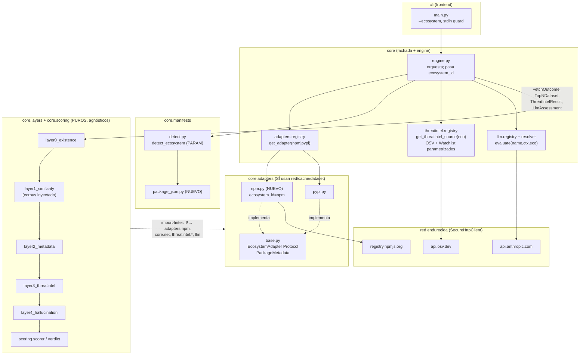
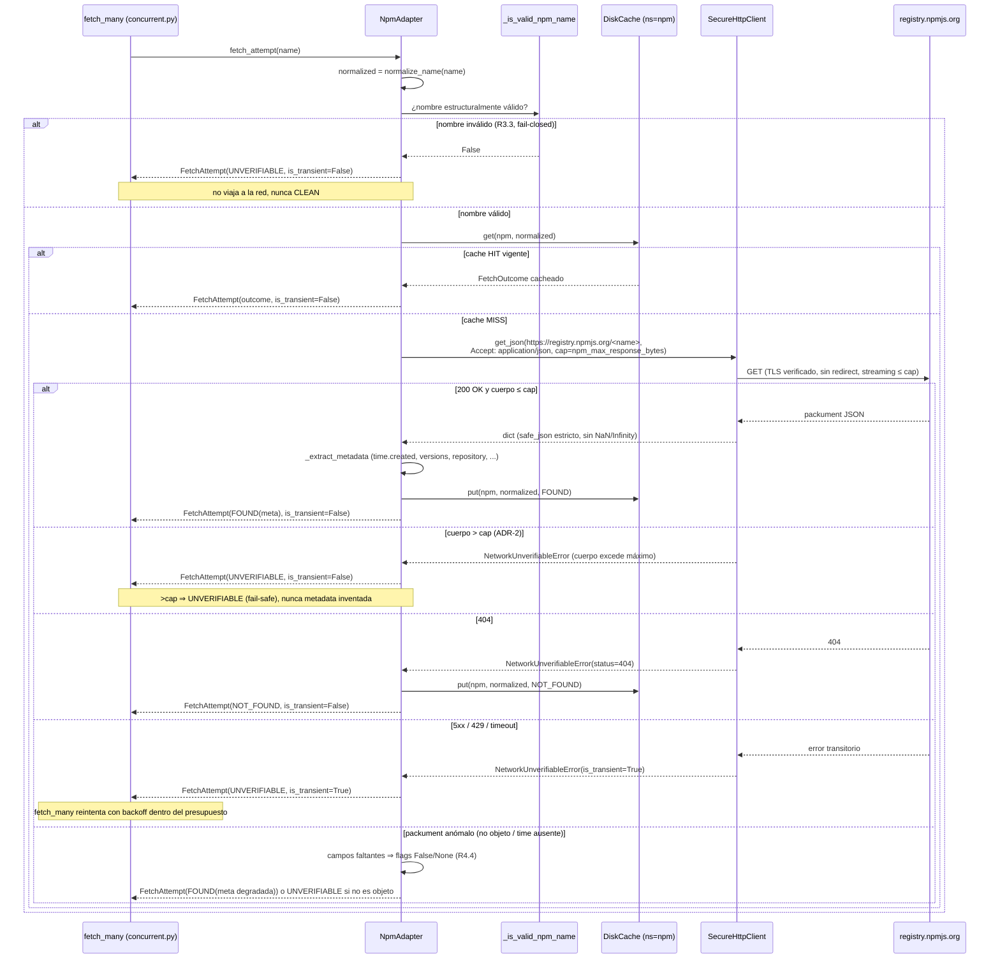

# Documento de Diseño: SlopGuard Hito 4 — Adaptador npm

> Fase 2 del flujo `/spec`. Fuente de verdad: `specs/slopguard-hito4-npm/requirements.md`
> (11 FR + NFR). Consistente con los diseños de Hito 1 (core-puro+fachada, `EcosystemAdapter`,
> fail-closed), Hito 2 (Capa 3 OSV, caché namespaced, anti-SSRF ADR-09) y Hito 3 (Capa 4 LLM,
> anti-block estructural, `PROMPT_VERSION`). Docs-as-code: Markdown in-repo con Mermaid embebido.

## 1. Resumen y principios

### 1.1 Qué se añade
Paridad funcional con PyPI para el ecosistema **npm**, materializada como **un adapter nuevo**
(`NpmAdapter`) más un parser de manifiesto (`package.json`) y la **parametrización por ecosistema**
de las tres piezas que hoy asumen PyPI por constante: la selección de adapter, la Capa 3 (OSV) y la
Capa 4 (LLM). El motor de capas/scoring **no se toca** salvo inyección de un corpus distinto (Capa 1)
y de un `ecosystem_id` ya existente en `ScanReport`.

| # | Componente | Tipo | Archivo |
|---|-----------|------|---------|
| C1 | `NpmAdapter` | NUEVO | `core/adapters/npm.py` |
| C2 | Parser `package.json` | NUEVO | `core/manifests/package_json.py` |
| C3 | Dataset npm + script de procedencia | NUEVO | `core/dataset/npm_top_8k.json` + `.sha256` + `scripts/build_npm_top_n.py` |
| C4 | Corpus npm para Capa 1 | NUEVO (datos) | cargado por `NpmAdapter.load_top_n()` |
| C5 | `get_adapter` soporta `"npm"` | PARAM | `core/adapters/registry.py` |
| C6 | Selección de ecosistema (auto-detección + `--ecosystem` + stdin) | PARAM | `core/manifests/detect.py`, `core/engine.py`, `cli/main.py` |
| C7 | Capa 3 OSV parametrizada por ecosistema | PARAM | `core/threatintel/osv.py`, `registry.py`, `core/engine.py` |
| C8 | Capa 4 LLM parametrizada por ecosistema | PARAM | `core/llm/prompt.py`, `core/llm/evaluator.py` (Protocol), `core/llm/anthropic.py`, `core/llm/resolver.py`, `core/llm/registry.py`, `core/config.py`, `core/engine.py` |
| C9 | Contratos import-linter incluyen `adapters.npm` | PARAM | `pyproject.toml` |

### 1.2 Qué NO se toca (invariantes preservados)
- **`core.scoring.*` y la tabla de pesos (ADR-01/ADR-11):** intactos. El veredicto npm sale del
  mismo `build_dependency_result`/`compute_score` que PyPI.
- **Invariante anti-FP (R5.6 Hito 1):** `SOFT_CAP=25 < umbral_warn=50`; señales blandas solas nunca
  cruzan a warn/block. Sin cambios.
- **Invariante anti-block L4 (R9.3, Hito 3):** `SOFT_CAP + LLM_SOFT_CAP < umbral_block`, validado por
  `_validate_anti_block` y por test de propiedad estructural. Sin cambios.
- **Fail-closed/degradación segura:** nombre inválido / packument anómalo / cap excedido / red agotada
  → `UNVERIFIABLE`, jamás CLEAN.
- **Cero deps de runtime:** solo stdlib + `SecureHttpClient` propio.
- **Determinismo:** sin reloj de pared en la decisión; `now_epoch` único por corrida; dataset npm fijo
  y verificado por SHA-256.
- **Frontera `core.layers`/`core.scoring` ✗→ red/adapter concreto/LLM:** ampliada, nunca relajada.

### 1.3 Principio rector
> "npm = un adapter nuevo + parametrización estricta por ecosistema; el motor de decisión es el mismo."

Toda divergencia npm↔PyPI vive **dentro del adapter o detrás de una constante de ecosistema**, nunca
como `if ecosystem == "npm"` esparcido por las capas. Las capas siguen consumiendo `PackageMetadata`,
`TopNDataset`, `ThreatIntelResult` y `LlmAssessment` agnósticos.

---

## 2. Arquitectura — componentes y responsabilidades

### 2.1 Componentes NUEVOS

**C1 · `NpmAdapter` (`core/adapters/npm.py`).** Implementa el Protocol `EcosystemAdapter` y el
opcional `RetryableAdapter` (igual que `PypiAdapter`), con `ecosystem_id = "npm"`. Construye su propio
`SecureHttpClient(extra_allowed_hosts=frozenset({"registry.npmjs.org"}))` (el host npm entra al
allowlist **solo** por aquí, R4.5/NFR-Seg.1, análogo a cómo `OsvSource` aporta `api.osv.dev`), su
`DiskCache` (mismo root, namespace por `ecosystem_id`) y carga+verifica el dataset npm una vez en
`__init__` (ADR-02 heredado: integridad al arranque, no por-dependencia). Responsabilidades: `fetch`
(caché→red→`PackageMetadata`), `normalize_name` (reglas npm), `load_top_n` (dataset npm verificado),
`get_downloads`→`None` (hook reservado). **No** decide edad/override/scoring (eso es del core).

**C2 · Parser `package.json` (`core/manifests/package_json.py`).** Cumple el Protocol `ManifestParser`
(Forma A de §3.3: firma uniforme `parse(path, project_root, *, max_manifest_bytes, max_deps,
max_include_depth)`, **ignorando** `project_root`/`max_include_depth` porque `package.json` no tiene
includes; documentado en el docstring). Esto permite enchufarlo en `detect_and_parse` con el mismo
contrato que los parsers PyPI (§3.7). Lee `dependencies` + `devDependencies`, extrae **nombres**
(descarta rangos semver), excluye
specifiers no-registry (R2.7), deduplica por nombre normalizado npm, aplica `max_manifest_bytes`
(antes de leer) y `max_deps`. Ignora `peerDependencies`/`optionalDependencies`/`bundledDependencies`
y lockfiles sin fallar (R2.6). Malformado → `ManifestParseError` con origen saneado.

**C3 · Dataset npm + procedencia (`core/dataset/`).** `npm_top_8k.json` (≈8.000 nombres) +
`npm_top_8k.sha256`, cargados por `load_top_n_npm()` (variante de `load_top_n` parametrizada por ruta;
reutiliza `build_top_n`, ver §3.6). `scripts/build_npm_top_n.py` documenta y reproduce el snapshot
(fuente + fecha + pin) offline.

**C4 · Corpus npm para Capa 1.** Es el `TopNDataset` que devuelve `NpmAdapter.load_top_n()`. La Capa 1
permanece agnóstica: recibe el corpus inyectado, no sabe que es npm (R6.3).

### 2.2 Componentes PARAMETRIZADOS

**C5 · `get_adapter` (`core/adapters/registry.py`).** Añade la rama `ecosystem_id == "npm"` →
`NpmAdapter(config, use_cache)`. Cualquier id ∉ {`pypi`,`npm`} → `ValueError` listando los disponibles
(R1.4). Es el único punto de construcción de adapters.

**C6 · Selección de ecosistema (`detect.py` + `engine.py` + `cli/main.py`).** Se introduce
`detect_ecosystem(path|None, override) -> str`:
- override `--ecosystem {npm|pypi}` gana siempre (R1.3);
- sin override y nombre `package.json` → `npm`; `requirements*.txt`/`pyproject.toml` → `pypi` (R1.2);
- stdin (`-`) sin `--ecosystem` → error de configuración accionable (R1.5), nunca default silencioso.

El parser de manifiesto se elige por ecosistema mediante el **punto de inyección definido en §3.6**:
`detect_and_parse(path, config, *, ecosystem_id, manifest_type)` ramifica a `parse_package_json` cuando
`ecosystem_id=="npm"` y conserva la detección PyPI por nombre cuando `=="pypi"`;
`detect_and_parse_stdin(text, config, *, ecosystem_id)` trata el stdin npm como `package.json` en texto
(no pip-freeze). El engine reenvía `adapter.ecosystem_id` a ambas (hoy NO lo reenvía: ese es el wiring que
se añade). El CLI valida `ecosystem_id ∈ {pypi,npm}` antes de llamar al core (hoy solo acepta `pypi`).

**C7 · Capa 3 OSV (`threatintel/osv.py`, `registry.py`, `engine.py`).** `OsvSource` recibe
`ecosystem_id` en `__init__`; deriva la **constante** del cuerpo OSV (`PyPI`↔`npm`) y el **prefijo de
caché** (`pypi:`↔`npm:`) de una tabla cerrada, jamás reflejada del usuario (R8.1). El charset de
validación pre-POST se elige por ecosistema (predicado npm propio, R8.3). `get_threatintel_source`
recibe `ecosystem_id` y lo pasa a `OsvSource`; el engine pasa `adapter.ecosystem_id`.

**Superficie real de la parametrización (no solo `__init__`).** En el código actual el ecosistema y el
prefijo viven en **constantes de módulo** (`_OSV_ECOSYSTEM`, `_CACHE_KEY_PREFIX`, `_OSV_NAME_RE`)
consumidas por **funciones libres** que NO son métodos y por tanto NO ven el `ecosystem_id` de la
instancia: `_build_body`, `_cache_key`, `_to_blob`, `_validate_osv_blob`, `_is_valid_osv_name`,
`_parse_batch_response`. Parametrizar solo `__init__` dejaría esas funciones usando el default `pypi`/`PyPI`
⇒ **filtración cruzada** de cuerpo/caché entre ecosistemas. El diseño exige propagar a cada función la
tripleta `(osv_const, cache_prefix, name_validator)` —o convertirlas en métodos que lean `self`—. Decisión:
**convertir a métodos** las que consumen las constantes (`_build_body`, `_cache_key`, `_to_blob`,
`_validate_osv_blob`) y leer `self._osv_const`/`self._cache_prefix`/`self._name_re`, fijados en `__init__`
desde la tabla cerrada; `_parse_batch_response`/`_extract_advisories`/`_advisory_from_id` no usan el
ecosistema y quedan como funciones puras. El **validador de blob** compara contra el `self._cache_prefix`
derivado, **no** contra el literal `_CACHE_KEY_PREFIX`. Ver test de aislamiento exigido en ADR-5.

**`WatchlistSource` también se parametriza (ADR-8).** No solo OSV: `get_threatintel_source` pasa
`ecosystem_id` también a `WatchlistSource`, cuya clave de caché hoy NO lleva prefijo de ecosistema (cruce
npm↔PyPI) y cuyo charset PEP 503 nunca matchea scoped npm. Se prefija la clave (`pypi:`/`npm:`) y se elige
el charset/normalización por ecosistema (detalle y trade-offs en ADR-8).

**C8 · Capa 4 LLM (`llm/prompt.py`, `evaluator.py`, `anthropic.py`, `resolver.py`, `registry.py`,
`config.py`, `engine.py`).** La parametrización por ecosistema cruza **toda** la cadena real
`engine → resolve_layer4 → evaluator.evaluate → AnthropicEvaluator._build_body → build_prompt`, no solo
`build_prompt`/`resolver`. Cambios concretos (ver firma exacta en §3.7 y detalle en ADR-6):
1. **`build_prompt(name, context, ecosystem_id)`** (`prompt.py`): emite el texto del ecosistema correcto
   ("npm"/"PyPI") en lugar del literal "PyPI" hardcodeado. `PROMPT_VERSION` (constante) se sincroniza a
   `h4-v1` *o se elimina* por huérfana (ver ADR-6, fuente de verdad).
2. **`LlmEvaluator.evaluate(name, context, ecosystem_id)`** (`evaluator.py`, Protocol): se amplía la firma
   del Protocol con `ecosystem_id` manteniendo el contrato "evaluate NUNCA lanza ⇒ `None` ante cualquier
   abstención". Es un cambio de frontera de interfaz (lo consume el resolver; lo implementa
   `AnthropicEvaluator`).
3. **`AnthropicEvaluator.evaluate`/`_build_body(name, context, ecosystem_id)`** (`anthropic.py`): propaga
   `ecosystem_id` hasta `build_prompt`. Sin tocar este evaluador concreto, el prompt seguiría diciendo
   "PyPI" para npm (R9.1/R9.2 sin mecanismo).
4. **`resolve_layer4`** (`resolver.py`): recibe `ecosystem_id`, lo pasa a `evaluator.evaluate(...)` y lo
   incorpora a `_cache_key` (clave L4: `f"{ecosystem_id}|{name}|{model}|{prompt_version}|{ctx_hash}"`).
5. **`Config.prompt_version`** (`config.py`): su **default** sube `"h3-v1"` → `"h4-v1"` (es el único bump
   que invalida la caché L4 y sella el assessment; ver ADR-6). Este campo —no la constante de módulo— es
   la fuente de verdad de la clave/sello.
6. **`engine.py`**: propaga `adapter.ecosystem_id` a `build_context`/`resolve_layer4`/`evaluate`.

El anti-block es intacto (estructural, no depende del texto del prompt).

**C9 · import-linter (`pyproject.toml`).** El contrato R10.1 amplía `forbidden_modules` con
`slopguard.core.adapters.npm`; se mantienen los 7 contratos (ver ADR-7 §5).

### 2.3 Diagrama de componentes y frontera core→adapter



**Lectura de la frontera (qué importa a qué):** las capas y el scoring importan **solo** de
`core.adapters.base` (modelos normalizados) y `core.models`; nunca de `adapters.npm`, `core.net`,
`core.threatintel.*` ni `core.llm`. El `NpmAdapter`, como el `PypiAdapter`, sí puede usar
`core.net`/`core.cache`/`core.dataset`. El engine (en `core`, no en `cli`) coordina adapter+fuentes.

---

## 3. Modelos de datos / contratos de API

### 3.1 Firma de `NpmAdapter` (implementa `EcosystemAdapter` + `RetryableAdapter`)

```python
class NpmAdapter:
    ecosystem_id: str = "npm"

    def __init__(self, config: Config, *, use_cache: bool = True) -> None:
        # SecureHttpClient(extra_allowed_hosts={"registry.npmjs.org"})  (R4.5/NFR-Seg.1)
        # DiskCache(root, ttl_cache_horas, enabled=use_cache)
        # self._top_n = load_top_n_npm()   # verifica SHA-256 una vez (ADR-02)

    def normalize_name(self, raw: str) -> str: ...        # reglas npm (§3.4)
    def fetch(self, name: str) -> FetchOutcome:           # via fetch_attempt (un intento)
    def fetch_attempt(self, name: str) -> FetchAttempt:   # cache→red, is_transient (R4.1)
    def load_top_n(self) -> TopNDataset: ...              # dataset npm verificado (R5.2)
    def get_downloads(self, name: str) -> None: return None
```

`fetch` colapsa toda anomalía a `FetchOutcome(UNVERIFIABLE)`; `fetch_attempt` distingue transitorios
para que `fetch_many` reintente (reutiliza `concurrent.py` sin cambios, NFR-Rend.1). El cap de tamaño
npm-específico y el mapeo packument→metadata viven en `_fetch_from_network`/`_extract_metadata` del
adapter (§4.1, ADR-1/ADR-2).

### 3.2 Mapeo packument npm → `PackageMetadata`

Toda la entrada es **NO confiable**: cada acceso se tipa antes de usar; campo ausente/tipo inesperado
⇒ flag `False`/`None`, jamás señal inventada (R4.4, fail-closed).

| Campo `PackageMetadata` | Origen en el packument | Regla |
|---|---|---|
| `name` | — | `normalize_name(name_consultado)` (no se confía en `payload["name"]`) |
| `first_release_epoch` | `time.created` (ISO-8601) | parse a epoch UTC; inválido/ausente ⇒ `None` |
| `releases_count` | `len(versions)` | `versions` no-dict ⇒ `0` |
| `has_repo_url` | `repository` | dict con `url:str` http(s) **o** string http(s) ⇒ `True` |
| `has_description` | `description` | str no vacío ⇒ `True` |
| `has_author` | `author` | str no vacío, **o** dict con `name:str` no vacío ⇒ `True` |
| `has_license` | `license` | str no vacío, **o** dict `{type:str}` (SPDX legacy) ⇒ `True` |
| `has_classifiers` | `keywords` | lista no vacía ⇒ `True` (análogo npm de classifiers, R4.2) |
| `in_top_n` | dataset npm | `normalize_name(name) in top_n.members` |

`first_release_epoch` se toma de `time.created` (no del mínimo de `time[<ver>]`): es el campo canónico
de "primera publicación" del packument; si `time` falta o `created` no parsea ⇒ `None` (sin
`NEW_PACKAGE` espurio ni "viejo" inventado). El doc abreviado `install-v1` omite `time`/`repository`/
etc. y por eso se descarta (ADR-1).

### 3.3 Contrato del parser `package.json`

El Protocol real `ManifestParser.parse` (manifests/base.py) tiene la firma
`parse(path, project_root, *, max_manifest_bytes, max_deps, max_include_depth)`. `package.json` **no**
tiene includes (no hay `-r`/`include` como en requirements). Para no afirmar falsamente que cumple un
Protocol con parámetros que ignora, el diseño adopta **una de estas dos formas** (se fija en Fase 3, sin
ambigüedad en el cableado de §3.7):

**Forma A — cumple el Protocol `ManifestParser` (firma uniforme, recomendada para enchufar en `detect.py`):**

```python
def parse_package_json(
    path: Path,
    project_root: Path,                 # parte del Protocol; package.json no lo usa (sin includes)
    *,
    max_manifest_bytes: int,
    max_deps: int,
    max_include_depth: int,             # parte del Protocol; package.json lo IGNORA (no hay includes)
) -> tuple[Dependency, ...]: ...
```

`project_root` y `max_include_depth` se aceptan por conformidad de firma y se **ignoran explícitamente**
(documentado en el docstring: "package.json no soporta includes; ambos parámetros son no-ops"). El
`origin` saneado se deriva internamente de `path.name` (igual que los parsers PyPI vía `_safe_origin`),
no se recibe como parámetro: así la firma coincide con `detect_and_parse` y el resto de parsers, y el
cableado de §3.7 puede tratar todos los parsers de forma uniforme.

**Forma B — función libre con firma propia + adaptador de firma:** si se prefiere una firma mínima
`parse_package_json(path, *, max_manifest_bytes, max_deps)`, entonces el diseño **no** afirma que
implementa `ManifestParser`; en su lugar `detect_and_parse` la invoca directamente en la rama npm (§3.7)
sin pasar `project_root`/`max_include_depth`. En esta forma C2 (§2.1) debe decir "parser de `package.json`
(función de manifiesto npm)", no "implementa `ManifestParser`".

Se elige **Forma A** por uniformidad de cableado (un solo punto de despacho en `detect_and_parse`). C2 se
corrige acorde (ver §2.1). En ambas formas el comportamiento de parseo es idéntico:

- **Entrada:** ruta a `package.json`. Chequea `max_manifest_bytes` con `path.stat()` **antes** de leer
  (R2.2). Carga con `json.loads` (no `tomllib`); JSON malformado, top-level no-objeto, o
  `dependencies`/`devDependencies` no-objeto ⇒ `ManifestParseError` con `origin` saneado (R2.4).
- **Salida:** `tuple[Dependency, ...]` con `name` ya normalizado npm, `version_pin` = el specifier
  saneado solo si es pin exacto del registry (si no, `None`), `raw` = nombre saneado, `origin` = nombre
  de archivo saneado.
- **Recolección:** itera claves de `dependencies` luego `devDependencies`. Para cada `(nombre, spec)`:
  - **Exclusión R2.7:** si `spec` es no-registry (`file:`, `link:`, `workspace:`, `git`/`git+…`,
    `github:`, o tarball `http(s)://`) ⇒ **omitida explícita** (no se consulta al registry). Solo
    specifiers de versión del registry (semver/dist-tag) se evalúan.
  - normaliza el nombre; si ya está visto (dedup por nombre normalizado, R2.5) ⇒ se ignora la
    repetición (un único `Dependency` aunque aparezca en ambos bloques).
- **Límites:** al superar `max_deps` ⇒ `ManifestParseError`. Sin `dependencies`/`devDependencies` o
  vacíos ⇒ `()` (0 deps, exit 0, R2.3). `peer/optional/bundledDependencies` se ignoran (R2.6).

### 3.4 Reglas de normalización npm

```python
def normalize_name(raw: str) -> str  # en NpmAdapter
```

1. `strip()` + `lower()` (npm es case-insensitive en publicación nueva; minúsculas canónicas, R3.1).
2. **Scoped `@scope/name`:** se conserva el `/` del scope; se normalizan ambas partes por separado, sin
   colapsarlo (R3.1). El `@` inicial se preserva.
3. Idempotencia: `normalize(normalize(x)) == normalize(x)` (R3.2).
4. **No** se aplica el colapso PEP 503 de `._-` (eso es PyPI); npm los conserva como caracteres válidos
   del nombre. `PypiAdapter.normalize_name` queda intacto (R3.4).

**Validez estructural npm (R3.3/R8.3, fail-closed) — un único núcleo de charset compartido.** Para evitar
la divergencia clásica entre dos predicados que deben rechazar lo mismo (`_is_valid_npm_name` pre-fetch y
`_is_valid_npm_osv_name` pre-POST OSV), **ambos derivan de una sola constante de charset por segmento** y
solo difieren en límite de longitud:

```python
# Núcleo de charset npm (constante compartida; un solo punto de endurecimiento).
_NPM_SEGMENT_CHARS = "a-z0-9._~-"                 # caracteres permitidos en UN segmento de nombre npm
# Un segmento válido: 1+ chars del núcleo, NO empieza por '.' ni '_' (regla npm), NO es '.'/'..'.
# Nombre = segmento simple `name`  O  scoped `@<scope-seg>/<name-seg>` (EXACTAMENTE un '/').
_NPM_SEGMENT_RE = re.compile(rf"(?![._])[{_NPM_SEGMENT_CHARS}]+")
_NPM_NAME_RE    = re.compile(rf"^(@{_NPM_SEGMENT_RE.pattern}/)?{_NPM_SEGMENT_RE.pattern}$")
```

Reglas (las comparten los dos predicados por construcción del núcleo):
- **Charset:** solo `[a-z0-9._~-]` por segmento. Cualquier CRLF/ANSI/C0-C1/espacio/`%`/unicode/`:` ⇒
  inválido (no pueden aparecer en `_NPM_SEGMENT_CHARS`). Esto es idéntico al rechazo del predicado OSV PyPI.
- **Estructura scoped:** a lo sumo **un** `/`, y solo en la posición `@scope/name`; un `/` extra ⇒
  inválido (cierra el path-traversal de §4.1). Ningún segmento `.` ni `..`; ningún segmento que empiece
  por `.`/`_`.
- **Vacío** ⇒ inválido.
- **Longitud (única diferencia entre predicados):** `_is_valid_npm_name` (pre-fetch) admite ≤ **214**
  (límite del registry npm); `_is_valid_npm_osv_name` (pre-POST OSV) admite ≤ **100** (cota del cuerpo OSV,
  igual que `_OSV_NAME_RE` PyPI usa ≤100). Mismo núcleo de charset/estructura, distinto tope.

Un nombre inválido **no** viaja a la red como "consultado" y **nunca** produce CLEAN: el adapter lo marca
de modo que el core lo trate como `UNVERIFIABLE` (ver §4.1, rama de validación previa al fetch); en la
ruta OSV queda `UNVERIFIABLE` sin viajar al POST (R8.3).

**Test de propiedad cruzado exigido (R3.3/R8.3/NFR-Seg.4):** todo nombre que `_is_valid_npm_name` rechaza
por charset/estructura peligrosa (`/` extra, `..`, CRLF/ANSI/control, `%`, unicode), `_is_valid_npm_osv_name`
**también** lo rechaza (y viceversa para el subconjunto común): los dos predicados no pueden divergir en su
núcleo de seguridad, solo en el límite de longitud. Así un endurecimiento futuro del charset toca el núcleo
único y se aplica a ambos canales a la vez (sin bypass por un canal sí y otro no).

**Regla determinista de similaridad para scoped (R6.2).** La Capa 1 permanece agnóstica; el corpus npm
inyectado ya contiene los nombres scoped normalizados. El falso positivo **peligroso real** NO es el de
dos paquetes del mismo scope con `name` distinto (ese sí lo separa la distancia), sino el de **el mismo
`name` en scopes distintos** (`@types/node` vs `@acme/node`): difieren solo en el segmento de scope, así
que sobre el nombre completo la distancia es pequeña (≤ `dl_max` o JW ≥ `jw_min`) y `layer1_similarity`
—que opera sobre el nombre completo con `by_first_char['@']`— marcaría TYPOSQUAT contra el paquete
legítimo de **otro dueño de scope**. El scope es un namespace con dueño verificado por el registry;
clonar el `name` bajo un scope legítimo distinto NO es typosquatting. Reglas deterministas (datos +
**pre/post-filtro agnóstico inyectado por el adapter**, no `if ecosystem=="npm"` en la capa pura):

1. **Comparación segmentada del scope (pre-filtro de candidatos del adapter).** Para un nombre consultado
   scoped `@s/n`, el conjunto de candidatos del corpus se restringe de forma que **un candidato scoped
   `@s'/n'` solo es elegible si `s == s'`** (mismo scope) — un scope distinto se descarta como candidato
   ANTES de medir distancia. Así `@acme/node` nunca se compara contra `@types/node`: scopes distintos son
   namespaces distintos por construcción, no typos entre sí. La distancia se mide entonces sobre el
   nombre completo (que dentro del mismo scope equivale a medir sobre `n` vs `n'`, capturando el typo real
   `@scope/lodahs` vs `@scope/lodash`).
2. **Sin cruce scoped↔no-scoped.** `by_first_char` usa el primer carácter del nombre completo (`@` para
   scoped): los scoped se comparan entre sí y los no-scoped entre sí. Combinado con (1), el espacio de
   comparación de un scoped queda acotado a su propio scope.
3. **Mecanismo de inyección.** El filtro de candidatos es un predicado/función agnóstica que el adapter
   provee junto con el corpus (parte del `TopNDataset` npm o un `candidate_filter` opcional consumido por
   `layer1_similarity`), **no** lógica por-ecosistema en la capa: PyPI inyecta el filtro identidad (todos
   los candidatos elegibles), npm inyecta el filtro de "mismo scope para nombres scoped". `damerau`/
   `jaro_winkler` no cambian (R6.3). Si por simplicidad de Hito 4 no se introduce el parámetro
   `candidate_filter`, la alternativa equivalente y también agnóstica es construir el corpus npm de modo
   que el índice `by_first_char` agrupe por **scope completo** (`@scope/`) en vez de por primer carácter,
   logrando el mismo aislamiento por datos; el diseño exige UNA de las dos y la fija en Fase 3.

**Test de propiedad exigido (R6.2):** `@scopeA/name` vs `@scopeB/name` (mismo `name`, scopes distintos)
**NO** produce TYPOSQUAT; `@scope/lodahs` vs `@scope/lodash` (mismo scope, typo en `name`) **SÍ** produce
la señal de similaridad. Esto hace el FP **verificable por prueba**, no solo declarado.

### 3.5 Salida y `schema_version`
`ScanReport.ecosystem` ya existe y se puebla con `adapter.ecosystem_id` (R10.1). **No** se añaden
campos de salida nuevos ⇒ `schema_version` permanece **1.2** (R10.2). El `ecosystem` se sanea en
render (ya ocurre). Exit codes idénticos a PyPI por el peor veredicto (R10.3, reutiliza
`aggregate_exit_code`).

### 3.6 Cableado de la selección de parser por ecosistema (C6, R2.1/R1.3)

Hoy `detect_and_parse(path, config, *, manifest_type)` (detect.py) elige el parser SOLO por nombre de
archivo (`_resolve_type`) y está cableado a los parsers Python; `detect_and_parse_stdin(text, config)`
asume formato **pip-freeze**. Ninguno recibe `ecosystem_id`, así que un `package.json` terminaría en
`parse_requirements`/`pyproject` o en `_resolve_type` lanzando "tipo no reconocido". El contrato del
punto de inyección es:

**Firma nueva de las funciones de detección (ramifican por ecosistema):**

```python
def detect_and_parse(
    path: Path, config: Config, *, ecosystem_id: str, manifest_type: str | None = None,
) -> tuple[Dependency, ...]: ...

def detect_and_parse_stdin(
    text: str, config: Config, *, ecosystem_id: str,
) -> tuple[Dependency, ...]: ...
```

- **`detect_and_parse`:** `ecosystem_id == "npm"` ⇒ rama directa a `parse_package_json` (Forma A, §3.3),
  ignorando `_resolve_type`/`manifest_type` (que son del flujo PyPI; `--manifest-type` no aplica a npm).
  `ecosystem_id == "pypi"` ⇒ comportamiento **idéntico** al actual (detección por nombre + parsers
  Python), cero regresión (R11). El despacho por ecosistema es la **rama externa**; la detección por
  nombre de archivo (`_resolve_type`) queda **dentro** de la rama pypi.
- **`detect_and_parse_stdin`:** stdin de npm es un **`package.json` en texto**, NO pip-freeze. Con
  `ecosystem_id == "npm"` el texto se parsea como JSON `package.json` (mismo cuerpo que
  `parse_package_json`, alimentado desde memoria en vez de `path`: se factoriza el núcleo de parseo a una
  función que acepta `str`/bytes ya leídos, reutilizada por ambas rutas tras el chequeo de
  `max_manifest_bytes` sobre la longitud en bytes). Con `ecosystem_id == "pypi"` ⇒ pip-freeze como hoy
  (cero regresión). El `origin` de stdin es `"stdin"` saneado en ambos casos.
- **Quién provee `ecosystem_id`:** el engine ya lo conoce (`adapter.ecosystem_id`, fijado por
  `detect_ecosystem`/CLI, §2.2). `scan_manifest`/`scan_stdin` (engine.py) lo pasan a
  `detect_and_parse`/`detect_and_parse_stdin`. Hoy esas funciones de engine ya reciben `ecosystem_id`
  (default `"pypi"`) y construyen el adapter con él, pero **no** lo reenvían a la detección: ese reenvío
  es el cambio puntual de wiring que cierra el hueco.

**Regla de frontera:** la selección de parser por ecosistema vive en `core.manifests`/`core.engine`
(fachada), no en las capas puras. No se introduce `if ecosystem=="npm"` en `layer*`; la ramificación es
de **parser/origen de datos**, no de lógica de decisión.

### 3.7 Firmas parametrizadas por ecosistema (OSV y L4) — resumen de contratos

Punto único de referencia de las firmas que cambian (detalladas en C7/C8, ADR-5/ADR-6):

```python
# Capa 3 — OSV (C7, ADR-5)
class OsvSource:
    def __init__(self, config: Config, *, ecosystem_id: str, use_cache: bool = True) -> None: ...
def get_threatintel_source(config: Config, *, use_cache: bool, ecosystem_id: str) -> ThreatIntelSource | None: ...

# Capa 4 — LLM (C8, ADR-6); ecosystem_id cruza TODA la cadena
class LlmEvaluator(Protocol):            # evaluator.py — cambio de firma del Protocol
    def evaluate(self, name: str, context: HallucinationContext, ecosystem_id: str) -> LlmAssessment | None: ...
class AnthropicEvaluator:                 # anthropic.py
    def evaluate(self, name, context, ecosystem_id) -> LlmAssessment | None: ...
    def _build_body(self, name, context, ecosystem_id) -> dict[str, object]: ...
def build_prompt(name: str, context: HallucinationContext, ecosystem_id: str) -> str:  # prompt.py
    ...
def resolve_layer4(evaluator, cache, items, config, ecosystem_id, *, now=None): ...      # resolver.py
def _cache_key(name, context, config, ecosystem_id) -> str:                              # resolver.py
    # f"{ecosystem_id}|{name}|{config.llm_model}|{config.prompt_version}|{ctx_hash}"
    ...
def _to_blob(assessment, ecosystem_id) -> dict[str, Any]:           # resolver.py — 2ª capa: persiste `ecosystem`
    ...
def _validate_blob(payload, ecosystem_id) -> LlmAssessment | None:  # resolver.py — rechaza blob de ecosistema ajeno
    ...
```

La 2ª capa L4 (blob `ecosystem` + validación) replica el patrón OSV (ADR-6 punto 5): aislamiento por clave
**y** por validador, no solo por clave.

`Config.prompt_version` default sube a `"h4-v1"` (ADR-6, fuente de verdad del sello/clave). El contrato
"`evaluate` NUNCA lanza" se preserva en la firma ampliada.

---

## 4. Secuencias (Mermaid)

### 4.1 Fetch del packument npm (existencia + metadatos)



Notas de seguridad del fetch (heredadas de `SecureHttpClient`, sin código nuevo de transporte): TLS no
desactivable, allowlist efectiva `{pypi.org, registry.npmjs.org}` **solo** para la instancia del
adapter npm, sin redirects cross-host, `Content-Length` excesivo rechazado, descompresión acotada,
`safe_json_loads(max_json_depth)`. La URL solo lleva el nombre del paquete (NFR-Priv).

**Contrato de construcción de URL del registry (R4.5/R3.3/NFR-Seg.1 — anti path-traversal/SSRF por
path).** `SecureHttpClient._validate_url` valida scheme + host (puerto/userinfo rechazados) pero **NO**
valida el PATH. Para PyPI eso es seguro porque PEP 503 acota el nombre a `[a-z0-9-]`. Para npm el nombre
scoped legítimo contiene `@` y `/` (`@scope/name`), caracteres que SÍ tienen significado en el path; si la
URL se interpolara con el nombre crudo, un nombre que pasara el predicado de charset pero contuviera un
`/` extra o un segmento `..` podría producir traversal (`https://registry.npmjs.org/<scope>/../-/...`) o
ambigüedad de ruta, **sin** que `_validate_url` (host allowlisted) ni el redirect handler lo frenaran. Por
eso, como contrato **verificable** del adapter npm (no como nota informal):

1. **`_is_valid_npm_name` rechaza estructura peligrosa ANTES de construir URL:** ningún `/` fuera de la
   única posición `@scope/name` (a lo sumo un `/`, y solo si hay `@` inicial); ningún segmento `.` ni
   `..`; ningún nombre que empiece por `.`/`_`. Un nombre que viole esto ⇒ inválido ⇒ UNVERIFIABLE, jamás
   viaja a la red (rama "nombre inválido" del diagrama).
2. **URL-encode estricto OBLIGATORIO:** el nombre validado se pasa por `urllib.parse.quote(name, safe='')`
   ANTES de interpolarlo en la URL, de modo que `@`→`%40` y `/`→`%2F` (`@scope%2Fname`). El registry
   resuelve el nombre scoped por su forma encodeada; el path resultante es un único segmento opaco, sin
   `/` ni `..` interpretables.

**Test exigido (R4.5/R3.3):** un nombre con un `/` extra o con `..` (a) NO escapa del path del registry y
(b) cae a UNVERIFIABLE — nunca produce una consulta de red con path manipulado. Un nombre scoped legítimo
(`@scope/name`) produce exactamente `https://registry.npmjs.org/%40scope%2Fname` (un solo segmento).

### 4.2 Selección de ecosistema (auto-detección vs override vs stdin)

**Contrato de `detect_ecosystem(path: Path | None, override: str | None) -> str` (precedence ESTRICTA,
R1.3).** El orden de evaluación es **override → stdin-guard → auto-detección**, sin que el guard de stdin
pueda alcanzarse cuando hay override:

1. **Override primero (gana SIEMPRE, incluso stdin):** si `override is not None`, se valida `∈ {pypi,npm}`
   y se **retorna inmediatamente**, ANTES de cualquier inspección de `path`/stdin. Esto garantiza que
   `scan - --ecosystem npm` use `npm` sin tropezar con el guard de stdin (R1.3).
2. **Guard de stdin (solo si `override is None`):** si `override is None` **y** `path is None` (entrada
   `-`), error de configuración accionable "stdin exige `--ecosystem`" (R1.5). El guard es inalcanzable
   con override por el `return` del paso 1.
3. **Auto-detección por nombre (solo si `override is None` y hay `path`):** `package.json` ⇒ `npm`;
   `requirements*.txt`/`pyproject.toml` ⇒ `pypi` (R1.2); nombre no reconocido ⇒ error accionable.

```mermaid
sequenceDiagram
    participant U as Usuario
    participant CLI as cli/main.py
    participant D as detect_ecosystem
    participant EN as engine.scan_*

    U->>CLI: slopguard scan <path|-> [--ecosystem npm|pypi]
    CLI->>CLI: validar --ecosystem ∈ {pypi, npm} (si presente)
    alt id presente y no soportado (R1.4)
        CLI-->>U: error config + exit operacional<br/>"disponibles: [npm, pypi]"
    else id soportado o ausente
        CLI->>D: detect_ecosystem(path | None, override=--ecosystem)
        alt override != None (R1.3, PRECEDENCE: se evalúa PRIMERO y RETORNA)
            D-->>CLI: override (gana SIEMPRE, incl. stdin; no se inspecciona path)
        else override == None  (solo aquí se mira la entrada)
            alt path == None (stdin "-") sin --ecosystem (R1.5)
                D-->>CLI: ERROR: stdin exige --ecosystem
                CLI-->>U: mensaje accionable + exit operacional
            else path es archivo (auto-detección, R1.2)
                D->>D: package.json ⇒ npm; requirements*.txt / pyproject.toml ⇒ pypi
                D-->>CLI: ecosystem_id auto-detectado
            end
        end
        CLI->>EN: scan_manifest/scan_stdin(path|text, config, ecosystem_id)
        EN->>EN: get_adapter(ecosystem_id) ; parser por ecosistema (§3.6)
    end
```

---

## 5. ADRs

### ADR-1 · Packument completo vs documento abreviado `install-v1` (R4.3)
**Contexto.** El registry npm sirve dos representaciones: el **packument completo**
(`Accept: application/json`) con `time`/`versions`/`repository`/`description`/`author`/`license`/
`keywords`, y el **abreviado** (`Accept: application/vnd.npm.install-v1+json`), pensado para
instaladores, que **omite** `time`, `repository`, `description`, `author`, `license`, `keywords`.
**Decisión.** Solicitar **siempre el packument completo**. Las Capas 0 (edad, vía `time.created`) y 2
(metadata: repo/descripción/autor/licencia/keywords) quedarían **inertes** con el abreviado,
degradando npm a "solo existencia" — pérdida de paridad con PyPI.
**Alternativas.** (a) Abreviado + segunda llamada por versión para fechas: 2× round-trips, más
superficie de red, sin ganar los campos de metadata. (b) Solo existencia (HEAD): rompe R4.2/R7.2.
**Trade-offs.** El packument es **grande** (paquetes con miles de versiones pueden pesar MB); se mitiga
con el cap npm-específico (ADR-2). Aceptamos más bytes a cambio de paridad funcional real.
**Consecuencias.** El cliente HTTP existente sirve sin cambios; el peso motiva el cap de ADR-2.

### ADR-2 · Cap de tamaño npm-específico → UNVERIFIABLE (fail-safe)
**Contexto.** El packument de un paquete muy versionado supera el `max_response_bytes` de PyPI
(10 MB), pensado para el JSON de PyPI. Subir el cap global afectaría también a PyPI/OSV/LLM.
**Decisión.** Un cap **propio del fetch npm** (`npm_max_response_bytes`, default mayor — p.ej. 25 MB),
aplicado por el `SecureHttpClient` en streaming. Un packument que excede el cap ⇒ `UNVERIFIABLE`
(fail-safe), **nunca** CLEAN ni metadata parcial inventada (R4.3).
**Alternativas.** (a) Subir `max_response_bytes` global: acopla npm con los presupuestos de PyPI/OSV/
LLM y agranda su superficie de bomba. (b) Sin cap: vector de DoS por memoria. (c) Lectura parcial y
parseo del prefijo: JSON truncado no es parseable de forma segura.
**Trade-offs.** Paquetes legítimos enormes (raros) caen a UNVERIFIABLE en vez de CLEAN: es el lado
seguro (exit 3, el usuario revisa), coherente con fail-closed. El cap es config (`_INT_FIELDS`,
estrictamente positivo) para calibración.
**Consecuencias.** Nuevo campo de config `npm_max_response_bytes`; el fetch npm lo pasa a `get_json`
en vez del global. Cero impacto en PyPI (usa `max_response_bytes` como hoy).

### ADR-3 · Fuente y procedencia del dataset top-N npm (R5.1)
**Contexto.** La Capa 1 necesita un corpus de ≈8.000 nombres npm legítimos, reproducible y verificable
offline, sin red en CI/runtime.
**Decisión.** Snapshot **público pinneado** de los paquetes npm más descargados (p.ej. ranking de
descargas semanales de la API pública de npm / dataset comunitario de "most-depended-upon"), con
**procedencia documentada** (script `scripts/build_npm_top_n.py` + fuente URL + fecha + commit del
snapshot) y artefacto `npm_top_8k.json` + `npm_top_8k.sha256`. `load_top_n_npm()` verifica SHA-256 al
arranque; mismatch/ausencia ⇒ `DatasetIntegrityError` (exit 3), reutilizando el contrato del Hito 1.
Los nombres se normalizan con la regla npm en `build_top_n` (invariante defensivo, scoped intactos).
**Alternativas.** (a) Descargar el ranking en runtime: viola "offline/determinista" y mete red en la
ruta de Capa 1. (b) Reusar el dataset PyPI: corpus equivocado, falsos negativos/positivos masivos.
**Trade-offs.** El dataset envejece (typosquats de paquetes nuevos no cubiertos hasta regenerar); se
acepta y se documenta el procedimiento de regeneración (R5.4). El tamaño embebido crece el wheel.
**Consecuencias.** `build_top_n` debe parametrizar la normalización (PyPI vs npm); ver ADR-3b en §6.

### ADR-4 · Regla de similaridad para paquetes scoped (R6.2)
**Contexto.** Los scoped `@scope/name` comparten prefijo `@scope/`. El FP **peligroso** no es el de dos
paquetes del mismo scope con `name` distinto (la distancia los separa), sino el del **mismo `name` en
scopes distintos** (`@types/node` vs `@acme/node`): difieren solo en el segmento de scope, así que sobre
el nombre completo la distancia es ínfima y una métrica ingenua marcaría TYPOSQUAT contra el paquete
legítimo de otro dueño de scope. El scope es un namespace con dueño verificado por el registry: clonar el
`name` bajo otro scope legítimo no es typosquatting.
**Decisión.** Regla determinista por DATOS + pre/post-filtro agnóstico inyectado por el adapter (§3.4):
un candidato scoped solo es elegible si **comparte scope** con el nombre consultado scoped (scopes
distintos se descartan ANTES de medir distancia); la distancia se mide sobre el nombre completo
(equivale, dentro del scope, a medir el `name`), capturando el typo real `@scope/lodahs`↔`@scope/lodash`.
`by_first_char` separa scoped de no-scoped. El filtro de candidatos lo provee el adapter (PyPI = filtro
identidad; npm = "mismo scope"), o se materializa por construcción del índice del corpus agrupando por
`@scope/` — **sin** `if ecosystem=="npm"` en la capa pura. `damerau`/`jaro_winkler`/`layer1_similarity`
no cambian su algoritmo (R6.3).
**Alternativas.** (a) Distancia sobre el nombre completo SIN filtrar candidatos por scope: deja pasar el
FP de mismo-`name`-distinto-scope (el defecto que esta ADR corrige). (b) Comparar solo la parte `name`
ignorando el scope: dos paquetes idénticos en scopes distintos no se separarían y, peor, un typo de
`name` en el scope correcto se confundiría con otro scope. (c) Penalizar el scope distinto con código en
la capa pura: lógica por-ecosistema prohibida (R6.3).
**Trade-offs.** Un typosquat que ataca scope **y** `name` a la vez (`@scopr/lodahs`) cae fuera de la
comparación intra-scope; la Capa 3 (OSV `MAL-*`) y la Capa 4 (LLM) cubren ese gris. A cambio se elimina
el FP masivo de "mismo name, scope legítimo distinto", que es el riesgo dominante.
**Consecuencias.** El generador del dataset (ADR-3) debe emitir scoped en forma `@scope/name`; el adapter
expone el filtro de candidatos (o el índice agrupa por scope). Test de propiedad obligatorio: mismo-name
distinto-scope ⇒ NO TYPOSQUAT; mismo-scope con typo ⇒ SÍ señal (§3.4).

### ADR-5 · Separación de caché OSV por ecosistema (R8.2/NFR-Seg.3)
**Contexto.** Hoy `OsvSource` hardcodea `_CACHE_KEY_PREFIX="pypi"` y `_OSV_ECOSYSTEM="PyPI"`. Con npm,
un blob de `react` (npm) no debe ser legible como `react` (PyPI), ni el cuerpo OSV mezclar ecosistemas.
**Decisión.** `OsvSource.__init__(config, *, ecosystem_id, use_cache)`. Una **tabla cerrada**
`{"pypi": ("PyPI","pypi"), "npm": ("npm","npm")}` da `(osv_ecosystem_const, cache_prefix)`, fijados en
`__init__` como `self._osv_const`/`self._cache_prefix` (y `self._name_re` = el predicado de charset del
ecosistema). La clave de caché pasa a `f"{cache_prefix}:{name}"` bajo el namespace `osv` (el `DiskCache`
hashea `namespace:key`); el body lleva la constante OSV correcta, **nunca** reflejada del usuario (R8.1).
El validador de blob exige `payload["ecosystem"] == self._cache_prefix` (mismatch ⇒ miss), así un blob npm
no se acepta en una corrida PyPI **por construcción**.

**Superficie completa (las funciones libres también).** El ecosistema/prefijo hoy vive en constantes de
módulo (`_OSV_ECOSYSTEM`, `_CACHE_KEY_PREFIX`, `_OSV_NAME_RE`) leídas por funciones que **no** ven `self`:
`_build_body`, `_cache_key`, `_to_blob`, `_validate_osv_blob`, `_is_valid_osv_name`. Parametrizar solo
`__init__` no basta —cualquier ruta que olvide el parámetro caería al default `pypi`/`PyPI` y filtraría
cuerpo/caché entre ecosistemas—. Por eso esas funciones se **convierten en métodos** (o reciben la
tripleta `(osv_const, cache_prefix, name_validator)` explícita) y leen los atributos de instancia:
`_build_body` usa `self._osv_const`; `_cache_key` usa `self._cache_prefix`; `_to_blob` persiste
`self._cache_prefix` en el campo `ecosystem` del blob; `_validate_osv_blob` compara
`payload["ecosystem"] == self._cache_prefix` (NO contra el literal `_CACHE_KEY_PREFIX`); el charset
pre-POST usa `self._name_re`. `_parse_batch_response`/`_extract_advisories`/`_advisory_from_id` son
agnósticas del ecosistema y quedan puras.

**Alternativas.** (a) Caché separada en disco por ecosistema (otro root): más superficie, mismo
resultado que prefijar la clave. (b) Sufijo en el nombre: contamina el nombre que viaja a OSV. (c) Dejar
las funciones como libres leyendo constantes de módulo: descartada, es el origen de la filtración cruzada.
**Trade-offs.** Una constante hardcodeada se vuelve parametrizable; el riesgo es que un id ajeno entre
al body — mitigado porque `ecosystem_id` proviene del adapter (registry cerrado), no del usuario. Convertir
funciones libres en métodos amplía la superficie de cambio del módulo, pero es la única forma de que el
ecosistema inyectado gobierne TODAS las rutas (cuerpo, clave, blob, validador).
**Test de aislamiento exigido (R8.1/R8.2/NFR-Seg.3):** con `OsvSource(ecosystem_id="npm")`,
(i) `_build_body` emite `ecosystem=="npm"`; (ii) `_cache_key` antepone `npm:`; (iii) `_to_blob` persiste
`ecosystem=="npm"` y `_validate_osv_blob` RECHAZA (⇒ miss) un blob con `ecosystem=="pypi"` para el mismo
nombre (y viceversa con `ecosystem_id="pypi"` rechazando un blob `npm`). Esto verifica que las funciones
usan el `ecosystem_id` inyectado, no la constante de módulo.
**Consecuencias.** `get_threatintel_source(config, *, use_cache, ecosystem_id)`; el engine pasa
`adapter.ecosystem_id`. La ruta PyPI es idéntica (mismo prefijo `pypi`, misma constante `PyPI`) ⇒ cero
regresión (R8.6). El charset pre-POST se elige por ecosistema (`_is_valid_osv_name` PyPI vs
`_is_valid_npm_osv_name`); un nombre que no pasa ⇒ UNVERIFIABLE, nunca CLEAN (R8.3).

### ADR-6 · Estrategia de `PROMPT_VERSION` y clave de caché L4 con ecosistema (R9.2)
**Contexto.** El prompt L4 dice "PyPI" en su texto; para npm debe decir "npm". Si el texto cambia, los
veredictos cacheados del prompt viejo no deben reutilizarse; y un veredicto npm no debe colisionar con
uno PyPI del mismo nombre. **Aviso crítico de fuente de verdad:** existen DOS identificadores de versión
de prompt en el código real y **no son el mismo**:
- `prompt.PROMPT_VERSION` (constante de módulo, hoy `"h3-v1"`) — **huérfana**: `grep` confirma 0
  referencias fuera de su definición. Bumpearla NO invalida caché ni cambia la clave/sello.
- `Config.prompt_version` (campo de config, default `"h3-v1"`) — **gobierna de hecho**: la clave de caché
  L4 (`resolver._cache_key`) y el sello del assessment (`anthropic._validate_assessment`,
  `prompt_version=self._settings.prompt_version`) usan EXCLUSIVAMENTE `config.prompt_version` (vía
  `AnthropicSettings.prompt_version`). Es el único bump con efecto sobre R9.2.

**Decisión.**
1. **Bump del campo de config que gobierna:** `Config.prompt_version` default `"h3-v1"` → `"h4-v1"`. Este
   es el cambio que invalida la caché L4 vieja y sella los nuevos assessments; es el bump exigido por R9.2
   (no-reutilización del prompt viejo).
2. **Destino de la constante huérfana `prompt.PROMPT_VERSION`:** se **sincroniza** a `"h4-v1"` (sigue
   siendo el default literal del campo de config, mantenido en un único punto) **o se elimina** si se
   refactoriza el default de config para no duplicar el literal. La regla de diseño es: **un solo literal
   de versión de prompt en el repo**; si se conserva la constante, `Config.prompt_version` la referencia
   (sin duplicar la cadena) para que no puedan divergir. R9.2 NO depende de la constante.
3. `build_prompt(name, context, ecosystem_id)` emite el texto del ecosistema correcto (cambia el texto del
   prompt ⇒ justifica el bump).
4. La **clave de caché L4 incorpora `ecosystem_id`**: `f"{ecosystem_id}|{name}|{model}|{prompt_version}|{ctx_hash}"`.
   Con (1) y (4) un veredicto npm jamás se sirve a PyPI ni reutiliza el prompt anterior.
5. **Segunda capa de aislamiento (defensa en profundidad simétrica con OSV).** Hoy el aislamiento L4
   npm↔PyPI depende ÚNICAMENTE de la clave; el blob L4 (`resolver._to_blob`) NO guarda `ecosystem` y
   `resolver._validate_blob` NO lo verifica. Esto es **asimétrico** respecto a OSV, donde
   `_validate_osv_blob` exige `payload["ecosystem"]==cache_prefix` como segunda capa además de la clave. Un
   bug de implementación que omita o malforme el prefijo de ecosistema en `_cache_key` (interpolación mal
   ordenada, o reusar el `_cache_key` actual que NO lleva ecosystem) serviría un veredicto PyPI cacheado de
   `react` a una consulta npm de `react` sin que ningún validador lo detecte. Se replica el patrón OSV:
   - **`_to_blob`** persiste un campo `ecosystem` con el `ecosystem_id` de la corrida.
   - **`_validate_blob`** recibe el `ecosystem_id` esperado y RECHAZA (⇒ `None` ⇒ miss) todo blob cuyo
     `ecosystem` no coincida. Así el aislamiento es por **construcción** (clave) **Y** por **validación
     explícita** (blob), no solo por la clave.

**Cadena de cableado (cierra el hueco de interfaz, blocker R9.2).** La parametrización debe propagarse por
toda la cadena real, no solo por `build_prompt`/`resolver`:
`engine.resolve_layer4(ecosystem_id) → evaluator.evaluate(name, context, ecosystem_id) →
AnthropicEvaluator._build_body(name, context, ecosystem_id) → build_prompt(name, context, ecosystem_id)`.
Se amplía la firma del **Protocol `LlmEvaluator.evaluate`** con `ecosystem_id` (frontera de interfaz),
preservando el contrato "evaluate NUNCA lanza ⇒ `None` ante cualquier abstención". `evaluator.py` y
`anthropic.py` se listan en C8 como puntos parametrizados (sin tocarlos, el prompt npm seguiría diciendo
"PyPI"). Alternativa considerada para no cambiar la firma del Protocol: pasar `ecosystem_id` dentro de
`HallucinationContext`. Se descarta porque `HallucinationContext` es el dato determinista de las capas
0-2 que también forma el `ctx_hash` de la clave de caché; meter `ecosystem_id` ahí lo acoplaría al hash
de contexto y duplicaría su rol con el prefijo explícito de la clave. El cambio de firma del Protocol es
honesto y localizado (un solo implementador concreto, `AnthropicEvaluator`).

**Alternativas.** **Versionado por ecosistema** (`prompt_version` distinto npm vs PyPI): más granular,
pero (a) `prompt_version` es un único campo de config y string, y (b) el bump global + `ecosystem_id`
en la clave ya garantiza no-colisión y no-reutilización con **menos piezas móviles**. Se elige bump
global por simplicidad (principio "empezar simple").
**Trade-offs.** El bump global invalida la caché L4 de PyPI existente (se re-evaluará una vez); es
aceptable y barato (caché con TTL). El `ecosystem_id` en la clave es content-addressing puro. Cambiar la
firma de un Protocol toca a todos sus implementadores; hoy solo hay uno (`AnthropicEvaluator`) y los
fakes de test, así que el coste es acotado.
**Consecuencias.** `default Config.prompt_version = "h4-v1"`; `LlmEvaluator.evaluate`,
`AnthropicEvaluator.evaluate`/`_build_body`, `build_prompt`, `_cache_key`, `build_context`/`resolve_layer4`
reciben/propagan `ecosystem_id`. Anti-block intacto (estructural, no depende del texto). PyPI con `h4-v1`
produce **el mismo veredicto** que con `h3-v1` salvo `prompt_version` (mismo modelo/contexto/taxonomía
encajonada): cero regresión semántica (R9.5). **Tests exigidos:** (a) un fake `LlmEvaluator` afirma que
recibe `ecosystem_id=="npm"` y que el prompt construido contiene "npm" (no "PyPI"); (b) la clave de caché
L4 de npm y la de PyPI para el mismo nombre/contexto difieren (no colisionan); (c) **aislamiento por
validador (2ª capa):** un blob L4 sellado con `ecosystem=="pypi"` se RECHAZA (⇒ miss) ante una lectura con
`ecosystem_id=="npm"` para el MISMO nombre (`react` en ambos ecosistemas) y viceversa — de modo que el
aislamiento no dependa solo de la clave. Esto reemplaza el punto 4 de §7.2 (que hoy solo verifica la clave).

### ADR-7 · Contratos import-linter para incluir `adapters.npm` (NFR-Arq.1)
**Contexto.** Hay 7 contratos. El R10.1 prohíbe a `core.layers`/`core.scoring` importar
`adapters.pypi` y `core.net`. `adapters.npm` debe quedar igualmente prohibido sin romper los otros 6.
**Decisión.** Ampliar **solo** el contrato R10.1 ("Capas y scoring no dependen de PyPI ni de la red")
añadiendo `slopguard.core.adapters.npm` a `forbidden_modules`. Los 6 contratos restantes (core✗→cli;
threat-intel ×2; source✗→net; layer3 puro; LLM ×2) no cambian: `NpmAdapter` no introduce paquetes
nuevos fuera de `core.adapters`, así que ningún contrato existente lo referencia.
**Alternativas.** (a) Un contrato nuevo dedicado a npm: redundante con el patrón del de PyPI. (b)
Contrato genérico `adapters.*`: rompería que las capas importen `adapters.base` (que **deben** importar).
**Trade-offs.** Editar un contrato existente vs añadir uno: editar mantiene la simetría con PyPI (ambos
adapters concretos en la misma lista de prohibidos) y reduce el número de contratos a mantener.
**Consecuencias.** Diff mínimo en `pyproject.toml` (una línea en `forbidden_modules`); los 7 contratos
siguen verdes y `adapters.npm` queda vedado a capas/scoring por análisis estático (verificable en CI).

> **ADR-3b (nota de soporte, no de Compuerta 1).** `build_top_n` colapsa hoy con `normalize_name`
> (PEP 503). Para npm se parametriza la función de normalización inyectada (`load_top_n_npm` pasa la
> regla npm), sin tocar la ruta PyPI. Es parametrización de datos, alineada con el principio rector.

### ADR-8 · Watchlist por ecosistema: aislamiento de caché y match scoped (R8.2/NFR-Seg.3)
**Contexto.** `WatchlistSource` (corpus depscope de alucinaciones) es la **otra** fuente threat-intel
activa cuando `enable_watchlist=true`, y hoy NO está parametrizada por ecosistema. Dos defectos reales
para npm:
1. **Caché cruzada (watchlist.py:113):** su clave es `f"{watchlist_host}{watchlist_source_path}"`, SIN
   prefijo de ecosistema. Un mismo blob de corpus se reusa entre una corrida npm y una PyPI; como el match
   es por **nombre normalizado**, un nombre que coincida cruza ecosistemas, violando "un blob de un
   ecosistema no es legible como el otro" (R8.2/NFR-Seg.3). Aunque el corpus depscope sea agnóstico de
   ecosistema, el **veredicto cacheado** y su clave no deben colisionar entre ecosistemas, por simetría con
   OSV y para que el aislamiento sea uniforme y verificable.
2. **Match degradado para scoped (watchlist.py:54,263):** el corpus valida con
   `_WATCHLIST_NAME_RE=^[a-z0-9-]+$` (PEP 503) y normaliza con `normalize_name` PEP 503; un nombre scoped
   npm `@scope/name` nunca matchearía (el `@`/`/` se descartan o lo invalidan), falseando/silenciando el
   resultado.
**Decisión.** `WatchlistSource.__init__(config, *, ecosystem_id, use_cache)`:
- **Clave de caché namespaced por ecosistema:** `self._cache_key = f"{cache_prefix}:{host}{path}"` (mismo
  patrón de prefijo cerrado `pypi:`/`npm:` que OSV), de modo que el blob npm y el PyPI no colisionen; el
  `_validate_blob` reaplica `source`/`host` esperados como hoy (la separación adicional es por clave). El
  corpus se descarga una vez por ecosistema (coste menor; el corpus es pequeño y cacheado 24h).
- **Charset/normalización por ecosistema:** el predicado de validación del corpus y la `normalize_name` se
  eligen por ecosistema igual que en OSV (PyPI = PEP 503; npm = regla npm + `_is_valid_npm_*`-núcleo de
  §3.4, que admite scoped). Así un nombre scoped legítimo se normaliza y puede matchear.
**Alternativas.** (a) **Declarar la watchlist out-of-scope para npm en Hito 4** y NO instanciarla con
`--ecosystem npm` (el registry omite `WatchlistSource` si `ecosystem_id=="npm"`): elimina el cruce por
construcción sin parametrizar, pero **degrada paridad** (npm pierde la señal `KNOWN_HALLUCINATION` que sí
tiene PyPI) — inaceptable si el objetivo es paridad funcional. (b) No tocar nada: deja el cruce de caché y
el match roto (el defecto). Se elige parametrizar (no out-of-scope) por paridad; si en Fase 3 se decide
diferir la watchlist npm, la vía segura es **(a)**: no-instanciarla, jamás dejar el cruce sin tratar.
**Trade-offs.** Parametrizar una segunda fuente amplía el wiring (registry pasa `ecosystem_id` también a
`WatchlistSource`); a cambio el aislamiento de caché es uniforme entre OSV y watchlist, y npm gana la señal
de watchlist. La ruta PyPI es idéntica (prefijo `pypi`, charset PEP 503): cero regresión.
**Consecuencias.** `get_threatintel_source(config, *, use_cache, ecosystem_id)` propaga `ecosystem_id`
a `OsvSource` **y** `WatchlistSource`; `CompositeSource` no cambia. Test exigido: una corrida npm y una
PyPI del mismo nombre no comparten blob de watchlist (claves `npm:`/`pypi:` distintas); un nombre scoped
`@scope/name` presente en el corpus npm matchea `KNOWN_HALLUCINATION`.

---

## 6. Trazabilidad R1–R11 + NFR clave

| Req | Criterio (resumen) | Componente / decisión que lo satisface |
|-----|--------------------|----------------------------------------|
| **R1** | Selección/registro npm; auto-detección; `--ecosystem`; stdin exige id | C5 `get_adapter("npm")`; C6 `detect_ecosystem` (§2.2, §4.2); CLI valida id (R1.4) y guard de stdin (R1.5) |
| **R2** | Parseo `package.json`; dedup; límites; exclusión no-registry; selección de parser por ecosistema | C2 `package_json.py` (§3.3, cumple `ManifestParser` Forma A): `dependencies`+`devDependencies`, dedup normalizado (R2.5), `max_manifest_bytes`/`max_deps` (R2.2), R2.7 exclusión specifiers no-registry, ignora peer/optional/bundled (R2.6); cableado de selección por ecosistema en `detect_and_parse`/`detect_and_parse_stdin` con `ecosystem_id` (§3.6, R2.1: stdin npm = package.json en texto, no pip-freeze) |
| **R3** | Normalización npm; scoped; máx 214; idempotente; inválido nunca CLEAN | C1 `normalize_name` (§3.4) + `_is_valid_npm_name` fail-closed (R3.3), núcleo de charset compartido con OSV (rechaza `/` extra/`..`/CRLF/ANSI/unicode); `PypiAdapter` intacto (R3.4) |
| **R4** | `fetch` found/not_found/unverifiable; mapeo packument; cap; allowlist solo vía adapter; URL anti-traversal | C1 `fetch`/`fetch_attempt` (§3.1, §4.1); mapeo §3.2 (R4.2); ADR-1 packument completo (R4.3); ADR-2 cap→UNVERIFIABLE (R4.3); host npm solo en el adapter (R4.5); URL con `quote(name, safe='')` + rechazo de `/` extra/`..` (§4.1, anti path-traversal/SSRF); anómalo ⇒ flags False/None (R4.4) |
| **R5** | Dataset npm ≈8.000 verificable; `DatasetIntegrityError`; `TopNDataset` agnóstico | C3 + ADR-3: snapshot pinneado + SHA-256 + procedencia + regeneración offline (R5.1/R5.4); `load_top_n_npm` verifica al arranque (R5.2); `TopNDataset` reutilizado (R5.3) |
| **R6** | Capa 1 typosquatting npm; corpus npm; regla scoped sin FP; algoritmos reutilizados | C4 corpus inyectado; ADR-4 regla scoped determinista (R6.2: filtro de candidatos por mismo-scope evita FP de mismo-name-distinto-scope, test de propiedad exigido); `layer1_similarity`/`damerau`/`jaro_winkler` sin cambios de algoritmo (R6.3) |
| **R7** | Capas 0/2 agnósticas para npm sin código por-ecosistema | `layer0_existence`/`layer2_metadata` consumen `PackageMetadata`/`FetchOutcome` (§3.2); override 404 con misma semántica (R7.1); edad/metadata agnósticas (R7.2). *Texto "PyPI" en detalle L2 = riesgo cosmético (§open_risks)* |
| **R8** | OSV `ecosystem=="npm"`; caché separada (OSV **y** watchlist); charset npm; MAL-*; degradación; cero-regresión PyPI | C7 + ADR-5: constante/prefijo por tabla cerrada propagados a las **funciones libres** (`_build_body`/`_cache_key`/`_to_blob`/`_validate_osv_blob` como métodos que leen `self`, no el literal de módulo; test de aislamiento) (R8.1/R8.2); `_is_valid_npm_osv_name` derivado del núcleo de §3.4 (R8.3); ADR-8 watchlist parametrizada por ecosistema (clave `pypi:`/`npm:` + charset/match scoped, sin cruce de caché) (R8.2); `MAL-*` override block reutilizado (R8.4); degradación UNVERIFIABLE Hito 2 (R8.5); ruta PyPI idéntica (R8.6) |
| **R9** | LLM prompt ecosistema; bump `PROMPT_VERSION`; clave+blob caché con ecosistema; anti-block; cero-regresión | C8 + ADR-6: cadena completa `engine→resolve_layer4→evaluator.evaluate(...,ecosystem_id)→AnthropicEvaluator._build_body→build_prompt(...,ecosystem_id)` (cambio de firma del Protocol `LlmEvaluator`); bump del campo que gobierna `Config.prompt_version=h4-v1` (constante huérfana sincronizada/eliminada) (R9.2); `_cache_key` con `ecosystem_id` **y** 2ª capa `_to_blob`/`_validate_blob` con `ecosystem` (aislamiento por clave Y validador, R9.2/NFR-Seg.3); anti-block estructural intacto (R9.3); degradación `LLM_UNAVAILABLE` (R9.4); PyPI idéntico salvo `prompt_version` (R9.5) |
| **R10** | Salida con `ecosystem`; `schema_version` 1.2 estable; exit codes | §3.5: `ScanReport.ecosystem` poblado (R10.1), sin campos nuevos ⇒ 1.2 (R10.2), `aggregate_exit_code` reutilizado (R10.3) |
| **R11** | Cero regresión PyPI; suites Hitos 1–3 verdes | §7: parametrización no altera ruta PyPI (mismas constantes/prefijos/`PyPI`); `--ecosystem pypi` idéntico al Hito 3 (R11.1); suite completa en CI (R11.2) |
| **NFR-Det** | Determinismo; dataset fijo; LLM tras caché | `now_epoch` único; dataset SHA-256; clave L4 content-addressed con ecosistema |
| **NFR-Seg** | Allowlist npm solo vía adapter; entrada no confiable; cachés separadas; charset fail-closed; URL anti-traversal | `extra_allowed_hosts` por instancia + validación `_is_valid_https_host` en `SecureHttpClient`; `safe_json` estricto + caps; URL del registry con `quote(name, safe='')` + rechazo de `/` extra/`..` (§4.1); aislamiento por ecosistema en TODAS las cachés — OSV (prefijo + blob `ecosystem`), L4 (clave + 2ª capa blob `ecosystem`), watchlist (prefijo `npm:`/`pypi:`, ADR-8) y adapter (namespace) — por construcción Y por validador; `_is_valid_npm_*` derivados de un único núcleo de charset (§3.4) |
| **NFR-Arq** | Fronteras import-linter; cero deps runtime; mypy/ruff | ADR-7 (R10.1 ampliado, 7 contratos verdes); solo stdlib; tipado estricto en componentes nuevos |
| **NFR-Cal** | Cobertura ≥90/95%; gate CI verde | §7: suites nuevas por componente + no-regresión PyPI |
| **NFR-Rend** | Reusar concurrencia/presupuestos | `NpmAdapter` implementa `RetryableAdapter` ⇒ `fetch_many`/backoff/presupuesto sin camino nuevo |

**Trazabilidad completa:** cada uno de R1–R11 y los NFR clave está cubierto por al menos un componente
o decisión. ✔

---

## 7. Estrategia de pruebas y cero-regresión PyPI

### 7.1 Pruebas nuevas (NFR-Cal.2)
- **Parser `package.json`** (`tests/manifests/test_package_json.py`): válido (deps+devDeps), vacío/sin
  bloques (0 deps, exit 0), malformado/no-objeto/bloque no-objeto (`ManifestParseError`), dedup
  cross-bloque, exclusión R2.7 (`file:`/`link:`/`workspace:`/`git`/`github:`/tarball), límites
  `max_manifest_bytes`/`max_deps`, ignora peer/optional/bundled sin fallar; **conformidad de firma
  `ManifestParser`** (Forma A: acepta `project_root`/`max_include_depth` y los ignora sin efecto).
- **Selección de parser por ecosistema** (`tests/manifests/test_detect_ecosystem.py`): `detect_and_parse`
  con `ecosystem_id="npm"` despacha a `parse_package_json` (un `package.json` NO cae en
  requirements/pyproject ni lanza "tipo no reconocido"); `detect_and_parse_stdin` con `ecosystem_id="npm"`
  parsea **package.json en texto** (no pip-freeze); ambos con `="pypi"` idénticos al actual (cero regresión).
- **Normalización npm** (`tests/adapters/test_npm_normalize.py`): scoped `@scope/name` (sin colapsar
  `/`), >214 inválido, `.`/`_` inicial inválido, charset inválido, idempotencia, caso mixto;
  propiedad: inválido ⇒ nunca CLEAN (la dep cae a UNVERIFIABLE en el flujo).
- **Validez estructural + URL anti-traversal** (`tests/adapters/test_npm_name_validation.py`): `/` extra,
  segmento `..`/`.`, CRLF/ANSI/C0-C1/`%`/espacio/unicode ⇒ inválido ⇒ UNVERIFIABLE sin viajar a la red;
  un nombre scoped legítimo produce exactamente `https://registry.npmjs.org/%40scope%2Fname` (un solo
  segmento, `quote(name, safe='')`); **propiedad cruzada:** todo nombre que `_is_valid_npm_name` rechaza
  por charset/estructura peligrosa, `_is_valid_npm_osv_name` también lo rechaza (núcleo de charset único).
- **`fetch` npm** (`tests/adapters/test_npm_fetch.py`, transporte mockeado): 200→FOUND con mapeo
  campo-por-campo (§3.2), 404→NOT_FOUND, 5xx/429/timeout→UNVERIFIABLE transitorio (reintento),
  **>cap→UNVERIFIABLE** (ADR-2), packument anómalo (sin `time`, `versions` no-dict)→flags False/None,
  scoped url-encodeado, `safe_json` rechaza NaN/Infinity.
- **Integridad dataset** (`tests/dataset/test_npm_top_n.py`): checksum bueno→carga; corrupto/ausente→
  `DatasetIntegrityError`; nombres normalizados con regla npm; scoped presentes.
- **Capa 1 npm** (`tests/layers/test_layer1_npm.py`): typosquat de top-N npm con corpus npm; **propiedad
  scoped (ADR-4):** `@scopeA/name` vs `@scopeB/name` (mismo name, scopes distintos) NO produce TYPOSQUAT;
  `@scope/lodahs` vs `@scope/lodash` (mismo scope, typo) SÍ produce señal; no usa el corpus PyPI.
- **OSV npm** (`tests/threatintel/test_osv_npm.py`): body lleva `ecosystem=="npm"`; clave de caché
  `npm:`; **aislamiento por validador:** `_to_blob`(npm) persiste `ecosystem=="npm"` y
  `_validate_osv_blob` RECHAZA un blob `ecosystem=="pypi"` para el mismo nombre (y viceversa) — verifica
  que las funciones (ya métodos) usan el `ecosystem_id` inyectado, no el literal de módulo; charset npm
  (`_is_valid_npm_osv_name`) ⇒ inválido UNVERIFIABLE sin red; `MAL-*`→MALICIOUS override; degradación
  UNVERIFIABLE.
- **Watchlist npm** (`tests/threatintel/test_watchlist_npm.py`): clave de caché `npm:`/`pypi:` distinta
  (una corrida npm y una PyPI del mismo nombre NO comparten blob de watchlist, ADR-8); un nombre scoped
  `@scope/name` del corpus npm matchea `KNOWN_HALLUCINATION` (charset/normalización npm); ruta PyPI
  idéntica.
- **L4 npm** (`tests/llm/test_layer4_npm.py`): fake `LlmEvaluator` recibe `ecosystem_id=="npm"`; prompt
  contiene "npm" (no "PyPI"); clave de caché incluye `ecosystem_id` (npm vs pypi no colisionan);
  **aislamiento por validador (2ª capa):** blob L4 con `ecosystem=="pypi"` se rechaza ante lectura
  `ecosystem_id=="npm"` para el mismo nombre (y viceversa); el sello usa `Config.prompt_version=="h4-v1"`;
  **anti-block** (propiedad estructural: L4 npm nunca produce block); `LLM_UNAVAILABLE` no degrada exit.
- **Selección de ecosistema** (`tests/cli/test_ecosystem_selection.py`): auto-detección
  `package.json`→npm, `requirements*.txt`/`pyproject.toml`→pypi; **override `--ecosystem` gana SIEMPRE,
  incluso `scan - --ecosystem npm` (no dispara el guard de stdin)** (R1.3, precedence estricta §4.2);
  stdin sin `--ecosystem`→error config; id no soportado→error con lista de disponibles.

### 7.2 Garantía de R11 (cero regresión PyPI)
1. **Parametrización inerte para PyPI por construcción.** Cada constante que se parametriza conserva su
   valor PyPI exacto: `OsvSource` con `ecosystem_id="pypi"` ⇒ cuerpo `"PyPI"` y prefijo `"pypi"`
   (idénticos a hoy); clave L4 con `ecosystem_id="pypi"` antepone `pypi|` pero el resto del
   content-addressing no cambia; `PROMPT_VERSION` sube a `h4-v1` con el **mismo texto efectivo** para
   PyPI (taxonomía/encajonado intactos) ⇒ mismo veredicto salvo el sello de versión.
2. **Suite Hitos 1–3 verde sin modificar expectativas (R11.2).** Se ejecuta completa; los únicos tests
   que se ajustan son los que asertan literalmente `PROMPT_VERSION=="h3-v1"` o el `prompt_version` en
   un blob (cambian a `h4-v1`): es un cambio de **sello**, no de comportamiento. Ningún test de
   veredicto/score/exit de PyPI cambia su expectativa.
3. **Gate CI completo:** `mypy` (bare + `--strict`), `ruff check .`, `pytest --cov` (≥90 global / ≥95
   crítico, añadiendo `core.adapters.npm` y `core.manifests.package_json` como críticos),
   `lint-imports` (7 contratos, R10.1 ampliado), CodeQL.
4. **Test de aislamiento de caché entre ecosistemas (clave Y validador):** una corrida npm y una PyPI del
   **mismo nombre** (`react`, `lodash` existen en ambos) no comparten blob OSV, L4, watchlist ni adapter.
   La prueba verifica **dos líneas de defensa**, no solo la clave: (a) las claves/namespaces difieren
   (prefijos `npm:`/`pypi:`); (b) **el validador de blob rechaza** un blob del ecosistema ajeno —
   `_validate_osv_blob` y `_validate_blob` (L4) devuelven miss ante un `ecosystem` que no coincide con el
   `ecosystem_id` de la corrida. Así un bug que malforme la clave (interpolación/prefijo) sigue siendo
   atrapado por el validador (NFR-Seg.3 por construcción Y por validación explícita).

### 7.3 Marcado para `developer-complex` (alto riesgo de implementación)
- **Cap de streaming npm + parseo defensivo del packument** (RISK: bomba de memoria, JSON gigante con
  miles de versiones, descompresión; correctness del límite a mitad de stream).
- **Parametrización por ecosistema de TODAS las cachés sin filtración cruzada** (RISK: control de
  seguridad). Cubre: (a) OSV — convertir las **funciones libres** `_build_body`/`_cache_key`/`_to_blob`/
  `_validate_osv_blob` en métodos que leen `self._osv_const`/`self._cache_prefix` (no la constante de
  módulo); (b) L4 — clave con `ecosystem_id` **más** la **2ª capa** `_to_blob`/`_validate_blob` con el
  campo `ecosystem` (aislamiento por validador, simetría con OSV); (c) watchlist (ADR-8) — clave prefijada
  + charset/match por ecosistema. Un id mal cableado en cualquiera de estas rutas filtra un ecosistema en
  el body/caché del otro.
- **Construcción de URL del registry npm anti path-traversal** (RISK: SSRF por path / traversal con
  `/` extra o `..`; `_validate_url` no valida el path). Exige `quote(name, safe='')` + rechazo estructural
  en `_is_valid_npm_name` ANTES de la red (§4.1).
- **Predicados de charset npm derivados de un único núcleo** (`_is_valid_npm_name`,
  `_is_valid_npm_osv_name`) (RISK: un bypass deja pasar CRLF/ANSI/unicode/`/`/`..` a URL/cuerpo; divergencia
  entre los dos predicados; fail-closed crítico).
- **Cambio de firma del Protocol `LlmEvaluator.evaluate` + propagación de `ecosystem_id` por toda la cadena
  L4** (RISK: frontera de interfaz; un punto sin propagar deja el prompt diciendo "PyPI" para npm,
  incumpliendo R9.1/R9.2 silenciosamente).

El resto (parser `package.json`, mapeo de metadata, registro de ecosistema, dataset+procedencia,
diagramas y contratos) es de complejidad estándar y no requiere delegación.

---

## 8. Non-goals (lo que este diseño NO hará)
- Lockfiles (`package-lock.json`/`yarn.lock`/`pnpm-lock.yaml`/`npm-shrinkwrap.json`) ni deps transitivas.
- yarn/pnpm, `workspaces`/monorepos, registries privados (`.npmrc`).
- Resolución de rangos de versión (`^`,`~`): se escanea el **nombre**, no la versión resuelta.
- `peer/optional/bundledDependencies`.
- Otros ecosistemas (Go, Cargo, RubyGems): la frontera del adapter los habilita en el futuro, no aquí.
- Tocar `core.scoring`/`core.layers` con lógica `if ecosystem == "npm"`: prohibido por el principio rector.
