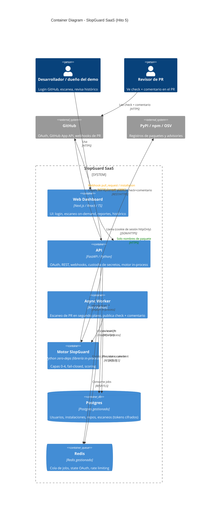
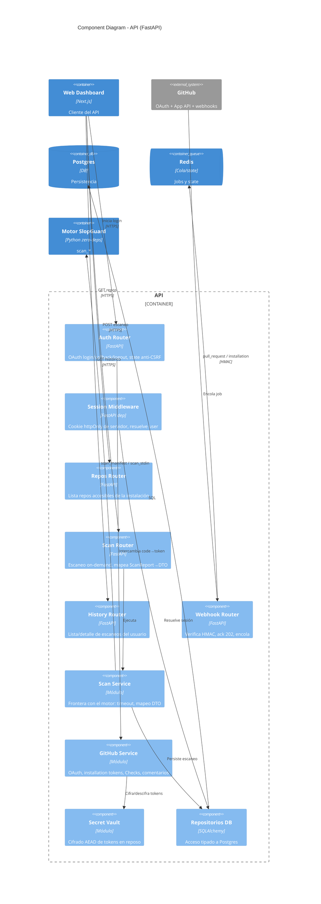
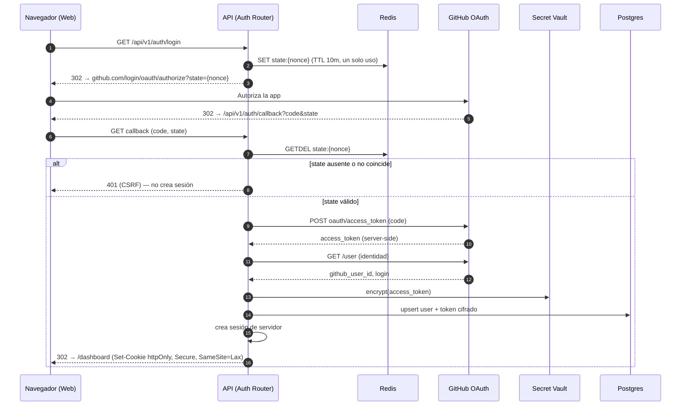
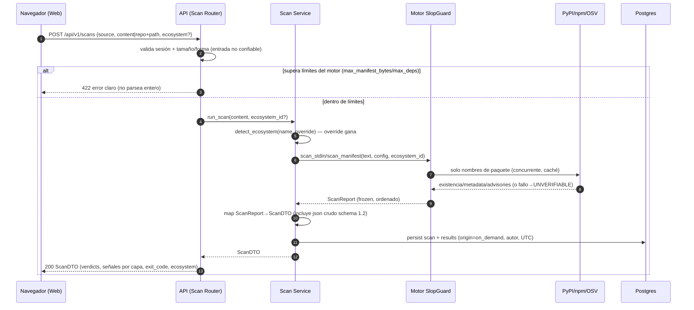
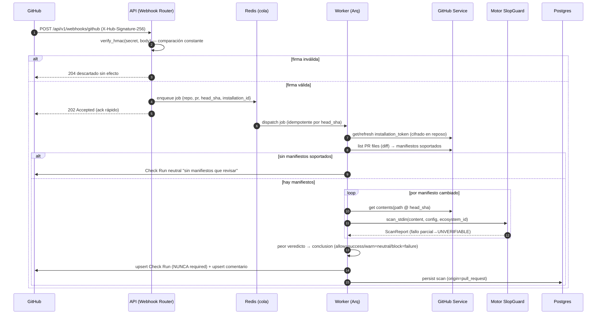
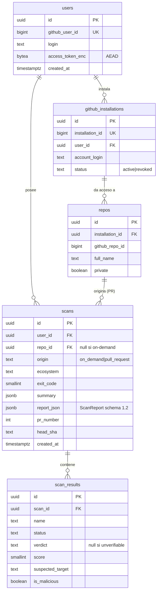

# Documento de Diseño: SlopGuard SaaS (Hito 5)

> Fase 2 del flujo spec-driven. Contrato: `specs/slopguard-hito5-saas/requirements.md` (aprobado, Compuerta 1).
> Convención SlopGuard: markdown in-repo + Mermaid embebido. Tono: decisiones con el *porqué* y trade-offs.

## Introducción

SlopGuard SaaS es la cara web del motor de detección de slopsquatting (`src/slopguard`, Python,
cero deps de runtime, fail-closed). Reutiliza ese motor **como librería in-process** y lo expone por
dos vías: (a) un **dashboard** donde un desarrollador autenticado escanea manifiestos on-demand y
consulta su histórico, y (b) una **GitHub App** que en cada PR escanea los manifiestos cambiados y
publica un **check informativo NO bloqueante + un comentario**. Alcance: **portfolio/demo
single-tenant**, un solo entorno, sin billing ni multi-tenant.

El principio rector arquitectónico es el mismo que vertebró el Hito 4: **el motor es la fuente de
verdad y permanece zero-deps; el SaaS lo envuelve sin reimplementar capas/scoring y sin que el motor
conozca jamás al SaaS**. La frontera de imports es unidireccional: `web → api → motor`.

Invariantes heredadas del motor que el SaaS NO puede romper (R7.3, NFR-Seguridad-3):
- **Fail-closed:** ante fallo de red/parse, una dependencia es `UNVERIFIABLE`, nunca `allow`/CLEAN.
- **Anti-block de la Capa 4:** el LLM nunca eleva a `block` (garantía estructural del scorer).
- **Cero filtración de secretos:** `ANTHROPIC_API_KEY` (Capa 4, off por defecto) y los tokens de
  GitHub nunca salen al cliente ni a logs.

---

## 1. Arquitectura de componentes

### 1.1 Inventario de componentes y responsabilidades

| Componente | Tecnología | Responsabilidad | Frontera (qué NO hace) |
|---|---|---|---|
| **Web (dashboard)** | Next.js / React, TS estricto | Renderiza login, escaneo on-demand, visualización de reportes, histórico. Llama SOLO al API por HTTPS con cookie de sesión. | No habla con GitHub ni con el motor; no ve tokens; no decide veredictos. |
| **API** | FastAPI, Python, mypy estricto | Orquesta OAuth, sesión, endpoints REST, recepción de webhooks (verifica HMAC y ack rápido), custodia y cifra secretos, persiste en Postgres, **invoca el motor in-process**. | No reimplementa scoring; no bloquea en el escaneo de PR (lo encola). |
| **Motor-as-lib** | `slopguard` (zero-deps) | `scan_manifest`/`scan_stdin`/`scan_dependencies` → `ScanReport`. Capas 0-4, fail-closed, caché en disco. | No conoce HTTP del SaaS, ni Postgres, ni GitHub. Import unidireccional. |
| **Webhook handler** | Router FastAPI | Recibe `pull_request` y `installation*`, verifica firma HMAC **antes** de leer el body, responde `202` y encola el trabajo. | No escanea inline (no bloquea el ack, R9.3). |
| **Worker asíncrono** | Arq (worker) + Redis | Consume jobs de escaneo de PR: resuelve installation token, baja manifiestos del diff, llama al motor, publica Check Run + comentario, persiste el escaneo. | No expone HTTP; idempotente por `(repo, pr, head_sha)`. |
| **DB** | Postgres gestionado | Usuarios, instalaciones, repos, escaneos y resultados; tokens cifrados en reposo; migraciones versionadas (Alembic). | No guarda secretos en claro; no guarda el manifiesto completo del usuario salvo lo mínimo. |
| **Redis** | Redis gestionado | Cola de jobs del worker + store del `state` OAuth de un solo uso (TTL) + rate limiting de endpoints públicos. | Efímero; no es fuente de verdad de negocio. |

### 1.2 Frontera de imports (NFR-Arquitectura-2)

```
apps/web  ──HTTPS──▶  apps/api  ──import directo──▶  src/slopguard (motor)
                          │
                          └── el motor NUNCA importa apps/api ni apps/web
```

Esta regla se hace ejecutable extendiendo el `import-linter` del repo (igual que el contrato R10.1
del Hito 4): se añade un contrato que prohíbe a `slopguard.*` importar `apps.*`. El API importa el
motor por su **fachada pública** (`slopguard.core` / `slopguard.cli.render_json`), nunca módulos
internos de capas/scoring.

### 1.3 Diagrama de contenedores (C4 nivel 2)



### 1.4 Diagrama de componentes del API (C4 nivel 3)



---

## 2. Flujos críticos (diagramas de secuencia)

### 2.1 Login OAuth con GitHub (R1, NFR-Seg-1)

`state` aleatorio de un solo uso guardado en Redis con TTL corto; el callback exige coincidencia y
consume el `state` (no reutilizable). El token de acceso de GitHub se cifra antes de persistir y
**nunca** viaja al cliente: el cliente solo recibe una cookie de sesión httpOnly.



### 2.2 Escaneo on-demand desde el dashboard (R3, R4, R7)

El usuario pega/sube un manifiesto o elige repo+ruta. El API autodetecta el ecosistema (o respeta el
override), aplica un **timeout duro de envoltura** sin romper fail-closed, mapea `ScanReport`→DTO y
persiste. Como el motor hace I/O de red por dependencia, la llamada se ejecuta en un threadpool para
no bloquear el event loop de FastAPI.



### 2.3 Webhook de PR → escaneo async → Check Run + comentario (R6, R9.3)

El receptor verifica HMAC **antes** de procesar, responde `202` de inmediato (ack rápido, R9.3) y
encola. El worker resuelve el installation token (renovable), baja solo los manifiestos del diff,
escanea, publica un **Check Run no bloqueante** (`conclusion` = peor veredicto) y un comentario
idempotente (actualiza, no duplica).



---

## 3. Modelo de datos (Postgres) — R8

Migraciones versionadas con **Alembic** (idempotentes, deterministas, R8.3). Todo timestamp en `UTC`.
Los campos cifrados usan AEAD (ver ADR-4): se guardan como `BYTEA` (nonce + ciphertext + tag), nunca
texto plano (R8.2, NFR-Seg-3).

### 3.1 Tablas

**`users`** — identidad GitHub del dueño del demo.

| Campo | Tipo | Notas |
|---|---|---|
| `id` | `UUID` PK | Generado en servidor. |
| `github_user_id` | `BIGINT` UNIQUE NOT NULL | Identidad estable de GitHub (no el login, que cambia). |
| `login` | `TEXT NOT NULL` | Mostrado en UI; saneado. |
| `avatar_url` | `TEXT` | Opcional, para la UI. |
| `access_token_enc` | `BYTEA NOT NULL` | **Cifrado AEAD.** Token OAuth de usuario. Nunca al cliente/logs. |
| `created_at` / `updated_at` | `TIMESTAMPTZ NOT NULL` | UTC. |

**`github_installations`** — instalaciones de la GitHub App (R2).

| Campo | Tipo | Notas |
|---|---|---|
| `id` | `UUID` PK | |
| `installation_id` | `BIGINT` UNIQUE NOT NULL | Id de instalación de GitHub. |
| `user_id` | `UUID` FK→`users.id` | Dueño que instaló. |
| `account_login` | `TEXT NOT NULL` | Cuenta/owner donde se instaló. |
| `status` | `TEXT NOT NULL` | `active` \| `revoked` (R2.4: revoked no borra histórico). |
| `created_at` / `updated_at` | `TIMESTAMPTZ NOT NULL` | UTC. |

> Los **installation tokens** son de vida corta (~1h) y se renuevan bajo demanda (R2.5); **no se
> persisten** salvo, opcionalmente, una caché efímera en Redis con TTL < expiración, cifrada. Esto
> reduce la superficie de secretos en reposo. El App private key vive como secreto de entorno, no en DB.

**`repos`** — repos accesibles por instalación (R2.3).

| Campo | Tipo | Notas |
|---|---|---|
| `id` | `UUID` PK | |
| `installation_id` | `UUID` FK→`github_installations.id` | |
| `github_repo_id` | `BIGINT` NOT NULL | Id estable del repo. |
| `full_name` | `TEXT NOT NULL` | `owner/name`. |
| `private` | `BOOLEAN NOT NULL` | |
| `created_at` / `updated_at` | `TIMESTAMPTZ NOT NULL` | UTC. |
| | UNIQUE(`installation_id`,`github_repo_id`) | |

**`scans`** — un escaneo (on-demand o de PR), R5.1.

| Campo | Tipo | Notas |
|---|---|---|
| `id` | `UUID` PK | |
| `user_id` | `UUID` FK→`users.id` | Aislamiento por usuario (R5.3). |
| `repo_id` | `UUID` FK→`repos.id` NULL | NULL si on-demand sin repo. |
| `origin` | `TEXT NOT NULL` | `on_demand` \| `pull_request`. |
| `ecosystem` | `TEXT NOT NULL` | `pypi` \| `npm` (de `ScanReport.ecosystem`). |
| `schema_version` | `TEXT NOT NULL` | Del motor (`1.2`). |
| `tool_version` | `TEXT NOT NULL` | `ScanReport.tool_version`. |
| `exit_code` | `SMALLINT NOT NULL` | 0/1/2/3 (`summary.exit_code`). |
| `summary` | `JSONB NOT NULL` | `total/allow/warn/block/unverifiable/llm_unavailable`. |
| `error_category` | `TEXT NULL` | Si hubo error operacional total. |
| `report_json` | `JSONB NOT NULL` | **`ScanReport` completo** serializado (schema 1.2). Fuente del detalle/JSON crudo (R4.3). |
| `pr_number` | `INT NULL` | Si origin=pull_request. |
| `head_sha` | `TEXT NULL` | Idempotencia del PR (R6.6). |
| `created_at` | `TIMESTAMPTZ NOT NULL` | UTC (R5.1). |

**`scan_results`** — fila por dependencia (R4.1, R5.2 filtros y consulta). Desnormaliza
`report_json` para listar/filtrar sin parsear el JSONB completo.

| Campo | Tipo | Notas |
|---|---|---|
| `id` | `UUID` PK | |
| `scan_id` | `UUID` FK→`scans.id` ON DELETE CASCADE | |
| `name` | `TEXT NOT NULL` | Nombre normalizado. |
| `status` | `TEXT NOT NULL` | `ok` \| `unverifiable`. |
| `verdict` | `TEXT NULL` | `allow`/`warn`/`block`; NULL si unverifiable. |
| `score` | `SMALLINT NULL` | 0-100; NULL si unverifiable/block-override. |
| `suspected_target` | `TEXT NULL` | Si typosquat. |
| `is_malicious` | `BOOLEAN NOT NULL DEFAULT false` | True si tiene advisory `MAL-*` (R4.4, destacar). |

### 3.2 Índices clave

- `scans (user_id, created_at DESC)` — listado del histórico, más reciente primero (R5.2).
- `scans (user_id, repo_id)` y `scans (user_id, ecosystem)` — filtros básicos (R5.2).
- `scans (repo_id, pr_number, head_sha)` UNIQUE parcial (WHERE origin='pull_request') — idempotencia
  del escaneo de PR: re-sincronización actualiza la misma fila (R6.6).
- `scan_results (scan_id)` y `scan_results (scan_id, verdict)` — render del detalle.
- `repos (installation_id)` — listado de repos de la instalación (R2.3).

### 3.3 Qué se cifra y qué no

- **Cifrado AEAD (reposo):** `users.access_token_enc`; installation tokens si se cachean en Redis.
- **No se cifra (no es secreto):** identidades públicas de GitHub, nombres de repo, summaries,
  veredictos. El `report_json` solo contiene nombres de paquete y señales saneadas (NFR-Privacidad-1:
  nunca versiones/rutas/manifiestos completos salen del motor a registros; el manifiesto crudo del
  usuario **no se persiste** — solo el reporte derivado).

### 3.4 Diagrama ER



---

## 4. Contratos de API

Convenciones: prefijo de versión en URL (`/api/v1`), recursos en kebab-case/plural, JSON. Sesión por
**cookie httpOnly** (no Bearer en el cliente). Errores con forma estable
`{ "error": { "code", "message", "request_id" } }` — `message` siempre saneado, sin stacktrace ni
secretos (R9.2). Rate limiting en endpoints públicos con cabeceras `X-RateLimit-*` (NFR-Seg-5).

### 4.1 Endpoints

| Método | Ruta | Auth | Entrada | Salida | Estados |
|---|---|---|---|---|---|
| `GET` | `/api/v1/auth/login` | Público | — | `302` a GitHub (set `state`) | 302 |
| `GET` | `/api/v1/auth/callback` | Público | `code`, `state` (query) | `302` a `/dashboard` + cookie | 302, 401 (CSRF) |
| `POST` | `/api/v1/auth/logout` | Sesión | — | `204` | 204, 401 |
| `GET` | `/api/v1/me` | Sesión | — | `{ id, login, avatar_url }` | 200, 401 |
| `GET` | `/api/v1/installations` | Sesión | — | lista de instalaciones (`status`) | 200, 401 |
| `GET` | `/api/v1/repos` | Sesión | `installation_id?` (query) | repos accesibles (R2.3) | 200, 401 |
| `POST` | `/api/v1/scans` | Sesión | `ScanRequest` (ver 4.2) | `ScanDTO` (4.3) | 200, 401, 422 (límites), 502 (degradado saneado) |
| `GET` | `/api/v1/scans` | Sesión | `repo_id?`, `ecosystem?`, `page?`, `page_size?` | lista paginada de `ScanSummaryDTO` | 200, 401 |
| `GET` | `/api/v1/scans/{id}` | Sesión (propietario) | — | `ScanDTO` completo | 200, 401, 403, 404 |
| `GET` | `/api/v1/scans/{id}/raw` | Sesión (propietario) | — | `report_json` crudo (schema 1.2, R4.3) | 200, 401, 403, 404 |
| `POST` | `/api/v1/webhooks/github` | Público + HMAC | evento GitHub | `202` (ack) / `204` (descartado) | 202, 204 |
| `GET` | `/api/v1/health` | Público | — | `{ status, db, redis }` | 200, 503 |

> Aislamiento por usuario (R5.3): `GET /scans/{id}` devuelve `404` (no `403`) cuando el escaneo
> existe pero es de otro usuario, para no filtrar existencia. `403` se reserva para sesión inválida
> contra recurso propio en estado inconsistente.

### 4.2 `ScanRequest`

```jsonc
{
  "source": "inline" | "repo",        // inline = contenido pegado/subido; repo = repo+ruta conectado
  "content": "string",                 // requerido si source=inline (texto del manifiesto)
  "filename": "package.json",          // opcional: ayuda a autodetectar ecosistema
  "repo_id": "uuid",                   // requerido si source=repo
  "path": "requirements.txt",          // requerido si source=repo
  "ecosystem": "pypi" | "npm" | null   // override opcional; null = autodetección (override gana)
}
```

### 4.3 DTO del reporte (`ScanDTO`) — mapeo directo de `ScanReport`

El DTO es un **mapeo 1:1 del `ScanReport`** del motor (forma de `render_json`, schema 1.2). No se
inventan campos de veredicto; el API solo añade metadatos de persistencia (`scan_id`, `origin`,
`created_at`).

```jsonc
{
  "scan_id": "uuid",
  "origin": "on_demand" | "pull_request",
  "created_at": "2026-06-25T12:00:00Z",
  "schema_version": "1.2",
  "tool_version": "string",
  "ecosystem": "pypi" | "npm",
  "error_category": null | "manifest_parse" | "invalid_config" | "network_unverifiable" | "dataset_integrity",
  "summary": {
    "total": 0, "allow": 0, "warn": 0, "block": 0,
    "unverifiable": 0, "llm_unavailable": 0, "exit_code": 0
  },
  "results": [
    {
      "name": "string",
      "version_pin": null | "string",
      "status": "ok" | "unverifiable",
      "verdict": null | "allow" | "warn" | "block",
      "score": null | 0,
      "suspected_target": null | "string",
      "error_category": null | "string",
      "signals": [
        {
          "layer": 0, "code": "string", "weight": 0,
          "is_soft": true, "is_llm_channel": false,
          "detail": "explicación saneada en español",
          "suspected_target": null | "string"
        }
      ],
      "advisories": [
        { "id": "MAL-2025-47868", "kind": "malicious",
          "url": "https://osv.dev/vulnerability/MAL-2025-47868", "source": "osv" }
      ],
      "llm_assessment": null
    }
  ]
}
```

> El `score` de un block-override es `null` (semántica del motor: `DependencyResult.score` es `None`
> en unverifiable o block-override). La UI debe tratar `null` como "sin score numérico", no como 0.
> `llm_assessment` es `null` mientras la Capa 4 esté off por defecto (R7.2).

---

## 5. Decisiones de Arquitectura (ADRs)

### ADR-1 — Hosting/despliegue: front en Vercel + API/Worker en contenedor persistente (Fly.io/Render) + Postgres y Redis gestionados

**Contexto.** El motor hace **I/O de red por dependencia** (PyPI/npm/OSV), con timeout total por dep
de 30s (`Config.timeout_total_por_dep_s`) y concurrencia 8. Un escaneo real de un `requirements.txt`
mediano puede tardar varios segundos a decenas de segundos. Además el motor mantiene una **caché en
disco** (TTL configurable) que acelera escaneos repetidos, y necesitamos un **worker** que procese
webhooks de forma asíncrona. El propósito es demo single-tenant: coste y simplicidad importan, pero
no a costa de romper el flujo.

**Decisión.** Front estático/SSR en **Vercel**. **API + Worker en un runtime de contenedor
persistente** (Fly.io o Render: ambos corren un proceso Python de larga vida con disco montado y sin
límite duro de 10-60s por request). **Postgres gestionado** (Neon/Render PG) y **Redis gestionado**
(Upstash/Fly Redis). El front habla con el API por HTTPS con cookie de sesión.

**Alternativas.**
- *(A) Todo serverless en Vercel + Neon (Postgres serverless).* Rechazada: los límites de tiempo de
  ejecución de funciones serverless (10-60s según plan) chocan con escaneos largos limitados por red;
  el filesystem efímero **anula la caché en disco del motor** (cada invocación arranca en frío, sin
  caché → peor latencia, NFR-Rendimiento-1); y no hay un proceso de larga vida natural para el worker.
- *(C) Docker self-host (VPS único con docker-compose).* Rechazada para el demo: máximo control y
  caché persistente, pero más operación manual (TLS, backups, parches) de la que justifica una pieza
  de portfolio; añade superficie de seguridad que el alcance no pide.

**Trade-offs.** Ganamos: proceso de larga vida (worker natural), caché en disco persistente entre
escaneos, sin límite de tiempo por request, despliegue simple con un Dockerfile. Sacrificamos: dos
proveedores en lugar de uno (Vercel + Fly/Render), y un coste base pequeño del contenedor siempre
encendido (vs scale-to-zero serverless). Para un demo single-tenant el coste es marginal.

**Consecuencias.** El API y el worker comparten imagen/código (mismo `apps/api`), arrancados como dos
comandos (proceso web vs proceso worker). El disco montado aloja la caché del motor. Vercel solo
sirve UI y proxea al API. Health endpoint reporta `db`/`redis` para el panel del proveedor.

### ADR-2 — Ejecución asíncrona de escaneos de PR: cola real con Arq + Redis (no BackgroundTasks)

**Contexto.** R9.3 exige ack rápido del webhook y escaneo en segundo plano; cada escaneo de PR puede
escanear varios manifiestos, cada uno con I/O de red. R6.6 exige idempotencia (re-sync de un PR
actualiza, no duplica). El proceso debe sobrevivir a reinicios sin perder jobs.

**Decisión.** Cola real **Arq** (async, redis-backed, encaja con el stack asyncio de FastAPI) con
**Redis** como broker. El webhook valida HMAC, encola `{repo, pr, head_sha, installation_id}` y
responde `202`. El worker (proceso aparte, mismo contenedor, ADR-1) consume con idempotencia por
`head_sha`.

**Alternativas.**
- *(A) `FastAPI BackgroundTasks`.* Rechazada: corre en el **mismo proceso/event loop** del API; un
  escaneo largo compite con las requests del dashboard, y un reinicio/crash del API **pierde el job
  silenciosamente** (un PR quedaría sin check → viola la promesa de "nunca un escaneo silenciosamente
  vacío", R2.5/R9.1). Sin reintentos ni visibilidad.
- *(C) Celery + Redis/RabbitMQ.* Rechazada: potente pero pesado y síncrono por defecto; más
  configuración y dependencias de las que un demo single-tenant justifica. Arq da lo necesario
  (asyncio nativo, reintentos, deduplicación) con mucho menos peso.

**Trade-offs.** Ganamos: aislamiento del API, durabilidad del job, reintentos, idempotencia,
escalado del worker independiente. Sacrificamos: una pieza de infraestructura más (Redis, que de
todos modos ya usamos para `state` OAuth y rate limiting) y la complejidad de un segundo proceso.

**Consecuencias.** Redis pasa a ser dependencia de runtime del API (cola + state + rate limit). El
job key incluye `head_sha` para que un re-sync reemplace el resultado; el Check Run y el comentario
se hacen por **upsert** (buscar el check/comentario previo de la App y actualizarlo).

### ADR-3 — Integración del motor in-process: `Scan Service` como única frontera, llamada en threadpool con timeout de envoltura

**Contexto.** R7.1 exige invocar `slopguard` in-process (import directo), ambos ecosistemas, sin
reimplementar capas/scoring. El motor es **síncrono y bloqueante** (I/O de red propio); FastAPI es
asyncio. Hay que aislar coste/duración sin romper fail-closed (R3.5/R9.1).

**Decisión.** Un módulo `Scan Service` es el **único** punto del SaaS que toca el motor. Expone una
función que: (1) resuelve el ecosistema con `detect_ecosystem(filename, override)` (override gana,
R3.2); (2) construye `Config` (Capa 4 off salvo flag server-side con `ANTHROPIC_API_KEY`, R7.2); (3)
llama a `scan_stdin(content, config, ecosystem_id=...)` para contenido inline o `scan_manifest(path,
...)` para repo, **dentro de `anyio.to_thread.run_sync`** (no bloquea el event loop); (4) envuelve la
llamada en un **timeout de envoltura** (`asyncio.wait_for`); (5) mapea `ScanReport`→`ScanDTO` con la
forma de `render_json` (schema 1.2). El motor se importa por su **fachada pública** (`slopguard.core`
+ `slopguard.cli.render_json`), nunca módulos internos.

**Alternativas.**
- *(A) Subprocess/CLI.* Rechazada explícitamente por Fase 0 (in-process). Aislaría mejor el coste pero
  pierde la caché compartida en proceso y añade overhead de serialización por escaneo.
- *(B) Reusar `render_json` directamente como respuesta.* Parcialmente adoptada: usamos su **forma**
  como contrato del DTO, pero pasamos por un mapeo explícito para añadir metadatos de persistencia y
  no acoplar la API HTTP a un detalle de la CLI.

**Trade-offs sobre el timeout de envoltura (clave para no romper fail-closed).** El motor ya degrada
por-dependencia a `UNVERIFIABLE` ante fallo de red y tiene su propio `timeout_total_por_dep_s`. El
timeout de envoltura del API es una **red de seguridad de proceso**, no un reemplazo del fail-closed:
si salta (escaneo patológicamente largo), el API responde un error **saneado** (`502`/`504`,
R9.2) — **nunca** sintetiza un reporte "limpio". Es decir: timeout de envoltura ⇒ error explícito,
jamás `allow`. Esto preserva la invariante (R3.5/R9.1).

**Consecuencias.** El `Scan Service` es testeable de forma aislada (mock del motor). La Capa 4 se
activa con un conmutador de entorno; sin `ANTHROPIC_API_KEY` el motor devuelve `llm_assessment=null`
por construcción (no hay que defender nada extra). El motor permanece intacto y zero-deps.

### ADR-4 — Sesión y custodia de secretos: cookie de servidor httpOnly + AEAD para tokens + HMAC del webhook + `state` anti-CSRF + mínimo privilegio

**Contexto.** R1.5/R8.2/NFR-Seg exigen: token de GitHub cifrado en reposo y nunca al cliente; `state`
anti-CSRF de un solo uso; verificación HMAC del webhook; mínimo privilegio de la App. El motor ya
garantiza no filtrar `ANTHROPIC_API_KEY`; el SaaS debe extender esa disciplina a sus secretos.

**Decisión.**
- **Sesión:** **cookie de sesión opaca, httpOnly + Secure + SameSite=Lax**, con el estado de sesión
  en servidor (Redis/DB). No se usa JWT en el cliente ni se mete el token de GitHub en la cookie. El
  cliente nunca ve un token.
- **Cifrado en reposo:** **AEAD** (ChaCha20-Poly1305 o AES-GCM) con clave maestra desde variable de
  entorno (idealmente envuelta por un KMS del proveedor). `users.access_token_enc` y cualquier cache
  de installation token van cifrados; logs estructurados con redacción de secretos.
- **Webhook HMAC:** validar `X-Hub-Signature-256` sobre el **cuerpo crudo** con
  `hmac.compare_digest` (tiempo constante) **antes** de parsear el evento. Firma inválida ⇒ descartar
  sin efecto (R6.1).
- **`state` OAuth:** nonce aleatorio (`secrets.token_urlsafe`) en Redis con TTL corto, consumido en el
  callback (`GETDEL`); no coincide/expiró ⇒ 401 sin sesión (R1.3).
- **Mínimo privilegio de la App:** Contents `read`, Metadata `read`, Pull requests `read`, Checks
  `write`, comentarios de PR (Pull requests `write` acotado a publicar comentario). **Nada más**
  (R2.1, NFR-Seg-4). Suscripción a eventos: solo `pull_request` e `installation`/`installation_repositories`.

**Alternativas.**
- *(A) JWT stateless en cookie.* Rechazada: dificulta el logout real / revocación inmediata (R1.4) y
  tienta a meter claims sensibles del lado cliente. Sesión de servidor permite invalidar al instante.
- *(B) Tokens en texto plano "porque es demo".* Rechazada de plano: viola R8.2/NFR-Seg-3; el cifrado
  AEAD es barato y es justo lo que un evaluador de portfolio de seguridad espera ver.

**Trade-offs.** Sesión de servidor añade una lectura por request (mitigada con Redis) a cambio de
revocación inmediata y cero secretos en el cliente. AEAD añade gestión de una clave maestra (rotación
documentada) a cambio de cumplir la invariante de no-fuga.

**Consecuencias.** Logout invalida la sesión de servidor y olvida/permite revocar el token (R1.4). La
clave maestra es un secreto de despliegue crítico (su pérdida invalida los tokens cifrados, lo cual es
aceptable: se re-autentica con GitHub). El receptor de webhook debe acceder al **raw body** (no al
JSON ya parseado) para el HMAC.

### ADR-5 — Layout del monorepo y frontera de imports unidireccional

**Contexto.** NFR-Arquitectura-1/2: monorepo en el repo `slopguard` con `apps/api`, `apps/web` y el
motor `src/slopguard` reutilizado como librería; frontera `web → api → motor`, el motor no conoce al
SaaS; core zero-deps intacto.

**Decisión.** Layout:

```
slopguard/
├── src/slopguard/          # MOTOR (zero-deps, intacto). Fuente de verdad.
├── apps/
│   ├── api/                # FastAPI + worker (deps del backend viven aquí)
│   │   ├── slopguard_api/  # routers, services (scan/github), vault, db, worker
│   │   ├── migrations/     # Alembic
│   │   └── pyproject.toml  # depende de slopguard (path), fastapi, arq, sqlalchemy...
│   └── web/                # Next.js / TS estricto (deps del front aquí)
├── specs/                  # specs por hito (este documento)
└── pyproject.toml          # core: sigue zero-deps de runtime
```

El motor se consume como **dependencia de path** (`slopguard @ ../../`), no se copia. La frontera se
hace ejecutable con **import-linter**: contrato que prohíbe `slopguard.* → apps.*` (extiende los
contratos R10.1 del Hito 4). El API importa solo la **fachada pública** del motor.

**Alternativas.**
- *(A) Repos separados (polyrepo).* Rechazada: Fase 0 fijó monorepo; separar añade versionado cruzado
  y fricción de release para un demo de un solo equipo.
- *(B) `apps/worker` separado de `apps/api`.* Rechazada: worker y API comparten servicios (motor,
  vault, db, github service); mismo paquete, dos entrypoints (proceso web vs proceso worker) evita
  duplicación y deriva.

**Trade-offs.** Un solo repo simplifica el desarrollo coordinado del demo a cambio de un toolchain
mixto Python+TS (dos `pyproject`/`package.json`). El contrato import-linter previene la regresión más
peligrosa: que el motor empiece a depender del SaaS.

**Consecuencias.** El core conserva su garantía zero-deps de runtime (sus deps de test/dev no cuentan).
CI debe correr mypy (api), tsc estricto (web) e import-linter (frontera). El worker reusa el `Scan
Service` y el `GitHub Service` sin copiar código.

---

## 6. Trazabilidad (requisitos → diseño)

### 6.1 Requisitos funcionales

| Req | Elemento(s) de diseño que lo satisfacen |
|---|---|
| **R1** OAuth GitHub | Auth Router + Session Middleware (§1.4); flujo §2.1; `state` en Redis (ADR-4); `users.access_token_enc` AEAD (§3.1); `/auth/login`, `/auth/callback`, `/auth/logout` (§4.1). |
| **R2** Instalación App + repos | GitHub Service; tablas `github_installations`/`repos` (§3.1); `/installations`, `/repos` (§4.1); mínimo privilegio + renovación de installation token (ADR-4); `status=revoked` no borra histórico (§3.1). |
| **R3** Escaneo on-demand | Scan Router + Scan Service (§1.4); flujo §2.2; `detect_ecosystem` override-gana (ADR-3); validación de límites → `422` (§4.1); fail-closed→UNVERIFIABLE heredado del motor (ADR-3 trade-offs). |
| **R4** Visualización del reporte | `ScanDTO` 1:1 con `ScanReport` incl. señales por capa, ecosystem, exit_code (§4.3); `/scans/{id}/raw` JSON crudo (§4.1); `advisories` MAL-* + `is_malicious` para destacar (§3.1, §4.3); frontera UI §8. |
| **R5** Histórico | `scans`/`scan_results` (§3.1); índices por user/created/repo/ecosystem (§3.2); `/scans` con filtros + paginación (§4.1); aislamiento por usuario → `404` cruzado (§4.1, R5.3). |
| **R6** Check informativo NO bloqueante | Webhook Router + Worker (§1.1); flujo §2.3; HMAC (ADR-4); conclusion=peor veredicto; Check Run **nunca required**; upsert por `head_sha` (§3.2, ADR-2); neutral si sin manifiestos. |
| **R7** Integración del motor | Scan Service in-process por fachada pública (ADR-3); Capa 4 off salvo flag server-side (ADR-3); invariantes fail-closed/anti-block/no-fuga preservadas (Introducción, ADR-3/4). |
| **R8** Persistencia Postgres | Modelo de datos §3; Alembic migraciones idempotentes (§3); AEAD para tokens (§3.3, ADR-4). |
| **R9** Errores y degradación | Forma de error saneada `{error:{code,message,request_id}}` (§4); UNVERIFIABLE nunca CLEAN (ADR-3); async tras ack (ADR-2, §2.3); timeout de envoltura ⇒ error explícito, nunca allow (ADR-3). |

### 6.2 Requisitos no-funcionales

| NFR | Elemento(s) de diseño |
|---|---|
| **Seguridad** | ADR-4 completo: `state` CSRF, HMAC tiempo-constante, AEAD en reposo, mínimo privilegio App, entrada no confiable (validación + límites del motor), rate limiting en públicos con `X-RateLimit-*` (§4). |
| **UX** (prioritario) | Frontera de UI §8: sistema de diseño, paleta semántica allow/warn/block, tipografía, WCAG AA, explicar veredictos (señales legibles del DTO §4.3), estados carga/empty/error. |
| **Arquitectura** | Monorepo + frontera import-linter (ADR-5); core zero-deps intacto; mypy/tsc estricto (ADR-5 consecuencias). |
| **Rendimiento** | Caché en disco persistente del motor habilitada por contenedor persistente (ADR-1); concurrencia por-dep del motor; escaneo de PR en background (ADR-2). |
| **Privacidad** | Solo nombres salen a registros (heredado, Introducción/§3.3); manifiesto crudo del usuario **no se persiste**, solo el reporte derivado (§3.3); comentario de PR solo expone deps del propio diff (§2.3). |
| **Disponibilidad/Operación** | Un entorno demo-grade (ADR-1); `/health` con `db`/`redis` (§4.1); logs estructurados sin secretos (ADR-4); degradación elegante ante caída de externas (fail-closed del motor + errores saneados). |

---

## 7. Riesgos y alto riesgo para Fase 4 (delegar a developer-complex)

Marcar explícitamente para **developer-complex** (implementación de alto riesgo) las siguientes piezas:

- **Custodia de secretos / cripto (ADR-4):** cifrado AEAD de tokens, derivación/rotación de clave
  maestra, redacción en logs. *Criptografía → developer-complex.*
- **Verificación HMAC del webhook sobre raw body con comparación constante (ADR-4):** un fallo aquí
  abre RCE de webhook. *Seguridad de borde → developer-complex.*
- **Idempotencia/concurrencia del worker (ADR-2):** upsert de Check Run/comentario bajo re-sync
  concurrente del mismo PR (race por `head_sha`). *Concurrencia → developer-complex.*
- **Migraciones Alembic idempotentes (R8.3):** primera baseline + evolución sin pérdida de datos.
  *Migraciones → developer-complex.*
- **Timeout de envoltura sin romper fail-closed (ADR-3):** la red de seguridad nunca debe producir un
  reporte limpio sintético. *Invariante de seguridad → developer-complex.*

El resto (routers CRUD, mapeo DTO, UI) es trabajo de `developer` estándar; el front usa
`developer-complex` con skills de UI/UX senior inyectadas (directiva de Fase 0).

---

## 8. Frontera de UI/UX (guía para Fase 4)

No se diseñan pantallas pixel a pixel aquí: se fija el **sistema de diseño base** y los principios.
Identidad: **herramienta de seguridad / terminal moderna** — tipografía nítida, jerarquía clara,
color semántico, densidad de información controlada. Implementación en Fase 4 con `developer-complex`
+ skills de UI/UX senior, manteniendo consistencia.

### 8.1 Principios

1. **Explicar, no solo mostrar (R4, NFR-UX-3):** cada veredicto se acompaña de sus señales por capa
   en lenguaje humano (el `detail` saneado del DTO). El "por qué" es ciudadano de primera clase.
2. **El estado más peligroso domina:** `block` y `MAL-*` (malicioso confirmado) se destacan visualmente
   por encima de todo; `unverifiable` se comunica como "no se pudo verificar", **nunca** se pinta como
   verde/seguro (refleja el fail-closed en la UI).
3. **Estados cuidados:** loading (escaneo en curso, limitado por red), empty (histórico vacío con CTA
   al primer escaneo, R5.4), error (mensaje accionable y saneado, R9.2).
4. **Calma visual:** fondo oscuro tipo terminal por defecto, acentos de color reservados para
   semántica de riesgo (no decorativos).

### 8.2 Tokens de diseño (base, ajustables en Fase 4)

**Paleta semántica** (los acentos deben pasar contraste AA sobre el fondo elegido):

| Token | Rol | Guía de color |
|---|---|---|
| `--sg-bg` | Fondo base (terminal) | Gris muy oscuro neutro (p.ej. `#0E1116`). |
| `--sg-surface` | Tarjetas/paneles | Un paso más claro que el fondo. |
| `--sg-text` | Texto primario | Gris muy claro, AA sobre `--sg-bg`. |
| `--sg-allow` | Veredicto allow | Verde sobrio (no neón). |
| `--sg-warn` | Veredicto warn | Ámbar/amarillo. |
| `--sg-block` | Veredicto block | Rojo. |
| `--sg-malicious` | MAL-* confirmado | Rojo intenso + ícono/badge distinto de `block` heurístico. |
| `--sg-unverifiable` | Sin verificar | **Gris/azul neutro**, jamás verde (clave: no parece "seguro"). |
| `--sg-accent` | Acción primaria / foco | Cian/azul de marca. |

> Regla dura de a11y: **el color nunca es el único portador de significado.** Cada veredicto lleva
> también ícono + etiqueta de texto (WCAG 1.4.1).

**Tipografía:** una sans nítida para UI (Inter/Geist) + una **monoespaciada** (JetBrains Mono /
Geist Mono) para nombres de paquete, scores y bloques JSON crudo (refuerza la estética de terminal y
mejora la legibilidad de identificadores). Escala tipográfica con jerarquía clara (título de escaneo
> nombre de dep > detalle de señal).

**Espaciado/forma:** escala de espaciado consistente (múltiplos de 4px), radios suaves, bordes sutiles
para delimitar paneles sin ruido.

### 8.3 Accesibilidad (WCAG AA, NFR-UX-2)

- Contraste de texto y de acentos semánticos ≥ AA (4.5:1 texto normal / 3:1 texto grande y UI).
- Foco visible en todos los interactivos; navegación completa por teclado (tabla de histórico, filtros,
  lanzamiento de escaneo).
- Roles/ARIA donde aplique (tabla de resultados, badges de veredicto con `aria-label`, regiones live
  para el resultado de un escaneo asíncrono).
- Responsive: el dashboard funciona en viewport estrecho (la tabla de señales colapsa con cuidado).

### 8.4 Componentes guía (no exhaustivo)

- **VerdictBadge** (allow/warn/block/unverifiable + MAL-*): color + ícono + texto.
- **DependencyRow / SignalList:** nombre mono, score, target sospechado, señales por capa expandibles.
- **ScanSummaryBar:** conteos + exit code equivalente del CLI (0/1/2/3).
- **RawJsonViewer:** JSON crudo schema 1.2 con resaltado, copiable.
- **HistoryTable:** filtros por repo/ecosistema, orden por fecha desc, empty state con CTA.

---

## 9. Non-goals (lo que este diseño NO hará)

- **No** multi-tenant, organizaciones, equipos, RBAC ni panel de admin.
- **No** billing, planes, cuotas ni suscripciones.
- **No** bloqueo de merges ni checks *required* (la App es **solo informar**, por construcción).
- **No** SSO no-GitHub, SAML, ni login por email/contraseña.
- **No** integraciones con Slack/Jira/otros, ni app móvil nativa.
- **No** ecosistemas más allá de PyPI y npm (lo que soporte el motor).
- **No** reimplementar capas/scoring ni tocar el core: el SaaS envuelve, no modifica.
- **No** persistir el manifiesto crudo del usuario más allá del reporte derivado.
- **No** alta disponibilidad / multi-región: un solo entorno demo-grade con degradación elegante.
